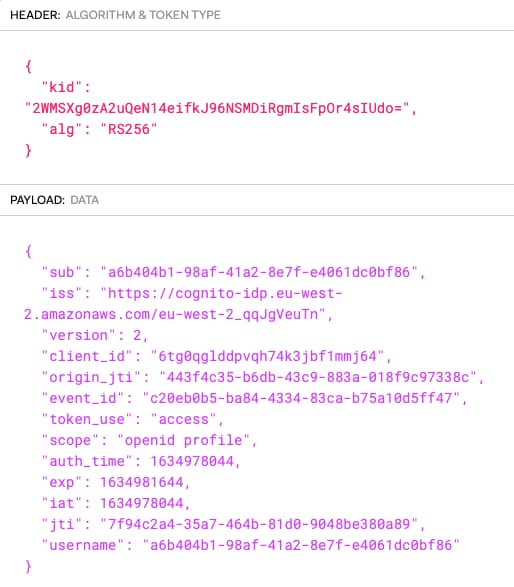
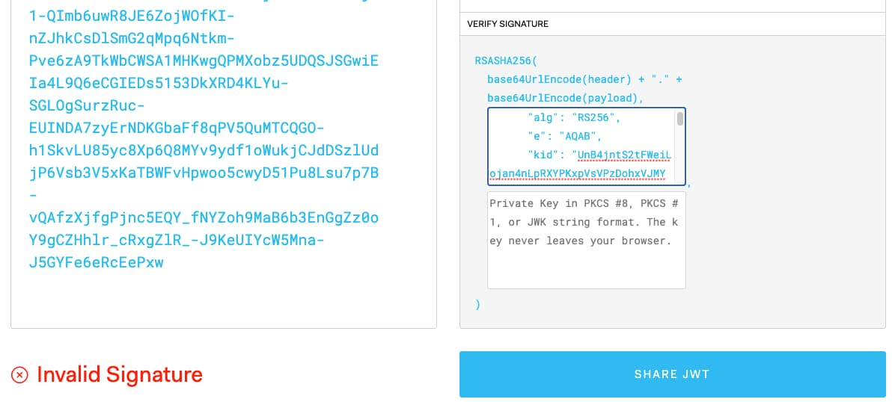

# JWT Access Token Validation

The previous post provided some <a href='basicapi-codingkeypoints.mdx'>API Code Details</a> for the initial code sample. Next I explain the most mainstream way in which APIs validate JWT access tokens. These techniques are covered in many other OAuth resources. This post summarises a few security best practices, but focuses primarily on a productive development setup when working with JWTs.

### Common Requirements

When designing token validation in APIs there are a few factors to consider:

| Factor | Description |
| ------ | ----------- |
| Straightforward Code | Validating a JWT should not require a great amount of code or complicate your API. |
| Enable API Authorization | The output from JWT validation should provide the main values the API needs for authorization. |
| Best Security Capabilities | Aim to use modern, secure and efficient JWT algorithms. |
| Developer Understanding | You should understand how the validation works, so that you can ensure it is doing the right things. |
| Useful Errors | You must ensure that API clients receive useful error responses when access tokens fail validation. |

### Libraries v Frameworks

Some technology stacks provide a *Resource Server Framework* that operates like a black box and hides the details from developers. This blog instead uses a library approach, for best control and understanding of the important behaviours.

### JOSE Libraries

This blog provides APIs developed in the following languages and in each case a *JSON Object Signing and Encryption (JOSE)* library is used, to enable up-to-date security options when needed:

| Technology | JOSE Library |
| ---------- | ------------ |
| Node.js | [jose](https://github.com/panva/jose) |
| .NET | [jose-jwt](https://github.com/dvsekhvalnov/jose-jwt) |
| Java | [jose4j](https://bitbucket.org/b_c/jose4j/wiki/Home) |

JOSE libraries support a number of OAuth-related security specifications like [RFC 7519](https://datatracker.ietf.org/doc/html/rfc7519). The specification documents can be read by developers to strengthen their OAuth knowledge. JOSE libraries are also useful for <a href='api-automated-tests.mdx'>issuing mock access tokens</a> in API tests.

### JWT Validation Code

JWT validation in APIs should require only a small amount of code. This blog's Node.js APIs demonstrates the approach. First, when the application starts, create an object to download and cache the authorization server's token signing public keys:

```typescript
export class JwksRetriever {

    private readonly remoteJWKSet: JWTVerifyGetKey;

    public constructor(configuration: OAuthConfiguration, httpProxy: HttpProxy) {
        this.remoteJWKSet = createRemoteJWKSet(new URL(configuration.jwksEndpoint), jwksOptions);
    }

    public getRemoteJWKSet(): JWTVerifyGetKey {
        return this.remoteJWKSet;
    }
}
```

In the access token validator object I then run code similar to the following on every API request:

```typescript
const accessToken = this.readAccessToken(request);
if (!accessToken) {
    throw ErrorFactory.fromMissingTokenError();
}

const options = {
    algorithms: [this.configuration.algorithm],
    issuer: this.configuration.issuer,
    audience: this.configuration.audience
} as JWTVerifyOptions;

const result = await jwtVerify(accessToken, this.jwksRetriever.remoteJWKSet, options);
return new ClaimsPrincipal(result.payload);
```

### Viewing JWT Access Tokens

A normal JWT access tokens consists of three parts that represent the most common JSON Web Signature format:

- *Header*
- *Payload*
- *Digital Signature*

The authorization server uses an asymmetric private key to sign JWT access tokens and the public key is made available to any party that needs to cryptographically verify JWT signatures. Here is an example AWS Cognito JWT access token from this blog's first code sample:

```markdown
eyJraWQiOiIyV01TWGcwekEydVFlTjE0ZWlma0o5Nk5TTURpUmdtSXNGcE9yNHNJVWRvPSIsImFsZyI6IlJTMjU2In0.eyJzdWIiOiJhNmI0MDRiMS05OGFmLTQxYTItOGU3Zi1lNDA2MWRjMGJmODYiLCJpc3MiOiJodHRwczpcL1wvY29nbml0by1pZHAuZXUtd2VzdC0yLmFtYXpvbmF3cy5jb21cL2V1LXdlc3QtMl9xcUpnVmV1VG4iLCJ2ZXJzaW9uIjoyLCJjbGllbnRfaWQiOiI2dGcwcWdsZGRwdnFoNzRrM2piZjFtbWo2NCIsIm9yaWdpbl9qdGkiOiI0NDNmNGMzNS1iNmRiLTQzYzktODgzYS0wMThmOWM5NzMzOGMiLCJldmVudF9pZCI6ImMyMGViMGI1LWJhODQtNDMzNC04M2NhLWI3NWExMGQ1ZmY0NyIsInRva2VuX3VzZSI6ImFjY2VzcyIsInNjb3BlIjoib3BlbmlkIHByb2ZpbGUiLCJhdXRoX3RpbWUiOjE2MzQ5NzgwNDQsImV4cCI6MTYzNDk4MTY0NCwiaWF0IjoxNjM0OTc4MDQ0LCJqdGkiOiI3Zjk0YzJhNC0zNWE3LTQ2NGItODFkMC05MDQ4YmUzODBhODkiLCJ1c2VybmFtZSI6ImE2YjQwNGIxLTk4YWYtNDFhMi04ZTdmLWU0MDYxZGMwYmY4NiJ9.CM5j3AXOGNL77AjW1-QImb6uwR8JE6ZojWOfKI-nZJhkCsDlSmG2qMpq6Ntkm-Pve6zA9TkWbCWSA1MHKwgQPMXobz5UDQSJSGwiEIa4L9Q6eCGIEDs5153DkXRD4KLYu-SGLOgSurzRuc-EUINDA7zyErNDKGbaFf8qPV5QuMTCQGO-h1SkvLU85yc8Xp6Q8MYv9ydf1oWukjCJdDSzlUdjP6Vsb3V5xKaTBWFvHpwoo5cwyD51Pu8Lsu7p7B-vQAfzXjfgPjnc5EQY_fNYZoh9MaB6b3EnGgZz0oY9gCZHhlr_cRxgZlR_-J9KeUIYcW5Mna-J5GYFe6eRcEePxw
```

You can paste this into an [Online JWT Validator](https://jwt.io) to view the details, and note the *Key Identifier (kid)* field in the JWT header:



### API Validation Steps

OAuth-secured APIs must validate JWT access tokens on every request. This is a fast and scalable operation. The API must provide correct inputs to the security library to validate the JWT correctly:

| Check | Description |
| ----- | ----------- |
| Algorithm | The API configures the algorithm(s) which which it expects JWTs to be signed. |
| Signature | The API provides the token signing public key to the library. The most common way to do so is to configure a trusted JWKS URI. |
| Issuer | The API configures its expected issuer to be the identity of the authorization server. |
| Audience | The API configures its expected audience to be its own identity, as registered at the authorization server. |
| Time | The API only accepts JWTs that are valid for use at the current time and rejects expired JWTs. |

### API OAuth Configuration

The API expresses its settings in its configuration file. At the time of writing, AWS Cognito does not allow me to issue an audience claim that contains the API's identity, so I leave the value blank when using that authorization server.

```json
{
    "api": {
        "port": 80,
        "trustedOrigins": [
            "http://localhost"
        ],
        "useProxy": false,
        "proxyUrl": "http://127.0.0.1:8888"
    },
    "oauth": {
        "jwksEndpoint": "https://cognito-idp.eu-west-2.amazonaws.com/eu-west-2_CuhLeqiE9/.well-known/jwks.json",
        "issuer": "https://cognito-idp.eu-west-2.amazonaws.com/eu-west-2_CuhLeqiE9",
        "audience": "",
        "algorithm": "RS256"
    }
}
```

### Failed Token Validation

When any token validation checks fail, the API should return an error response with a 401 HTTP status code. APIs should return the traditional *www-authenticate* response header to ensure interoperability:

```http
www-authenticate: Bearer error="invalid_token", error_description="Missing, invalid or expired access token"
```

This blog's APIs return JSON error objects with *code* and *message* fields, so also return that payload for 401 errors. The blog's clients can then process all API errors in the same way, while receiving correct details about expired access tokens.

```json
{
  "code": "invalid_token",
  "message": "Missing, invalid or expired access token"
}
```

In production systems, this type of error occurs frequently, since clients use short-lived access tokens. When a client receives a response with a 401 status code it attempts a token refresh operation. On success, the client retries its API request.

### Token Signing Public Keys

This blog's APIs provide their JOSE library with the authorization server's JWKS URI, from which the library downloads token signing public keys. The API rejects access tokens from any other source. For AWS Cognito I use the following JWKS URI:

- [https://cognito-idp.eu-west-2.amazonaws.com/eu-west-2_CuhLeqiE9/.well-known/jwks.json](https://cognito-idp.eu-west-2.amazonaws.com/eu-west-2_CuhLeqiE9/.well-known/jwks.json)

This endpoint returns multiple public keys in a JSON Web Key Set and each of these has a key identifier. The security library uses the entry whose kid value matches that in the access token's JWT header to verify the token:

```json
{
  "keys": [
    {
      "alg": "RS256",
      "e": "AQAB",
      "kid": "SNdU6pNlC2hZFj/LtbqQroR9dSkK+P4xp2OYC1P4h4s=",
      "kty": "RSA",
      "n": "2XS8bYFTWYr_yy6V3KUI8dq5GqBy4hbZGLL9_eDEiYRdktBEJKOu1R3gsSQxJ7hznp4DZSei9BPwLRCBK51xfAE55fVhUEhRLBRBwRGpraObCIz3gNWaEUkhcupBP1hWniDpGcIkcGBxiVL3Yti5Ns0PY4k3Z_JP1VFsXQO_-mle2o2q2ZzKXNbioyymbVBRIgiPJYQwJpmYUmEEYWcjz0-Y4OyBW_QrPTYGSESvJRqo3j7cF0Q-ADLmHdHKApFVG3EBQq8VZ_v5bmxHxCKZHa4OxI-oHJ80zsIjgaLxx1N8IgFpsqNJj1Nw5LCSgrsDOnGumFJ2NFA6y0zYElkCWw",
      "use": "sig"
    },
    {
      "alg": "RS256",
      "e": "AQAB",
      "kid": "QdDJdF0FVH9bamM7SoBhMShUmiP8tcfuhtNImYwRzOg=",
      "kty": "RSA",
      "n": "r9iOi5jCK2eWIA0PYv6P_BenV5P5oaGCWXFjt0u33FZKrJiFYSzFILZTtIozhfKyp9yVa29aNatub4gsjwz8zjW5Qo2maWjzOMqDSGYFpfTOgbT105B-VfXGQJkkoDuhj5fd7SMTtv4kF4fuOj7CO17vVm7Yei87CdrXPpOqp1olblT82hYrotMxbhklmT9r7ZzwfPCvxWqPK53DTLGfiJGZ1BbSFizFKw1BZWJlkZVPCX6YUBbjPtHkH3UFoWTdmXYj-Ja2etZY4fGeGXXO2nbVWNfzlOpAGI7sWQWDeHWbxgXI52yAEi3ZIaBWA8zQlTSJvHvy_uh2MSVJdRcj3Q",
      "use": "sig"
    }
  ]
}
```

### JWT Signature Verification

You can use an online JWT validator to manually paste in an access token and the public JSON Web Key with which to validate its signature. If you paste in a value from the JWKS endpoint whose kid does not match that in the JWT header you get a verification failure:



If a malicious party issues a JWT access token with their own private key and sends it to your API, or tampers with a JWT and alters its contents, the API should reject the JWT using the same logic as the JWT utility website.

### JSON Web Key Set Caching

Ideally, the JOSE library should also cache the JSON Web Key Set details in-memory, for best performance and reliability. On future API requests, you should get the following behaviours:

| Input | Library Action |
| ----- | -------------- |
| Same Key Identifier | The security library uses the cached JSON Web Key, to prevent further calls to the authorization server's JWKS URI. |
| New key identifier | The security library makes a new call to the JWKS URI to get updated JSON Web Keys, including that for the new key identifier. |

### Token Signing Key Renewal

You should periodically rotate the token signing public keys that your authorization server uses. The new private key then signs future JWTs and a new public key is added to the JSON Web Key Set. For a while the JSON Web Key Set contains both old and new public keys, until you remove the old one. APIs therefore cope seamlessly with token signing key renewal. When you use OAuth, you get a key management and renewal solution for applications and APIs. This reduces complexity as the number of components grows.

### API Authorization

After JWT access token validation completes, your API trusts claims in the JWT payload and uses them in its business authorization. I say more about the use of claims in this blog's <a href='api-authorization-design.mdx'>Authorization Behaviour</a> post.

### Where Are We?

I explained how developers can validate JWTs in APIs, with very little code. Next, let's switch back to some setup related topics, starting with getting up and running with your own authorization server.

### Next

- I explain this blog's <a href='oauth-infrastructure-setup.mdx'>OAuth Infrastructure Setup</a>.
- For a list of all blog posts see the <a href='index.mdx'>Index Page</a>.
