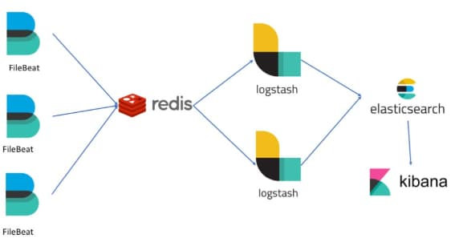

# OAuth Log Aggregation Setup

Previously I explained this blog's <a href='api-automated-tests.mdx'>API Automated Tests</a>, Next I deploy a local Docker-based log aggregation system that could receive logs from both OAuth secured APIs and the authorization server. I show how to aggregate logs from APIs during development.

### API Logging Output

This blog's final APIs use request and audit loggers. Each log entry contains a single line of bare JSON. Typically the hosting platform captures the API's standard output and writes logs to files ready for log shipping. The following example request logs show the format of log entries.

```json
{"type": "request", "id":"f1c38406-6d1e-212f-ee8b-e100a4219b28","utcTime":"2022-07-15T17:34:28.631Z","apiName":"FinalApi","operationName":"getCompanyList","hostName":"UBUNTU","method":"GET","path":"/investments/companies","statusCode":401,"errorCode":"unauthorized","millisecondsTaken":10,"correlationId":"b868385c-e8fa-9496-9d5b-492158e3d555","errorData":{"statusCode":401,"clientError":{"code":"unauthorized","message":"Missing, invalid or expired access token"},"context":"No access token was supplied in the bearer header"}}
{"type": "request", "id":"c997e4f0-e7a3-ed9c-253f-fd25110a4a33","utcTime":"2022-07-15T17:34:37.065Z","apiName":"FinalApi","operationName":"getCompanyTransactions","hostName":"UBUNTU","method":"GET","path":"/investments/companies/2/transactions","resourceId":"2","clientName":"LoadTest","userId":"a6b404b1-98af-41a2-8e7f-e4061dc0bf86","statusCode":200,"millisecondsTaken":124,"correlationId":"bd845c50-8995-92eb-fb2f-bc81a4405fef","sessionId":"50f7bbae-04a2-8ba1-1cde-6a44916ab4aa"}
{"type": "request", "id":"8e41a54c-1d40-8269-c8f4-12b1bf54ad74","utcTime":"2022-07-15T17:34:37.046Z","apiName":"FinalApi","operationName":"getUserInfo","hostName":"UBUNTU","method":"GET","path":"/investments/userinfo","clientName":"LoadTest","userId":"a6b404b1-98af-41a2-8e7f-e4061dc0bf86","statusCode":200,"millisecondsTaken":162,"correlationId":"5ec0eedf-0dcf-aa8d-f64c-1522e8a65a32","sessionId":"50f7bbae-04a2-8ba1-1cde-6a44916ab4aa"}
```

Of course these raw logs are not easy to read, and the next step is to import them into a *Queryable Data Store*. This does not require any coding, but you need to understand how to configure and deploy open source logging tools.

### Logging Technology Stack

I use an installation of [Elastic Stack](https://www.elastic.co/products/elastic-stack) components, which provides a mature platform with some productivity features.



I run the following components to a basic level on a development computer, to enable SQL-like API queries against log data.

| Component | Role |
| --------- | ---- |
| Elasticsearch | A *Big Data* log store and API that can read rich queries as input and return filtered logs as output. |
| Kibana | A frontend which authorised people can use to make log queries against the big data store. |
| Filebeat | A lightweight tool to ship JSON log files to Elasticsearch where they undergo ingestion. |

This blog's API logging solution is based on a design pattern and not locked in to Elastic Stack. If I found a better log aggregation system I could migrate to it without any API code changes.

### Step 1: Download Elastic Resources

You can download helper resources with the following command:

```bash
git clone https://github.com/gary-archer/oauth.logaggregation.elasticsearch
```

### Step 2: Configure DNS and SSL

First add the following logging domain name to your computer's hosts file:

```markdown
127.0.0.1 logs.authsamples-dev.com
```

My deployment of Kibana uses an HTTPS URL so you must create development certificates. Ensure that OpenSSL 3+ is installed and then run the following commands:

```bash
export SECRETS_FOLDER="$HOME/secrets"
mkdir "$SECRETS_FOLDER"
./certs/create.sh
```

Then follow instructions to configure <a href='developer-ssl-setup.mdx'>Browser SSL Trust</a> for the following root certificate, so that you can run the Kibana UI and avoid SSL trust errors:
 for a development computer
```markdown
./certs/authsamples-dev.ca.crt
```

### Step 3: Understand Elasticsearch Deployment

The repo includes a Docker Compose deployment, that includes the main Elasticsearch system. The installation uses [xpack security](https://www.elastic.co/guide/en/elasticsearch/reference/current/security-settings.html) to a basic level, with usernames and passwords:

```yaml
elasticsearch:
  image: docker.elastic.co/elasticsearch/elasticsearch:9.1.2
  hostname: elasticsearch-internal
  environment:
    discovery.type: 'single-node'
    xpack.security.enabled: 'true'
    xpack.security.http.ssl.enabled: 'false'
    xpack.security.autoconfiguration.enabled: 'false'
    ES_JAVA_OPTS: -Xmx4g
    ELASTIC_PASSWORD: 'Password1'
```

### Step 4: Understand Data Initialization

A job container also runs, whose main role is to create index templates for request logs and audit logs, and an ingest pipeline used when Elasticsearch receives logs.
  

```yaml
elasticsearch-init-job:
  image: elasticjob:latest
  environment:
    ELASTIC_URL: 'http://elasticsearch-internal:9200'
    ELASTIC_USER: 'elastic'
    ELASTIC_PASSWORD: 'Password1'
    KIBANA_SYSTEM_USER: 'kibana_system'
    KIBANA_PASSWORD: 'Password1'
  depends_on:
    elasticsearch:
      condition: service_started
```

The following JSON shows format of the index template for request logs. The template sets data types to ensure that log data is received with the original types. This helps to ensure that queries on log data use the expected data types, for example to sort numbers and dates correctly:

```json
{
  "index_patterns": ["api-*"],
  "template": {
    "aliases": {
      "apilogs": {}
    },
    "mappings": 
    {
      "properties": 
      {
        "id": 
        {
          "type": "keyword"
        },
        "utcTime": 
        {
          "type": "date"
        },
        "apiName": 
        {
          "type": "keyword"
        },

        ... 

        "statusCode": 
        {
          "type": "integer"
        },
        "errorCode": 
        {
          "type": "keyword"
        },
        "errorId": 
        {
          "type": "integer"
        },

        ...

        "sessionId": 
        {
          "type": "keyword"
        },
        "performance": {
          "type": "object",
          "enabled": false
        },
        "errorData": {
          "type": "object",
          "enabled": false
        },
        "infoData": {
          "type": "object",
          "enabled": false
        }
      }
    }
  }
}
```

### Step 5: Understand Kibana Deployment

The Kibana system connects to Elasticsearch as the [kibana_system](https://www.elastic.co/guide/en/elasticsearch/reference/7.17/breaking-changes-7.8.html#builtin-users-changes) user, and the initialization job sets the user's password. Meanwhile, you log in to the Kibana web UI using admin credentials of *elastic / Password1*:

```yaml
kibana:
  image: docker.elastic.co/kibana/kibana:9.1.2
  hostname: kibana-internal
  ports:
    - 5601:5601
  environment:
    ELASTICSEARCH_HOSTS: 'http://elasticsearch-internal:9200'
    ELASTICSEARCH_USERNAME: 'kibana_system'
    ELASTICSEARCH_PASSWORD: 'Password1'
    SERVER_PUBLICBASEURL: 'https://logs.authsamples-dev.com'
    SERVER_SSL_ENABLED: 'false'
```

Kibana runs at the following HTTPS URL that the Docker Compose cluster exposes:

- *https://logs.authsamples-dev.com*

### Step 6: Understand Filebeat Deployment

Filebeat uses the following deployment settings, where an API log folder is shared from the host computer to a volume in the Filebeat docker container. By default the deployment uses the folder for this blog's final Node.js API.

```yaml
filebeat:
  image: docker.elastic.co/beats/filebeat:9.1.2
  command: filebeat -e --strict.perms=false -c /etc/filebeat/filebeat.yml
  hostname: filebeat-internal
  volumes:
    - ./filebeat.yml:/usr/share/filebeat/filebeat.yml
    - ../../../oauth.apisample.nodejs/logs:/var/log/api
  environment:
    ELASTICSEARCH_USERNAME: 'elastic'
    ELASTICSEARCH_PASSWORD: 'Password1'
```

The main Filebeat configuration is in a *filebeat.yml* file, whose inputs can express multiple locations for log files. Filebeat reads lines of bare JSON in batches and sends them to the Elasticsearch API. 

```yaml
filebeat.inputs:
- type: filestream
  enabled: true
  id: apirequest
  paths:
  - /var/log/api/request-*.log
  fields:
    logtype: 'request'
  parsers:
  - ndjson:
      keys_under_root: true
      add_error_key: false
- type: filestream
  enabled: true
  id: apiaudit
  paths:
  - /var/log/api/audit-*.log
  fields:
    logtype: 'audit'
  parsers:
  - ndjson:
      keys_under_root: true
      add_error_key: false

output.elasticsearch:
  hosts: ['http://elasticsearch-internal:9200']
  username: elastic
  password: Password1
  index: "api-%{[fields.logtype]}-%{+yyyy.MM.dd}"
  pipelines:
  - pipeline: api

setup:
  ilm:
    enabled: false
  template:
    name: api
    pattern: api-*
    enabled: false

processors:
- drop_fields:
    fields: ['agent', 'ecs', 'host', 'input', 'version']

```

The Filebeat output configuration ensures that there is a separate index per day for both request logs and audit logs. This makes it easy to remove old indices containing log data after a desired time to live.

### Step 7: Generate Logs via an API and Client

To generate local API logs you need to run an API, and a client that calls the API to cause logs to be written. Components should be run in this type of folder layout, at the same level as the log aggregation repository:

```bash
~/dev/oauth.logaggregation.elasticsearch
~/dev/oauth.apisample.nodejs
```

I sometimes use log aggregation when developing this blog's secured components, when I want to look more closely at API logs. For example, I can run <a href='api-architecture-node.mdx'>Final Node.js API</a> locally and use its tests to trigger API requests that generate log entries.

### Step 8: Deploy the Elastic Stack

Run the following command to start the Docker deployment. It may take a few minutes for large Elastic Stack docker containers to download, the first time the deployment is run:

```bash
./deploy.sh
```

Wait for the containers to download and the init job to complete:

```markdown
Deploying the Elastic Stack ...
[+] Running 4/4
⠿ elasticsearch-init-1
⠿ Container elasticstack-apigateway-1     Started
⠿ Container elasticstack-filebeat-1       Started
⠿ Container elasticstack-elasticsearch-1  Started
⠿ Container elasticstack-kibana-1         Started
⠿ Container elasticsearch-init-1          Started
Waiting for the Elastic Stack to become available ...
```

Later, when you are finished with testing, free up all Docker resources with the following command:

```bash
./teardown.sh
```

### Step 9. Use Log Query Tools

Next, sign in to Kibana with credentials *elastic / Password1*. There are various tools for working with logs, though I consider the following URL to be the most important:

- *https://logs.authsamples-dev.com/app/dev_tools#/console*

The Kibana *Dev Tools* enable you to make rich queries against log documents based on the data they contain:


### Step 10: Understand Ingested Logs

Each log entry is received as a JSON document within an index of the form *api-request-2022-07-24* or *api-audit-2022-07-24*. You can filter data using top queries that reference top level fields. Meanwhile, JSON objects in logs, such as those used to represent errors, maintain their structure:

```json
{
  "hostName": "UBUNTU",
  "apiName": "FinalApi",
  "utcTime": "2022-07-24T14:13:20.647Z",
  "millisecondsTaken": 7,
  "errorCode": "exception_simulation",
  "errorData": {
    "serviceError": {
      "stack": [
        "com.authsamples.api.plumbing.errors.ErrorFactory.createServerError(ErrorFactory.java:20)",
        "com.authsamples.api.plumbing.interceptors.CustomHeaderInterceptor.preHandle(CustomHeaderInterceptor.java:35)",
        "org.springframework.web.servlet.HandlerExecutionChain.applyPreHandle(HandlerExecutionChain.java:148)",
        "org.springframework.web.servlet.DispatcherServlet.doDispatch(DispatcherServlet.java:1062)"],
      "errorCode": "exception_simulation"
    },
    "clientError": {
      "area": "FinalApi",
      "code": "exception_simulation",
      "utcTime": "2022-07-16T08:06:00.268106Z",
      "id": 32802,
      "message": "An exception was simulated in the API"
    },
    "statusCode": 500
  },
  "path": "/investments/companies",
  "correlationId": "fc081b42-2be0-454e-bdf6-f5df444b7b50",
  "id": "14ca7188-a4cb-4df5-9bb7-5f829d97b338",
  "errorId": 32802,
  "clientName": "LoadTest",
  "method": "GET",
  "operationName": "getCompanyList",
  "sessionId": "9553ffcb-f295-41e5-8b6e-5f9e068c7e2f",
  "userId": "a6b404b1-98af-41a2-8e7f-e4061dc0bf86",
  "@timestamp": "2022-07-16T08:06:00.262Z",
  "statusCode": 500
}
```

### Step 11: Understand Log Ingestion

By default, Filebeat adds some fields to each log entry on the outbound side of processing, and Elasticsearch adds fields during inbound processing. The init container customises the [ingestion pipeline](https://www.elastic.co/guide/en/elasticsearch/reference/current/ingest.html) to ensure that logs contain clean data. 

```json
{
    "description": "Ingestion Pipeline for API Logs",
    "processors": [
      {
        "drop": {
          "if" : "ctx.type == null"
        },
        "script": {
          "lang": "painless",
          "description": "Use a client side unique id to prevent duplicates",
          "source": "ctx.id = ctx.id"
        },
        "date" : {
          "field" : "utcTime",
          "formats" : ["ISO8601"]
        },
        "remove": {
          "field": ["log", "stream"],
          "ignore_missing": true
        }
      }
    ]
  }
  ```

The processors I use for the ingestion pipeline are summarised below:

| Processor | Behaviour |
| --------- | --------- |
| drop | Ignores any log events from foreign log files that do not have a *type* field. |
| script | Prevents Elasticsearch from generating a unique *_id* field and instead set it to the *id* field from API logs. This ensures that if Filebeat gets redeployed and logs reprocessed, there are no duplicate log entries. |
| data | Assigns the *utcTime* from original API logs to the mandatory *@timestamp* field, rather than setting this value to the time logs were received. |
| remove | Removes any extra fields that Elasticsearch generates during inbound processing. |

### Step 12. Query API Logs

The <a href='api-technical-support-analysis.mdx'>Technical Support Analysis</a> post describes a number of people focused API queries that you can issue, to improve productivity when you ship API logs that contain useful data.

### Step 13: Troubleshoot Filebeat

It can also be useful to understand how to diagnose logs that do not ship correctly. To do so, first make a remote connection to the Filebeat container with the following commands:

```bash
export FILEBEAT_CONTAINER_ID=$(docker ps | grep filebeat | awk '{print $1}')
docker exec -it $FILEBEAT_CONTAINER_ID bash
```

Then view the */var/log/api* folder, which points to the API *logs* subfolder on the host computer. The Filebeat docker container mounts that subfolder as a volume. You should see files whose sizes match those on the host:

```markdown
-rw-r--r-- 1 filebeat filebeat 26311 Oct  2 19:59 request-2022-10-02.log
-rw-r--r-- 1 filebeat filebeat  4657 Oct  3 20:23 audit-2022-10-03.log
```

Alternatively, view Filebeat's own logs to see details of any log shipping errors. The Filebeat documentation explains the component's [folder layout](https://www.elastic.co/guide/en/beats/filebeat/current/directory-layout.html), where the *data* folder tracks offsets in shipped log files.

```bash
export FILEBEAT_CONTAINER_ID=$(docker ps | grep filebeat | awk '{print $1}')
docker logs -f $FILEBEAT_CONTAINER_ID
```

### Step 13: Kubernetes Log Aggregation

If I deploy APIs to Kubernetes there are a couple of differences, since both request and audit logs get output to *stdout* instead of local files. Kubernetes saves *stdout* to the */var/log/containers* folder of Kubernetes nodes. I base a solution on the [Filebeat Kubernetes Reference Configuration](https://raw.githubusercontent.com/elastic/beats/9.1/deploy/kubernetes/filebeat-kubernetes.yaml) and use a Filebeat configuration that captures both request logs and audit logs as a single filestream. I first parse container log entries from Kubernetes nodes and then use the JSON parser to load the message part of each log entry.

```yaml
filebeat.inputs:
  - type: filestream
    enabled: true
    id: apilogs
    paths:
      - /var/log/containers/finalapi-*finalapi*.log
    parsers:
      - container: ~
      - ndjson:
          keys_under_root: true
          add_error_key: false
    prospector:
      scanner:
        symlinks: true

  output.elasticsearch:
    hosts: ['http://elasticsearch-svc:9200']
    username: elastic
    password: Password1
    index: "api-%{+yyyy.MM.dd}"
    pipelines:
    - pipeline: api
```

Then, during ingestion, I dynamically calculate the final index name for each log entry using its *type* field.

```json
{
  "description": "Ingest Pipeline for API Logs",
  "processors": [
    {
      "drop": {
        "if" : "ctx.type != 'request' && ctx.type != 'audit'"
      },
      "script": {
        "lang": "painless",
        "description": "Use client side IDs and select the index from data",
        "source": "
ctx._id = ctx.id;
if (ctx.type == 'request') {
  ctx._index = ctx._index.replace('api-', 'api-request-');
}
if (ctx.type == 'audit') {
  ctx._index = ctx._index.replace('api-', 'api-audit-');
}
"
      },
      "date" : {
        "field" : "utcTime",
        "formats" : ["ISO8601"]
      },
      "remove": {
        "field": ["log", "stream", "type"],
        "ignore_missing": true
      }
    }
  ]
}
```

### Where Are We?

I explained how to use Filebeat and Elastic Stack to aggregate logs and how to run a working end-to-end log aggregation solution on a local computer. This setup provides source data to query logs and in the next post I demonstrate some example queries.

### Next

- Next I run some API <a href='api-technical-support-analysis.mdx'>Technical Support Analysis</a> queries.
- For a list of all blog posts see the <a href='index.mdx'>Index Page</a>.
