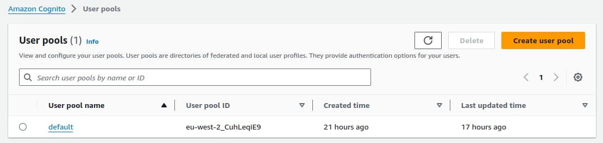
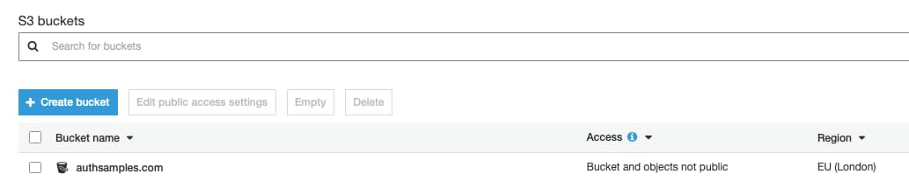
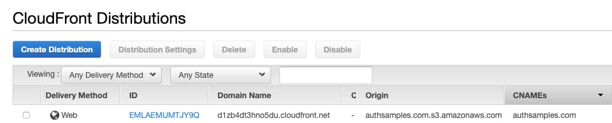
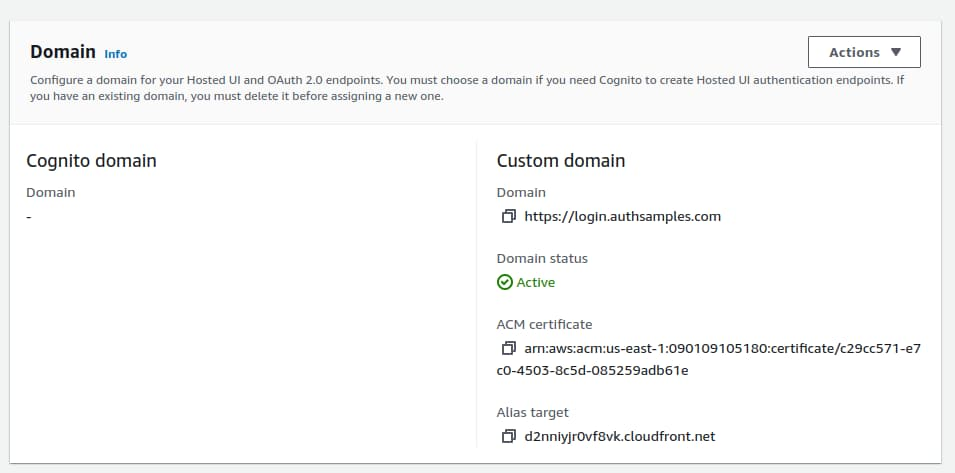
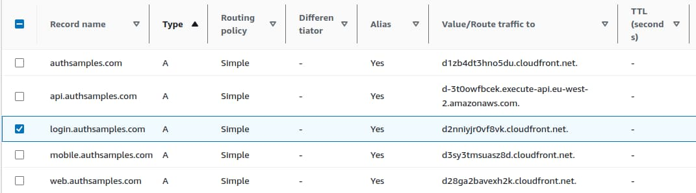
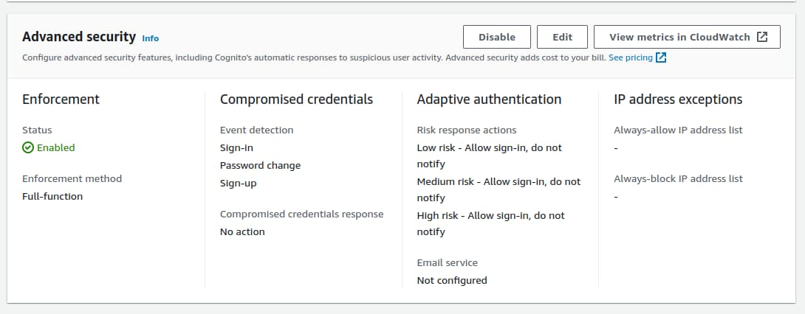
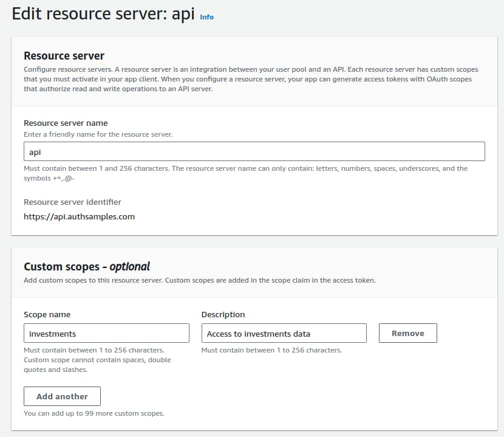
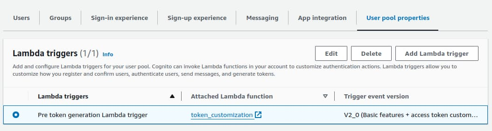

# Cloud Authorization Server Setup

Previously we explained our <a href='cloud-domain-setup.mdx'>Cloud Domain Setup</a> and next we will describe the more advanced configuration of AWS Cognito as a managed authorization server.

### Create the Authorization Server

In this blog I only use the standards-based authorization server role. In AWS terms this means I am using a *User Pool* with a *Hosted UI*. I started by navigating to Cognito in the AWS Console and created a user pool:



The basic configuration was described in the earlier post on <a href='oauth-infrastructure-setup.mdx'>OAuth Infrastructure Setup</a>. This included creating a user schema with custom fields used for authorization in APIs.

### Create a Custom Domain

For this blog, I wanted the authorization server to run at an internet URL of *https://login.authsamples.com*. For this to work in AWS, the root domain, located at *https://www.authsamples.com*, also has to be contactable. To enable this I first created an S3 bucket as a source for HTTP requests:



I then created a CloudFront Distribution for the root domain. We will cover further details of configuring S3 and CloudFront in the following post on SPA deployment.



Next I updated the user pool with the *Custom Authorization Server Subdomain* we defined in the previous post, and also referenced the *AWS Managed SSL Certificate*:



I then returned to Route 53 and added an *A Record* to associate the authorization server's subdomain to the above *Alias Target*. AWS then takes 15 minutes or so to make the domain available.



### Activate Advanced Features

I then activated Cognito advanced features, which did not add any noticeable increase in costs to my deployment. I chose the following options:



My only motivation for activating advanced features is to enable *Access Token Customisation* and issue fields from the user schema as claims. This is an essential OAuth behaviour for protecting data in APIs.

### Define Custom API Scopes

To define custom API scopes in AWS Cognito you must configure a *Resource Server*. In this blog’s code samples I use the generated identifier to represent a set of related APIs for the *investments* business area. Only clients that work with investments data would be assigned the investments scope and be able to successfully call this blog’s example APIs.



### Configure Token Customisation

I then created a [Pre-Token-Generation Lambda Trigger](https://docs.aws.amazon.com/cognito/latest/developerguide/user-pool-lambda-pre-token-generation.html), using the version 2 schema that supports access token customisation:



I added a lambda function with the following code:

```javascript
export const handler = function(event, context) {
  
  const response = {
    claimsAndScopeOverrideDetails: {
      idTokenGeneration: {
        claimsToSuppress: [
          'email',
          'email_verified',
          'given_name',
          'family_name',
          'custom:manager_id',
          'custom:role',
    	 ]
      },
      accessTokenGeneration: {
        claimsToAddOrOverride: {
    	 }
      }
    }
  };
  
  if (event.request.scopes.indexOf('https://api.authsamples.com/investments') !== -1) {
    const customClaims = response.claimsAndScopeOverrideDetails.accessTokenGeneration.claimsToAddOrOverride;
    customClaims.manager_id = event.request.userAttributes['custom:manager_id'];
    customClaims.role = event.request.userAttributes['custom:role'];
  }

  event.response = response;
  context.done(null, event);
};
```

The *claimsToSuppress* section is used to remove personal data from ID tokens, since my code samples instead get personal data from the Cognito user info endpoint.

The *claimsToAddOrOverride* section is used to customise access tokens. Claims are issued based on the client's scope so that different custom claims can be issued to different clients.

These claims provide convenient fields for APIs and produce a more complete access token. In many cases this helps to lock down the access token and reduce its privileges. This blog’s use of claims is further explained in the blog post on <a href='api-authorization-design.mdx'>API Authorization Behavior</a>.

### Where Are We?

We have completed the configuration of a low maintenance cloud authorization server and activated some advanced but essential features. Next we will describe how the SPA’s static content is deployed globally.

### Next

- Next we will explain this blog's <a href='cdn-static-content-delivery.mdx'>Web Content Delivery</a>
- For a list of all blog posts see the <a href='index.mdx'>Index Page</a>