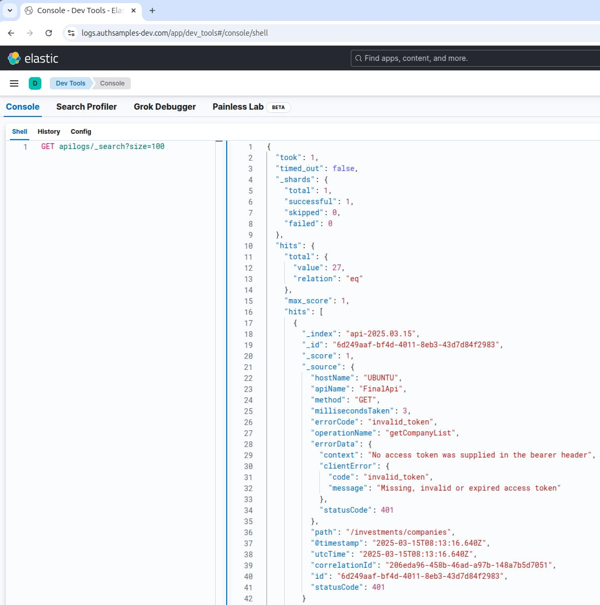

# .NET API – Code Details

In our previous post we described our <a href='net-core-api-oauth-integration.mdx'>.NET API OAuth Integration</a>. We will now drill into some final implementation details.

### Code Structure

Our advanced C# API consists of three main areas:

- REST Host
- API Business Logic
- Common Code (plumbing)

<div className='smallimage'>
    
</div>

In a real API platform, much of the plumbing folder could be extracted into one or more shared library references and there would be far less code.

### Application Startup Logic

As is standard for a .NET API, the startup logic is coded primarily in the following two classes:

| Class | Description |
| ----- | ----------- |
| Program | The application entry point |
| Startup | Manages REST and security specific behaviour |

The program class logic focuses on reading the configuration file and configuring logging:

```csharp
private static IWebHost BuildWebHost(ILoggerFactory loggerFactory)
{
    var configuration = Configuration.Load("./api.config.json");

    return new WebHostBuilder()
        .ConfigureServices(services =>
        {
            services.AddSingleton(loggerFactory);
            services.AddSingleton(configuration);
        })
        .ConfigureLogging(loggingBuilder =>
        {
            loggerFactory.Configure(loggingBuilder, configuration.Logging);
        })
        .UseKestrel(...)
        .UseStartup<Startup>()
        .Build();
}
```

### Dependency Composition

The main responsibility of these classes is to set up *Cross Cutting Concerns* which includes registering dependencies in the Microsoft IOC container:

```csharp
private void ConfigureBaseDependencies(IServiceCollection services)
{
    new BaseCompositionRoot()
        .UseOAuth(this.configuration.OAuth)
        .WithCustomClaimsProvider(new SampleCustomClaimsProvider())
        .WithLogging(this.configuration.Logging, this.loggerFactory)
        .WithProxyConfiguration(this.configuration.Api.UseProxy, this.configuration.Api.ProxyUrl)
        .WithServices(services)
        .Register();
}
```

### Middleware

Startup code creates various middleware classes, which are natural singletons, and some of them need to be registered with the container:

```csharp
private void ConfigureApiMiddleware(IApplicationBuilder api)
{
    api.UseMiddleware<LoggerMiddleware>();
    api.UseMiddleware<UnhandledExceptionMiddleware>();
    api.UseMiddleware<CustomHeaderMiddleware>();
}
```

The role of each of these middleware classes is summarised below:

| Middleware Class | Responsibility |
| ---------------- | -------------- |
| LoggerMiddleware | Manage the log entry for each API request, then log request and response details |
| CustomHeaderMiddleware | Allow advanced client side testing of APIs via custom headers |
| UnhandledExceptionMiddleware | A central place for handling exceptions, adding error details to logs, and producing the client error response |

### Single Threaded Code

For APIs with small dependency graphs, I like to reduce the likelihood of parallel requests  impacting each other. I do this by giving each request its own independent object instances. The API uses a request scope for REST specific objects, or a transient scope for domain logic classes:

```csharp
private void ConfigureApiDependencies(IServiceCollection services)
{
    services.AddTransient<SampleCustomClaimsProvider>();
    services.AddTransient<JsonReader>();
    services.AddTransient<CompanyRepository>();
    services.AddTransient<CompanyService>();
}
```

### High Throughput Requirement

All of this blog’s APIs will be non blocking, to prevent threads being tied up during I/O completion:


It is standard in .NET these days to be *async all the way*, starting at the controller entry point:

```csharp
[HttpGet("")]
public async Task<IEnumerable> GetCompanyListAsync()
{
    return await this.service.GetCompanyListAsync();
}
```

We then chain async calls together, all the way down to the actual I/O request, such as our JSON file reading (below), or network calls to the authorization server:

```csharp
public async Task<T> ReadDataAsync<T>(string filePath)
{
    string jsonText = await File.ReadAllTextAsync(filePath);
    return JsonConvert.DeserializeObject<T>(jsonText);
}
```

### Logging Implementation

API logging is also implemented via plumbing code, and the end goal is to enable <a href='api-technical-support-analysis.mdx'>platform wide technical support queries by people</a>.

<div className='smallimage'>
    
</div>

The log entry is a natural request scoped object so we use the following factory method to create it when another class first accesses it during the lifetime of an API request, then make it injectable:

```csharp
private void RegisterBaseDependencies()
{
    this.services.AddSingleton(this.loggingConfiguration);
    this.services.AddScoped<ILogEntry>(
        ctx =>
        {
            return this.loggerFactory.CreateLogEntry();
        });

    this.services.AddSingleton(this.httpProxy);
    this.services.AddSingleton<IHttpContextAccessor, HttpContextAccessor>();
}
```

The log entry is then injected into singleton middleware classes, which contribute data to logs at various points during the request life-cycle:

```csharp
public async Task Invoke(HttpContext context, ILogEntry logEntryParam)
{
    var logEntry = (LogEntry)logEntryParam;
    logEntry.Start(context.Request);

    await this.next(context);

    logEntry.End(context.Request, context.Response);
    logEntry.Write();
}
```

It is also possible to inject the log entry into business logic, so that extra data can be included in logs, as for the  below repository class, which contributes performance instrumentation:

```csharp
public class CompanyRepository
{
    public CompanyRepository(JsonReader jsonReader, ILogEntry logEntry)
    {
        this.jsonReader = jsonReader;
        this.logEntry = logEntry;
    }

    public async Task<IEnumerable<Company>> GetCompanyListAsync()
    {
        using (this.logEntry.CreatePerformanceBreakdown("getCompanyList"))
        {
            return await this.jsonReader.ReadDataAsync<IEnumerable<Company>>(@"./data/companyList.json");
        }
    }
}
```

Logging classes writes to a JSON log file and, if the <a href='log-aggregation-setup.mdx'>Log Aggregation Setup</a> is followed, logs will automatically flow to Elasticsearch:



The sample API uses fixed appenders and fixed JSON output formats. In a real API you may instead prefer to use [log4net XML configuration](https://logging.apache.org/log4net/release/manual/configuration.html), to enable logging behaviour to be dynamically altered without code changes.

### Error Handling Implementation

The API implements our <a href='error-handling-and-supportability.mdx'>Error Handling and Supportability</a> design. By default all errors escape to the global exception handler, whose role is to log errors and return an error response to the caller:

```csharp
public ClientError HandleException(Exception exception, HttpContext context)
{
    var logEntry = (LogEntry)context.RequestServices.GetService(typeof(ILogEntry));
    var configuration = (LoggingConfiguration)context.RequestServices.GetService(typeof(LoggingConfiguration));

    var error = ErrorUtils.FromException(exception);
    if (error is ServerError)
    {
        var serverError = (ServerError)error;
        logEntry.SetServerError(serverError);
        return serverError.ToClientError(configuration.ApiName);
    }
    else
    {
        ClientError clientError = (ClientError)error;
        logEntry.SetClientError(clientError);
        return clientError;
    }
}
```

This is very standard, but the art of good error handling is to design good error objects that are useful to both callers of the API and your technical support staff.

Error output has a *productive and readable* format, and production logs will also be rendered like this, including context such as which user, session, API and operation was involved:

```json
{
  "id": "0ff96924-1c02-469a-a5de-a1a6b7911ab2",
  "utcTime": "2022-12-10T13:25:40",
  "apiName": "FinalApi",
  "operationName": "GetCompanyTransactions",
  "hostName": "UBUNTU",
  "method": "GET",
  "path": "/investments/companies/4/transactions",
  "resourceId": "4",
  "clientName": "FinalSPA",
  "statusCode": 200,
  "errorCode": "unauthorized",
  "millisecondsTaken": 12,
  "correlationId": "d892c50e-c4fb-2e13-57c5-83389fc69c95",
  "sessionId": "004d32bc-9755-b50e-6315-5be09f277ebe",
  "errorData": {
    "statusCode": 401,
    "body": {
      "code": "unauthorized",
      "message": "Missing, invalid or expired access token"
    },
    "context": "JWT verification failed: Invalid signature."
  }
}
```

By default our exception handler treats unknown errors as general exceptions and returns a 500 response. For closer control of the response, the API’s code can throw a *ServerError* or *ClientError* derived instance:

```csharp
[HttpGet("{id}/transactions")]
public async Task<CompanyTransactions> GetCompanyTransactionsAsync(string id)
{
    int idValue;
    if (!int.TryParse(id, NumberStyles.Any, CultureInfo.InvariantCulture, out idValue) || idValue <= 0)
    {
        throw ErrorFactory.CreateClientError(
            HttpStatusCode.BadRequest,
            SampleErrorCodes.InvalidCompanyId,
            "The company id must be a positive numeric integer");
    }

    return await this.service.GetCompanyTransactionsAsync(idValue);
}
```

### Portability

The above code is very mainstream and the concepts can be easily followed in any technology stack. Our earlier Node.js API was almost identical.

### Where Are We?

We have implemented some foundational code in .NET without any blocking issues, and separated plumbing from other code. In a real API we could then focus on growing the business logic.

### Next

- Next we will implement our <a href='java-spring-boot-api-overview.mdx'>API Architecture in Java</a>
- For a list of all blog posts see the <a href='index.mdx'>Index Page</a>
