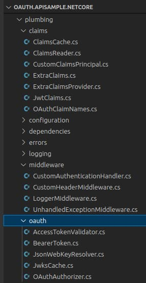
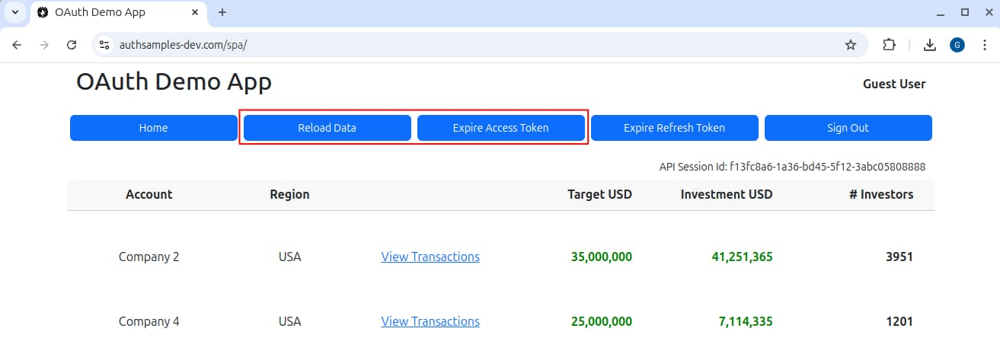
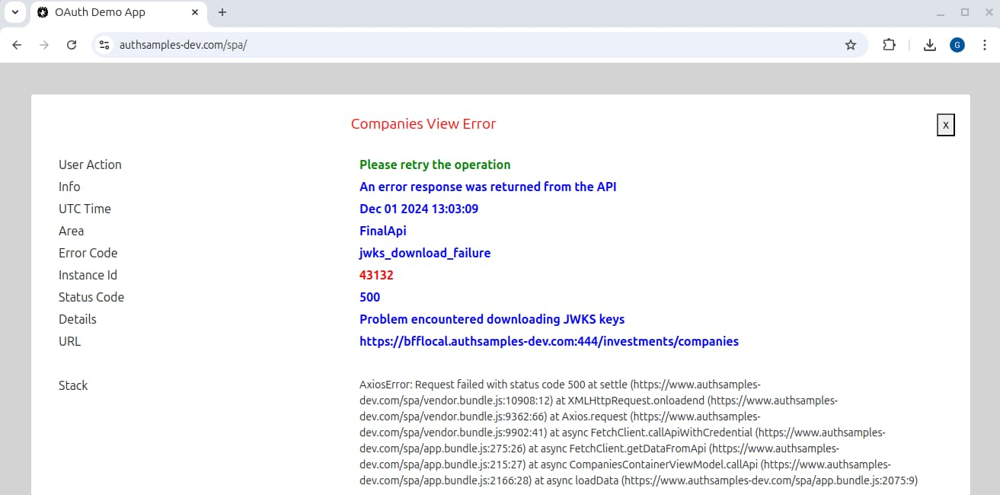

# .NET API – OAuth Integration

In our previous post we explained how to run this blog’s <a href='net-core-code-sample-overview.mdx'>Final .NET API</a> and its main behaviours. Next we will explain the custom OAuth integration.

### .NET API Defaults

By default .NET uses a framework based approach to OAuth security, where you add the [JwtBearer Middleware](https://www.nuget.org/packages/Microsoft.AspNetCore.Authentication.JwtBearer), then other details are looked up from the OpenID Connect metadata endpoint. For AWS Cognito, which does not include an audience claim in access tokens, this can be done as follows:

```csharp
private void ConfigureOAuth(IServiceCollection services)
{
    services
        .AddAuthentication(JwtBearerDefaults.AuthenticationScheme)
        .AddJwtBearer(options =>
        {
            options.Authority = this.configuration.IssuerBaseUrl;
            options.TokenValidationParameters = new TokenValidationParameters
            {
                ValidateAudience = false
            };
        });

    services.AddAuthorization(options =>
    {
        options.FallbackPolicy = new AuthorizationPolicyBuilder().RequireAuthenticatedUser().Build();
    });
}
```

You can then use an [AllowAnonymous](https://docs.microsoft.com/en-us/dotnet/api/microsoft.aspnetcore.authorization.allowanonymousattribute) annotation for any unsecured endpoints, and use [Authorization Policies](https://docs.microsoft.com/en-us/aspnet/core/security/authorization/policies) to check for required claims. To troubleshoot, you can configure a log level for the *Microsoft.AspNetCore.Authentication.JwtBearer* namespace.

```csharp
[HttpGet("{id}/transactions")]
[Authorize(Policy = "mypolicy")]
public async Task<CompanyTransactions> GetCompanyTransactionsAsync(string id)
{
    ...
}
```

When getting started with OAuth secured APIs you should use these defaults. Yet this blog’s .NET API focuses on some deeper requirements.

### Deeper Requirements

This blog’s .NET API will focus on customising default behaviour in order to meet the following requirements:

| Requirement | Description |
| ----------- | ----------- |
| Standards Based | We will use the same standards-based design patterns for OAuth security across Node.js, .NET and Java APIs. |
| Best Security | The [jose-jwt](https://github.com/dvsekhvalnov/jose-jwt) library will enable the most up to date and specialised security algorithms when dealing with JWTs. |
| Extensible Claims | APIs are in full control of the claims principal, to work around authorization server limitations or add values that should not be issued to access tokens. |
| Supportable | Identity and error details will be captured and included in logs, and JSON error responses will be customisable. |

In .NET our OAuth code will follow the same phases that are used by all of this blog’s APIs:

| Task | Description |
| ---- | ----------- |
| <a href='jwt-access-token-validation.mdx'>JWT Access Token Validation</a> | Downloading a JSON Web Key Set and verifying received JWTs |
| <a href='api-authorization-design.mdx'>API Authorization</a> | Creating a ClaimsPrincipal that includes useful claims, then applying them during authorization |

### Your .NET Secured API?

This API’s security implementation is meant to be thought provoking, to provide techniques for taking finer control over claims and error handling during secured requests. Some of these may be of interest to readers.

The API contains quite a bit of plumbing code though, to make the API code feel the same across technology stacks. For your own solution you may be able to meet similar requirements in alternative ways.

### OAuth API Configuration

The API uses a JSON configuration file with the following OAuth settings, which are the same as those used by the final Node.js API:

```json
{
  "oauth": {
    "issuer":                       "https://cognito-idp.eu-west-2.amazonaws.com/eu-west-2_CuhLeqiE9",
    "audience":                     "",
    "scope":                        "https://api.authsamples.com/investments",
    "jwksEndpoint":                 "https://cognito-idp.eu-west-2.amazonaws.com/eu-west-2_CuhLeqiE9/.well-known/jwks.json",
    "claimsCacheTimeToLiveMinutes": 15
  }
}
```

The meaning of each field is summarised in the following table:

| Field | Description |
| ----- | ----------- |
| issuer | The expected authorization server to be received in access tokens |
| audience | The audience in JWT access tokens represents a set of related APIs |
| scope | The business area for the API |
| jwksEndpoint | The location from which jose-jwt will use token signing public keys |
| claimsCacheTimeToLiveMinutes | The time for which extra claims, not present in access tokens, are cached |

### API Authorization

The API receives an access token with a payload of the following form. The scope of access is limited to investments data. The user’s business identity is a custom claim of *manager_id*, for a party who manages investments. Another custom claim for *role* is also issued to the access token:

```json
{
  "iss": "https://login.authsamples-dev.com",
  "aud": "api.authsamples.com",
  "scope": "openid profile investments",
  "sub": "a6b404b1-98af-41a2-8e7f-e4061dc0bf86",
  "manager_id": "10345",
  "role": "user",
  "exp": 1715630456.455
}
```

The API receives the main claims by processing the access token JWT, then does some more advanced work to deal with additional claims in an extensible way. The goal is to set up the API’s business logic with the most useful claims principal.

### Custom Authentication Handler

The *Startup* class wires up our API’s custom OAuth behaviour by creating a custom handler where, unless the authorization policy is overridden for a particular endpoint, the security will be applied:

```csharp
private void ConfigureOAuth(IServiceCollection services)
{
    string scheme = "Bearer";
    services.AddAuthentication(scheme)
            .AddScheme<AuthenticationSchemeOptions, CustomAuthenticationHandler>(scheme, null);

    services.AddAuthorization(options =>
    {
        options.FallbackPolicy = new AuthorizationPolicyBuilder().RequireAuthenticatedUser().Build();
    });
}
```

The implementation's main logic calls an *OAuthFilter* object, which ensures that the JWT access token is validated and that claims used for authorization can be controlled. The handler then customises API logs and error responses.

```csharp
protected override async Task<AuthenticateResult> HandleAuthenticateAsync()
{
    var logEntry = (LogEntry)this.Context.RequestServices.GetService(typeof(ILogEntry));
    logEntry.Start(this.Request);

    try
    {
        var filter = (OAuthFilter)this.Context.RequestServices.GetService(typeof(OAuthFilter));
        var claimsPrincipal = await filter.ExecuteAsync(this.Request);

        logEntry.SetIdentity(claimsPrincipal.JwtClaims.Sub);

        var ticket = new AuthenticationTicket(claimsPrincipal, new AuthenticationProperties(), this.Scheme.Name);
        return AuthenticateResult.Success(ticket);
    }
    catch (Exception exception)
    {
        var handler = new UnhandledExceptionMiddleware();
        var clientError = handler.HandleException(exception, this.Context);

        logEntry.End(this.Context.Request, this.Context.Response);
        logEntry.Write();

        this.Request.HttpContext.Items.TryAdd(ClientErrorKey, clientError);
        return AuthenticateResult.NoResult();
    }
}
```

### OAuth and Claims Code

A number of small classes are used to implement the desired behaviour. The main work is to validate the JWT received in the HTTP request, then return a *ClaimsPrincipal* that is useful to the rest of the API’s code.

<div className='smallimage'>
    
</div>

### JWT Access Token Validation

The *AccessTokenValidator* class wraps calls to the *jose-jwt* library and also makes some additional checks:

```csharp
public async Task ValidateTokenAsync(string accessToken)
{
    var claimsJson = string.Empty;
    try
    {
        var kid = this.GetKeyIdentifier(accessToken);
        if (kid == null)
        {
            throw ErrorFactory.CreateClient401Error("Unable to read the kid field from the access token");
        }

        var jwk = await this.jsonWebKeyResolver.GetKeyForId(kid);
        if (jwk == null)
        {
            throw ErrorFactory.CreateClient401Error($"The token kid {kid} was not found in the JWKS");
        }

        if (jwk.Alg != this.configuration.Algorithm)
        {
            throw ErrorFactory.CreateClient401Error($"The access token kid was not found in the JWKS");
        }

        claimsJson = JWT.Decode(accessToken, jwk);
    }
    catch (Exception ex)
    {
        throw ErrorUtils.FromTokenValidationError(ex);
    }

    var claims = new JwtClaims(claimsJson);
    this.ValidateProtocolClaims(claims);
    return claims;
}
```

There are a number of responsibilities that I would ideally like the JWT library to implement for an API:

| Responsibility | Description |
| -------------- | ----------- |
| JWKS Lookup | Downloading token signing public keys from the authorization server’s JWKS endpoint |
| JWKS Caching | Caching the above keys and automatically dealing with new lookups when the signing keys are recycled |
| Signature Checks | Cryptographically verifying the JSON Web Signature of received JWTs |
| Protocol Claim Checks | Checking that the token has the correct issuer and audience, and that it is not expired |

The jose.jwt library does not manage JWKS downloads, caching of JWKS keys, or checking issuer / audience claims. Therefore I wrote my own plumbing classes for a *JsonWebKeyResolver* and a *JwksCache*.

### Claims Principal

The claims principal for the sample API contains the custom fields listed below:

| Claim | Represents |
| ----- | ---------- |
| Scope | The scope for the API, which in this blog will be a  high level business area of *investments* |
| Subject | The user’s technical OAuth identity, generated by the authorization server |
| Manager ID | The business identity for a user, and in my example a manager is a party who administers investment data |
| Role | A role from which business permissions would be derived, about the level of access |
| Title | A business title for the user, which is displayed by frontend applications |
| Regions | An array claim meant to represent a more detailed business rule that does not belong in access tokens |

In code the *ClaimsPrincipal* class is represented like this, consisting of easy to use objects:

```csharp
public class CustomClaimsPrincipal : ClaimsPrincipal
{
    public CustomClaimsPrincipal(JwtClaims jwtClaims, ExtraClaims extraClaims)
        : base(GetClaimsIdentity(jwtClaims, extraClaims))
    {
        this.JwtClaims = jwtClaims;
        this.ExtraClaims = extraClaims;
    }

    public JwtClaims JwtClaims { get; private set; }

    public ExtraClaims ExtraClaims { get; private set; }
}
```

The claims can then be injected into business focused classes and used for authorization, so that there is full control over both data and logic:

```csharp
private bool IsUserAuthorizedForCompany(Company company)
{
    var isAdmin = this.claims.GetRole() == "admin";
    if (isAdmin)
    {
        return true;
    }

    var isUser = this.claims.GetRole() == "user";
    if (!isUser)
    {
        return false;
    }

    var extraClaims = this.claims.ExtraClaims as SampleExtraClaims;
    return extraClaims.Regions.Any(ur => ur == company.Region);
}
```

### OAuth Middleware

The *OAuthFilter* object encapsulates the overall OAuth work and deals with injecting claims into the claims principal when needed. In .NET it is also possible to add extra claims in an [OnTokenValidated](https://learn.microsoft.com/en-us/dotnet/api/microsoft.aspnetcore.authentication.jwtbearer.jwtbearerevents.ontokenvalidated) event handler.

```csharp
public async Task<CustomClaimsPrincipal> ExecuteAsync(HttpRequest request)
{
    var accessToken = BearerToken.Read(request);
    if (string.IsNullOrWhiteSpace(accessToken))
    {
        throw ErrorFactory.CreateClient401Error("No access token was received in the bearer header");
    }

    var jwtClaims = await this.accessTokenValidator.ValidateTokenAsync(accessToken);

    var accessTokenHash = this.Sha256(accessToken);
    var extraClaims = await this.cache.GetExtraUserClaimsAsync(accessTokenHash);
    if (extraClaims != null)
    {
        return this.extraClaimsProvider.CreateClaimsPrincipal(jwtClaims, extraClaims);
    }

    extraClaims = await this.extraClaimsProvider.LookupExtraClaimsAsync(jwtClaims, request.HttpContext.RequestServices);
    await this.cache.SetExtraUserClaimsAsync(accessTokenHash, extraClaims, jwtClaims.Exp);
    return this.extraClaimsProvider.CreateClaimsPrincipal(jwtClaims, extraClaims);
}
```

This technique adds complexity and is best avoided in most APIs. Yet this type of design can prove useful if you  run into productivity problems, where many fine-grained authorization values are managed in the authorization server.

If so, this is one possible way to ensure a stable access token and avoid needing to frequently deploy APIs and the authorization server together. It keeps the claims principal useful to the API’s logic, and reduces the need for access token versioning.

### OAuth Error Responses

The API implements this blog’s <a href='error-handling-and-supportability.mdx'>Error Handling Design</a>, starting by handling invalid or expired tokens. In a test client we can simulate a 401 error by clicking *Expire Access Token* followed by *Reload Data*:



This results in an invalid access token being sent to the API, which returns an error response in its standard format:

| Data | Description |
| ---- | ----------- |
| HTTP Status | The appropriate HTTP status is returned |
| Payload | A JSON error object containing *code* and *message* fields |

In total the following security related HTTP status codes may be returned:

| Status | Description |
| ------ | ----------- |
| 401 | Access token is missing, invalid or expired |
| 403 | The access token does not contain a required scope |
| 404 | A *Not Found for User* error is returned if a resource is requested that claims do not allow |
| 500 | A technical problem during OAuth processing, such as a network error downloading JWKS keys |

A 500 error is shown below, and developers can view this type of request by following the <a href='http-debugging-setup.mdx'>HTTP Proxy</a> tutorial:


The client can then take various types of action based on HTTP status and error code returned. For server errors, user facing apps display details that may be useful for technical support staff:



### Identity and API Logs

API logs include details about OAuth errors, which helps when there is a configuration problem:

```json
{
  "id": "b3629a0d-fc73-46b7-a3ca-6115963e8e43",
  "utcTime": "2022-12-10T13:17:28",
  "apiName": "FinalApi",
  "operationName": "GetCompanyTransactions",
  "hostName": "UBUNTU",
  "method": "GET",
  "path": "/investments/companies/2/transactions",
  "resourceId": "2",
  "clientName": "FinalSPA",
  "statusCode": 200,
  "errorCode": "unauthorized",
  "millisecondsTaken": 43,
  "correlationId": "b091ec8e-a1d0-dbf9-f764-012cc730c925",
  "sessionId": "004d32bc-9755-b50e-6315-5be09f277ebe",
  "errorData": {
    "statusCode": 401,
    "body": {
      "code": "invalid_token",
      "message": "Missing, invalid or expired access token"
    },
    "context": "JWT verification failed: Invalid signature."
  }
}
```

Once a JWT is validated, its generated subject claim, most commonly a UUID, is also written to logs. This can potentially help to track users in benign ways, for technical support purposes. This requires care, and is discussed further in the <a href='effective-api-logging.mdx'>Effective API Logging</a> post.

### Where Are We?

We have implemented .NET API Security in a requirements first manner, to enable behaviour that is likely to be important for any OAuth secured API, regardless of technology.

### Next

- Next I provide a <a href='net-core-api-coding-model.mdx'>.NET API Code Details</a>.
- For a list of all blog posts see the <a href='index.mdx'>Index Page</a>.
