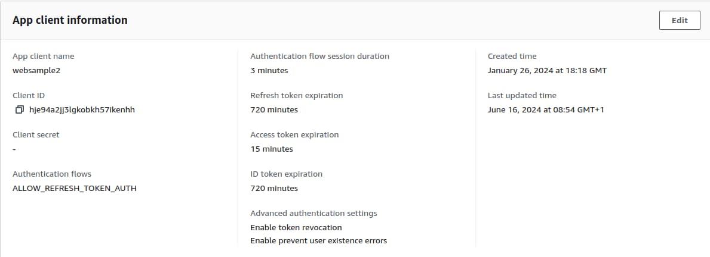

# OAuth Infrastructure Setup

The previous post explained <a href='jwt-access-token-validation.mdx'>JWT Access Token Validation</a> for developers. Next, I show how to get started with your OAuth infrastructure, including the main security component, the authorization server.

### Step 1: Define Base URLs

When working with OAuth, I recommend designing URLs for a development computer, to enable the most productive setups. I use the following base URLs for this blog’s code samples:

| Development Base URL | Description |
| -------------------- | ----------- |
| *https://www.authsamples-dev.com* | A base URL for web applications |
| *https://api.authsamples-dev.com* | A base URL for APIs |
| *https://login.authsamples.com* | The Authorization Server |

For this blog, I purchased a <a href='cloud-domain-setup.mdx'>cloud domain</a> called *authsamples.com* and used various subdomains for different purposes. When you run this blog's code samples, you use a mix of components, some of which run on your local computer and some of which run in the cloud.

The ones that run locally use a domain called *authsamples-dev.com*. This is a fictional domain that is an alias to your local loopback address of *http://127.0.0.1*. You configure subdomain aliases in your local computer's *hosts file*, at one of these locations:

| Operating System | Path |
| ---------------- | ---- |
| Windows | c:\system32\drivers\etc\hosts |
| macOS / Linux | /etc/hosts |

For the first code sample, you configure the following subdomains. By using real-world URLs on a development computer you can plan deployments and do early verification of their reliability:

```markdown
127.0.0.1 www.authsamples-dev.com api.authsamples-dev.com
```

### Step 2: Choose an Initial Authorization Server

By default, this blog’s code samples point to my low cost deployment of the AWS Cognito authorization server at *https://login.authsamples.com*. Anyone can run frontend code samples that point to it, then sign in and run an OAuth application lifecycle.


A key point when starting with OAuth is to point your apps to HTTPS endpoints developed by security experts rather than having to write or build the code for the authorization server. Choose one of these options initially, which are typically free for developers:

| Type | Description |
| ---- | ----------- |
| Cloud Hosted | A cloud platform’s authorization server, such as those from AWS or Microsoft, with internet OAuth endpoints. |
| Cloud Native | A docker based authorization server, with local OAuth endpoints and better visibility into how the authorization server works. |

Either provides a convenient option when getting started with OAuth. This blog shows how to integrate user-facing apps and APIs, using portable code. Your applications are then compliant with any standards-based authorization server.

### Step 3: Create the User Accounts Schema

You configure the authorization server to store user accounts that contain <a href='user-data.mdx'>user identity core attributes</a>. The authorization server can include user attributes as claims in access tokens issued to clients. Clients then call APIs, which authorize requests using access token claims. For this blog I created account records with custom user attributes of *manager_id* and *role*.


### Step 4: Create Test User Accounts

In the authorization server I acted as an administrator to create two initial user accounts for testing and populated their user fields. Any reader of this blog can sign into my code samples with these user accounts.


The test logins for this blog use the following usernames and are intended to encourage thought about user rights. A user sometimes has both organizational and personal privileges that need to be managed by your OAuth security.

- *guestuser@example.com*
- *guestadmin@example.com*

### Step 5: Configure the Login User Experience

An authorization server should enable many possible ways for users to authenticate. For this blog I only enable basic logins, where an email and password are entered for the above test user accounts.


This blog’s frontend code samples all perform an authorization code flow and therefore support many other ways to authenticate users. To update to a different method, you would reconfigure your authorization server. No application code would need to change.

### Step 6: Locate Open ID Connect Metadata

Authorization servers have a base URL and usually publish OpenID Connect metadata at a subpath of *.well-known/openid-configuration*. This *discovery endpoint* provides the locations of particular endpoints that applications use. For example, clients connect to the *authorization endpoint* to initiate user authentication and to the *token endpoint* to get access tokens.

- [https://cognito-idp.eu-west-2.amazonaws.com/eu-west-2_CuhLeqiE9/.well-known/openid-configuration](https://cognito-idp.eu-west-2.amazonaws.com/eu-west-2_CuhLeqiE9/.well-known/openid-configuration)

```json
{
  "authorization_endpoint": "https://login.authsamples.com/oauth2/authorize",
  "end_session_endpoint": "https://login.authsamples.com/logout",
  "id_token_signing_alg_values_supported": [
    "RS256"
  ],
  "issuer": "https://cognito-idp.eu-west-2.amazonaws.com/eu-west-2_CuhLeqiE9",
  "jwks_uri": "https://cognito-idp.eu-west-2.amazonaws.com/eu-west-2_CuhLeqiE9/.well-known/jwks.json",
  "response_types_supported": [
    "code",
    "token"
  ],
  "revocation_endpoint": "https://login.authsamples.com/oauth2/revoke",
  "scopes_supported": [
    "openid",
    "email",
    "phone",
    "profile"
  ],
  "subject_types_supported": [
    "public"
  ],
  "token_endpoint": "https://login.authsamples.com/oauth2/token",
  "token_endpoint_auth_methods_supported": [
    "client_secret_basic",
    "client_secret_post"
  ],
  "userinfo_endpoint": "https://login.authsamples.com/oauth2/userInfo"
}
```

### Step 7: Register OAuth Clients

Frontend apps are registered as OAuth clients using an administration user interface, where you configure fields such as *Client ID*, *Redirect URI* and *Scope*.


### Step 8: Configure Token Lifetimes

The configuration of OAuth clients includes token lifetimes. This blog’s code samples use the following example values:

- The access token lifetime is *15 minutes* and access tokens may expire multiple times during the user’s authenticated session.
- The refresh token lifetime is *12 hours*, which becomes the maximum time for the user’s authenticated session against APIs.
- The ID token lifetime is also *12 hours*, though this time is not used.



### Step 9: Configure Applications

You configure applications with OAuth settings, whose values you provide as input to security libraries. In application code I store these in one or more *Configuration* objects. In this blog I use JSON configuration files to populate that object in a natural way. If you prefer you can use other options, such as environment variables.

The *authority* URL is typically the base URL of the authorization server. You can often provide this value as input to security libraries, which append the metadata path and call the OpenID Connect discovery endpoint. Therefore, you avoid the need to configure multiple endpoints in frontend applications.

```json
{
    "app": {
        "apiBaseUrl":       "https://api.authsamples-dev.com/api"
    },
    "oauth": {
        "authority":        "https://cognito-idp.eu-west-2.amazonaws.com/eu-west-2_CuhLeqiE9",
        "clientId":         "62raqvncbki418n3ckl59uf0f4",
        "redirectUri":      "https://www.authsamples-dev.com/spa",
        "scope":            "openid profile"
    }
}
```

The OAuth configuration for an API focuses on how it validates OAuth access tokens, and downloads token signing public keys:

```json
{
    "api": {
        "port": 443,
        "trustedOrigins": [
            "https://www.authsamples-dev.com"
        ],
        "useProxy": false,
        "proxyUrl": "http://127.0.0.1:8888"
    },
    "oauth": {
        "jwksEndpoint": "https://cognito-idp.eu-west-2.amazonaws.com/eu-west-2_CuhLeqiE9/.well-known/jwks.json",
        "algorithm": "RS256",
        "issuer": "https://cognito-idp.eu-west-2.amazonaws.com/eu-west-2_CuhLeqiE9",
        "audience": ""
    }
}
```

### Step 10: Build Apps that use OAuth Standards

A key objective should be to use security libraries so that you integrate OAuth in a standards-based and portable manner. In this blog I never use vendor-specific libraries to integrate with the authorization server:

| Area | Description |
| ---- | ----------- |
| Clients | Getting logins working in a user friendly way, along with related operations such as user creation and password recovery. |
| APIs | Protecting data with OAuth, using access token validation and claims-based authorization. |

### Step 11: Clarify Requirements

During the journey of integrating OAuth into apps, you will form a better idea of what you need from the authorization server. Before committing to a vendor, ensure there are no blocking issues in your end-to-end flows, in areas such as user account fields, claims issuance and the user authentication methods that you need to use.

If your initial choice of authorization server does not meet your requirements you can then spend some time reviewing alternative choices. When your clients and APIs integrate OAuth in a standards-based way, switching authorization servers requires only minimal changes to application code.

### Where Are We?

I explained a thought process for an initial setup, to get started with OAuth development, while giving you time to learn and keep your options open. In a later post I provide further details on the <a href='managed-authorization-server-setup.mdx'>Cloud Authorization Server Setup</a>.

### Next

- Next I explain this blog’s <a href='web-technology-setup.mdx'>JavaScript Technology Setup</a>.
- For a list of all blog posts see the <a href='index.mdx'>Index Page</a>.