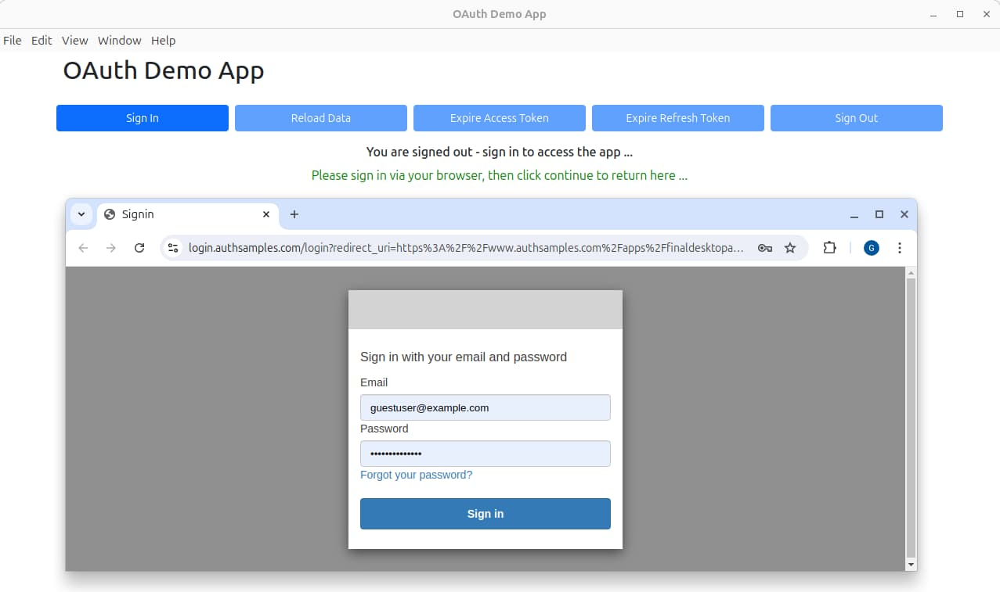

# Code Samples Quick Start

This page briefly summarises the blog’s final code samples, which use only fictional data and user accounts. They include frontends that call cloud hosted APIs and a cloud hosted authorization server. For each app, you can use one of the following credentials to sign in:

- Demo user with low privileges: *guestuser@example.com*
- Demo user with high privileges: *guestadmin@example.com*
- Password: *GuestPassword1*

### Secured Single Page Application

The React SPA implements OpenID Connect using the *Token Handler Pattern*. It uses SameSite cookies to transport short-lived access tokens to APIs, while also enabling pure SPA development and deployment.

I deploy the SPA to many global locations using AWS CloudFront. Anyone can run the app via the below link:

- [https://www.authsamples.com](https://www.authsamples.com)

Alternatively, you can follow the <a href='how-to-run-the-react-js-spa.mdx'>Final SPA Instructions</a> to run the app's code locally and connect it to cloud-hosted API endpoints. In either case, sign in with one of the test accounts:

### Secured Desktop App

The cross platform Electron React app runs on Windows, macOS and Linux. The [AppAuth-JS Library](https://github.com/openid/AppAuth-JS) implements Open ID Connect and logins use the system browser:

The app receives login responses on a redirect URI that uses a private-use URI scheme. To run the app on your local computer you can follow the <a href='final-desktop-sample-overview.mdx'>Final Desktop App Instructions</a>.

### Secured Android App

The Android App is a Single Activity App that uses Kotlin and Jetpack Compose. The [Android AppAuth Library](https://github.com/openid/AppAuth-Android) implements OpenID Connect and the app receives login responses on HTTPS redirect URIs, registered as Android app links.

    

Logins run on a *Chrome Custom Tab*, with modern security and good usability. To run the app from Android Studio you can follow the <a href='basicandroidapp-execution.mdx'>Android Code Sample Instructions</a>.

    

### Secured iOS App

The [iOS AppAuth Library](https://github.com/openid/AppAuth-iOS) implements OpenID Connect and the app receives login responses on HTTPS redirect URIs, registered as iOS universal links.

    

Logins run on Apple’s *ASWebAuthenticationSession* window. To run the app from Xcode you can follow the <a href='how-to-run-the-ios-code-sample.mdx'>iOS Code Sample Instructions</a>.

    

### API and Client Behaviors

APIs support the frontend code samples and help to ensure reliable end-to-end flows. The following posts walk through the key technical behaviours that I use for both APIs and clients, to achieve a modern and productive architecture.

- <a href='api-journey-server-side.mdx'>API Journey – Server Side</a>
- <a href='api-journey-client-side.mdx'>API Journey – Client Side</a>

### Next

- Return to the <a href='home.mdx'>Home Page</a>.
- For a list of all blog posts see the <a href='index.mdx'>Index Page</a>.
