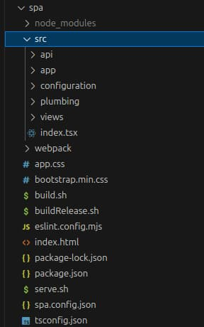

# Final SPA – Code Details

Previously I explained <a href='how-to-run-the-react-js-spa.mdx'>How to Run the Final SPA</a>, which uses cookies to transport short-lived access tokens to APIs. Next I describe the main changes to the SPA's code, with a particular focus on API requests. See also the <a href='api-journey-client-side.mdx'>Client Side API Journey</a> for a summary of the requirements being met.

### Previous Samples

I provided two earlier plain TypeScript SPA and API code samples:

| Solution | Description |
| -------- | ----------- |
| <a href='basicspa-codingkeypoints.mdx'>Code Sample 1</a> | Authorization code flow with PKCE, calling APIs with access tokens and handling 401 responses. |
| <a href='updated-spa-coding-key-points.mdx'>Code Sample 2</a> | Added in-memory token storage, silent token renewal and logout, to complete the SPA's session management. |

These earlier SPAs used access tokens in the browser, which is no longer recommended. Therefore, the final SPA instead uses utility API components that issue cookies, so that API credentials are unavailable to JavaScript code.

### SPA Code

The final SPA is a React app that runs at a */spa* path. Additional paths, for other micro-frontends, could run within the same web domain, to keep the code base manageable as it grows:

<div className='smallimage'>
    
</div>

From a security viewpoint, any additional apps added to the web domain should be for the same business area. All apps then share each other’s API cookies and also each other’s cross site scripting threats.

### HTML Markup

The final SPA uses the same HTML markup as earlier SPAs:

```html
<!DOCTYPE html>
<html lang='en'>
    <head>
        <meta charset='utf-8'>
        <meta name='viewport' content='width=device-width, initial-scale=1, shrink-to-fit=no'>

        <base href='/spa/' />
        <title>OAuth Demo App</title>

        <link rel='stylesheet' href='bootstrap.min.css'>
        <link rel='stylesheet' href='app.css'>
    </head>
    <body>
        <div id='root' class='container'></div>

        <script type='module' src='vendor.bundle.js'></script>
        <script type='module' src='react.bundle.js'></script>
        <script type='module' src='app.bundle.js'></script>
    </body>
</html>
```

### Web Host

The final SPA could use any web static content host, but this component should always be lightweight and never interferes with the frontend experience. For development I use the full-featured Express HTTP server for local testing of production web behaviours, like its content security policy. The web host's logic serves the SPA’s static content from the */spa* folder. Other folders could be added in future, for additional micro-frontends:

```typescript
public initialise(): void {

    const spaBasePath = '/spa/';
    const spaRoot = this._getSpaFilesBasePath();
    this._express.use(spaBasePath, express.static(spaRoot));

    this._express.get('*', (request, response) => {

        const requestPath = request.path.toLowerCase();
        if (requestPath === '/favicon.ico') {

            const root = this._getRootFilesBasePath();
            response.sendFile('favicon.ico', {root});

        } else if (requestPath.startsWith(spaBasePath)) {

            response.sendFile('index.html', {root: spaRoot});

        } else {

            response.redirect(spaBasePath);
        }
    });
}
```

When required, I can also deploy the web host in local docker-based deployments, such as to a development Kubernetes cluster. You can test a docker compose deployment of the web host with these commands:

```bash
./deployment/docker-local/build.sh
./deployment/docker-local/deploy.sh
./deployment/docker-local/teardown.sh
```

### React Library Setup

The SPA no longer uses a JavaScript security library to implement OpenID Connect. Instead, the *package.json* dependencies focus mainly on view-related logic and API requests.

```json
"dependencies": {
  "axios": "^1.7.2",
  "guid-typescript": "^1.0.9",
  "js-event-bus": "^1.1.1",
  "react": "^18.3.2",
  "react-dom": "^18.3.0",
  "react-modal": "^3.16.1",
  "react-router-dom": "^6.23.1"
}
```

### Entry Point

The entry point to the SPA begins with an *index.tsx* file. The SPA uses the React router to implement path-based routing. The router uses the base path expressed in the *index.html* file:

```typescript
import React, {StrictMode} from 'react';
import ReactDOM from 'react-dom/client';
import {BrowserRouter} from 'react-router-dom';
import {App} from './app/app';
import {AppViewModel} from './app/appViewModel';
import {BasePath} from './plumbing/utilities/basePath';
import {ErrorBoundary} from './views/errors/errorBoundary';

const props = {
    viewModel: new AppViewModel(),
};

const root = ReactDOM.createRoot(document.getElementById('root') as HTMLElement);
root.render (
    <StrictMode>
        <ErrorBoundary>
            <BrowserRouter basename={BasePath.get()}>
                <App {...props} />
            </BrowserRouter>
        </ErrorBoundary>
    </StrictMode>
);
```

### Routes and Navigation

In the *app.tsx* module of the main SPA, views now use JSX syntax. Routes enable users to navigate and swap out the main area of the SPA.

```jsx
return (
    <>
        <TitleView {...getTitleProps()} />
        <HeaderButtonsView {...getHeaderButtonProps()} />
        {model.error && <ErrorSummaryView {...getErrorProps()} />}
        {model.isLoaded &&
            <>
                <SessionView {...getSessionProps()} />
                <Routes>
                    <Route path='/companies/:id' element={<TransactionsContainer {...getTransactionsProps()} />} />
                    <Route path='/loggedout'     element={<LoginRequiredView {...getLoginRequiredProps()} />} />
                    <Route path='/*'             element={<CompaniesContainer {...getCompaniesProps()} />} />
                </Routes>
            </>
        }
    </>
);
```

### Mobile First Layout

I deploy the demo SPA’s static content to the AWS content delivery network. Since it is available online, I used Bootstrap's features to make the mobile layout basically presentable. In the transactions view the following markup shows 3 items per row on large screens, 2 items per row on medium screens and only a single item per row on small mobile devices:

```jsx
<div className='col-lg-4 col-md-6 col-xs-12' key={transaction.id} />
```

The transactions mobile view therefore shows a single card per transaction in mobile resolutions:

<div className='smallimage'>
    
</div>

The companies list becomes too squashed up for smaller sizes, so mobile layouts render a different view of the data:

```jsx
return  (
    <>
        {state.error && <ErrorSummaryView {...getErrorProps()}/>}
        {state.companies.length > 0 && (props.isMobileLayout ?
            <CompaniesMobileView {...getChildProps()}/> :
            <CompaniesDesktopView {...getChildProps()}/>)}

    </>
);
```

At mobile dimensions the companies list now uses a card-based layout rather than a grid based layout:

<div className='smallimage'>
    
</div>

### Views, View Models and State

React manages rendering when *state* changes, and views get created with *props*. I also like to use *view models* to handle operations such as API calls, and to keep the view classes focused on presentation:

```typescript
export interface CompaniesContainerProps {
    isMobileLayout: boolean;
    viewModel: CompaniesContainerViewModel;
}
```

Views get recreated frequently, whereas I manage application state within view model classes that get created only once. I manage this by storing child view model references within the root *AppViewModel*:

```typescript
public getCompaniesViewModel(): CompaniesContainerViewModel {

    if (!this._companiesViewModel) {

        this._companiesViewModel = new CompaniesContainerViewModel(
            this.fetchClient!,
            this._eventBus,
            this._viewModelCoordinator!,
        );
    }

    return this._companiesViewModel;
}
```

This technique is a basic but portable way to manage application state in frontend applications. Later in this blog I use the same pattern for Swift and Kotlin mobile apps.

### Separation of View Logic from General Logic

I use the React framework’s hook-based syntax to develop the SPA’s views. In mobile development I use other frameworks, such as SwiftUI, which have their own view syntax.

```typescript
export function CompaniesContainer(props: CompaniesContainerProps): JSX.Element {

    const model = props.viewModel;
    model.useState();

    useEffect(() => {
        startup();
        return () => cleanup();
    }, []);
}
```

I avoid the use of frameworks like React or SwiftUI for non-view logic, such as that for API and OAuth requests. This leads to more natural object-based code that is easier to port across technologies.

### Triggering API Requests

For views that call APIs, data loading typically begins when the [useEffect hook](https://reactjs.org/docs/hooks-effect.html) executes. The view’s *startup* method calls a *loadData* method to trigger API requests. The *Reload Data* button also invokes the *loadData* method.

```typescript
async function startup(): Promise<void> {
    model.eventBus.on(EventNames.ReloadData, onReload);
    await loadData();
}
```

The code to call APIs originates in the view, which forwards the request to its view model. On completion of each API request the view model rebinds any data or error values to the React state, to trigger a rendering update in the view:

```typescript
async function loadData(options?: ViewLoadOptions): Promise<void> {
    await model.callApi(options);
}
```

The view model logic is business-focused and uses a *fetch* client to deal with lower level aspects. The *ViewModelCoordinator* object provides a mechanism to trigger a new login redirect when the API session expires:

```typescript
public async callApi(options?: ViewLoadOptions): Promise<void> {

    const fetchOptions = {
        cacheKey: FetchCacheKeys.Companies,
        forceReload: options?.forceReload || false,
        causeError: options?.causeError || false,
    };

    this._viewModelCoordinator.onMainViewModelLoading();
    this._updateError(null);

    try {

        const result = await this._fetchClient.getCompanyList(fetchOptions);
        if (result) {
            this._updateCompanies(result);
        }

    } catch (e: any) {

        this._updateError(ErrorFactory.fromException(e));
        this._updateCompanies([]);

    } finally {

        this._viewModelCoordinator.onMainViewModelLoaded(fetchOptions.cacheKey);
    }
}
```

### Concurrent API Requests

In previous code samples, API requests ran in a sequential manner, and error handling was also sequential:

- First the main view called the API to get data and render results in the main area of the page.
- Next the userinfo view called the API, then displayed the user name in the top right.


In a real-world SPA it is more likely that multiple API requests could be in-flight at the same time. Therefore, the final SPA makes API requests in parallel. When React renders its tree of views, multiple fetch requests fire and their ordering is not deterministic.

### Concurrent View Errors

In the event of a view experiencing a problem it renders its own *Error Summary View*. You can rehearse concurrent API errors if you long press the *Reload Data* button for a few seconds. The SPA then renders an error link for each view that made a failed API request:


When clicked, a summary view uses a React modal dialog to display the *Error Details View* from earlier code samples. The final SPA uses an error display with details to help enable fast problem resolution.


Before any such concurrent API requests can run, the SPA must calculate the user's authentication status, then initiate a login to get an access token with which it can call APIs.

### Getting the User's Authenticated Status

Clients that use tokens can determine whether the user is authenticated by the presence of tokens, which is the technique I use for native apps later in this blog. For SPAs with cookies, I use a similar technique of storing a boolean *isLoggedIn=true* flag in local storage. Initially, this flag is not set and the SPA must initiate user authentication.

### Login Detection

The fetch client throws an error with a *login_required* error code when it is asked to call APIs but *isLoggedIn* is not set to true. For the final SPA this error could occur concurrently, so the SPA handles the condition using a *ViewModelCoordinator* object. After all view models have tried to load, if there is one or more errors with a *login_required* error code, an event is published. This main application view subscribes to this event and then triggers a login redirect.

```typescript
private _handleErrorsAfterLoad(): void {

    if (this._loadedCount === this._loadingCount) {

        const errors = this._getLoadErrors();

        const loginRequired = errors.find((e) => e.errorCode === ErrorCodes.loginRequired);
        if (loginRequired) {
            this._eventBus.emit(EventNames.LoginRequired, new LoginRequiredEvent());
            return;
        }
    }
}
```

### API Driven OpenID Connect

The final SPA continues to drive its own authentication flow, with the help of a remote OAuth agent. The SPA uses the following operations and this blog's earlier SPA code examples used pretty much the same interface.

```typescript
export interface Authenticator {
    isLoggedIn(): boolean;
    login(currentLocation: string): Promise<void>;
    handlePageLoad(): Promise<string | null>;
    logout(): Promise<void>;
    clearLoginState(): void;
    synchronizedRefresh(): Promise<void>
    expireAccessToken(): Promise<void>;
    expireRefreshToken(): Promise<void>;
}
```

The SPA begins a login by getting an authorization request URL from the OAuth agent and then redirecting the entire window to it:

```typescript
public async login(currentLocation: string): Promise<void> {

    try {

        const response = await this._callOAuthAgent('POST', 'login/start');
        HtmlStorageHelper.preLoginLocation = currentLocation;
        location.href = response.authorizationRequestUrl;

    } catch (e) {

        throw ErrorFactory.fromLoginOperation(e, ErrorCodes.loginRequestFailed);
    }
}
```

The page load handler processes the login response. The result is to issue encrypted session cookies, which contain the underlying OAuth tokens, to the browser.

```typescript
public async handlePageLoad(): Promise<string | null> {

    if (location.search) {

        const args = new URLSearchParams(location.search);
        const state = args.get('state');
        if (state) {

            try {

                const request = {
                    pageUrl: location.href,
                };
                const response = await this._callOAuthAgent(
                    'POST',
                    'login/end',
                    request) as EndLoginResponse;

                if (!response.handled) {
                    throw ErrorFactory.fromInvalidLoginResponse();
                }

                HtmlStorageHelper.isLoggedIn = true;
                return HtmlStorageHelper.getAndRemovePreLoginLocation() || '/';

            } catch (e: any) {

                if (this._isSessionExpiredError(e)) {
                    return null;
                }

                throw ErrorFactory.fromLoginOperation(e, ErrorCodes.loginResponseFailed);
            }
        }
    }

    return null;
}
```

The SPA retains full control over login usability. Rather than using a few lines of code to interact with the *oidc-client-ts* library, the SPA instead uses a few lines of code to interact with its OAuth agent.

### API Requests with Cookies

After login the SPA uses *HttpOnly SameSite=strict Secure* cookies to call APIs. The SPA must use the *withCredentials* flag to instruct the browser to send cookies to its backend for frontend. The SPA sends a custom header to enforce CORS preflight requests, as a CSRF prevention best practice. The SPA also sends some custom headers to the API for logging purposes.

```typescript
private async _callApiWithCredential(
    method: Method,
    url: string,
    fetchOptions: FetchOptions,
    dataToSend: any): Promise<any> {

    const headers: any = {
        'token-handler-version':        '1',
        'x-authsamples-api-client':     'FinalSPA',
        'x-authsamples-session-id':     this._sessionId,
        'x-authsamples-correlation-id': Guid.create().toString(),
    };

    const requestOptions = {
        method,
        url,
        data: dataToSend,
        headers,
        withCredentials: true,
    } as AxiosRequestConfig;

    const response = await axios.request(requestOptions);
    return response.data;
}
```

When the current access token expires, the SPA makes a token refresh request to get new tokens and rewrite cookies with new tokens. The SPA then retries the original API request with updated cookies. It is also possible that the user could close all browser windows when the *isLoggedIn=true* flag is set. The next time the user runs the app, session cookies are no longer present and APIs return 401 responses. The SPA, and this blog's native apps, cope reliably with these conditions using the following overall algorithm for API requests:

```typescript
if (!this._authenticator.isLoggedIn()) {
    throw loginRequiredError;
}

try {
    return await this._callApiWithCredential(method, url, options, dataToSend);

} catch (e1: any) {

    const error1 = ErrorFactory.fromHttpError(e1, url, 'API');
    if (error1.statusCode !== 401) {
        throw error1;
    }

    try {
        await this._authenticator.synchronizedRefresh();

    } catch (e2: any) {

        throw ErrorFactory.fromHttpError(e2, url, 'API');
    }

    try {

        return await this._callApiWithCredential(method, url, options, dataToSend);

    }  catch (e3: any) {
        throw ErrorFactory.fromHttpError(e3, url, 'API');
    }
}
```

The lower level API code uses a basic caching layer. This avoids duplicated API calls, such as when the user navigates to an already visited view, or uses the back button. The caching layer also deals efficiently with re-entrancy, when views are recreated in React strict mode.

### Synchronized Token Refresh

The SPA uses a class called *ConcurrentActionHandler* to avoid sending multiple token refresh requests at the same time. This prevents potential reliability problems when the authorization server issues single-use refresh tokens. The SPA only sends a token refresh request for the first view that requests it. All other views wait, then receive the same result as the first view. I manage this using a technique of queueing up promises:

```typescript
public async execute(action: () => Promise<void>): Promise<void> {

    const promise = new Promise<void>((resolve, reject) => {

        const onSuccess = () => {
            resolve();
        };

        const onError = (error: any) => {
            reject(error);
        };

        this._callbacks.push([onSuccess, onError]);
    });

    const performAction = this._callbacks.length === 1;
    if (performAction) {

        try {

            await action();

            this._callbacks.forEach((c) => {
                c[0]();
            });

        } catch (e) {

            this._callbacks.forEach((c) => {
                c[1](e);
            });
        }

        this._callbacks = [];
    }

    return promise;
}
```

### Finishing Touches

The final SPA deals reliably with some tricky areas, in the lower-level plumbing classes. Some of these could be turned into a shared library, which would reduce code. In a real organization the goal would be to grow the web code base by adding new view and view model classes. An early focus on security, development setups, deployment and reliability helps to enable this.

There is one remaining post for this blog's final SPA. It is part of the cloud theme and covers <a href='cdn-static-content-delivery.mdx'>Web Content Delivery</a> using a cloud platform. The SPA's static content gets uploaded to a content delivery network which deploys it to ~400 global locations for globally equal performance. The SPA's deployment is also portable and runs the same anywhere, including a development computer.

### Where Are We?

I security hardened this blog's final SPA, by using token handler API components to perform the OpenID Connect and cookie issuing work. This migration was done without any adverse effects on the web side of the architecture. The SPA code uses a modern web framework with a frontend-only focus and its deployment is able to take full advantage of modern web hosting.

### Next

- I begin this blog's second theme with an <a href='api-platform-design.mdx'>API Platform Overview</a>.
- For a list of all blog posts see the <a href='index.mdx'>Index Page</a>.
