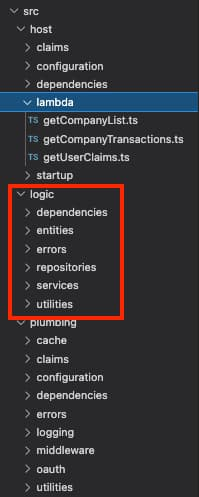
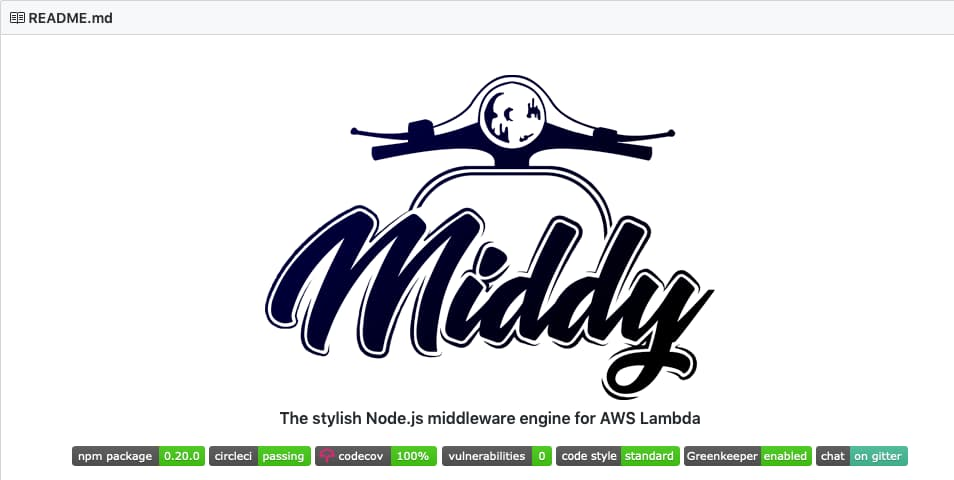
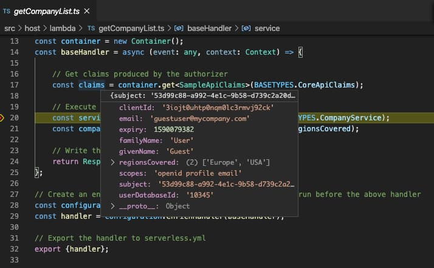

# Serverless API Code Details

Previously I explained this blog's <a href='serverless-api-deployment.mdx'>Serverless API Deployment</a>. Next I describe some code details for this blog's lambda based APIs, to implement cross cutting concerns in clean ways. The code includes integration tests that call the API's lambda functions with user level access tokens.

### Portable Code

The earlier <a href='api-architecture-node.mdx'>Node.js API</a> used the Express HTTP Server. As part of migrating to AWS Serverless I changed the API's host layer but the API logic classes are identical to those in the Express API:

<div className='smallimage'>
    
</div>

### Lambda Entry Points

The entry point to lambda functions is equivalent to earlier *Rest Controller Classes*:

- The lambda resolves the service instance for the request and asks it to do the work.
- Cross cutting concerns execute before and after the lambda base handler.

```typescript
const container = new Container();
const baseHandler = async (): Promise<APIGatewayProxyResult> => {

    const baseClaims = container.get<BaseClaims>(BASETYPES.BaseClaims);
    ScopeVerifier.enforce(baseClaims.scopes, 'transactions_read');

    const service = container.get<CompanyService>(SAMPLETYPES.CompanyService);
    const companies = await service.getCompanyList();

    return ResponseWriter.objectResponse(200, companies);
};

const configuration = new LambdaConfiguration();
const handler = configuration.enrichHandler(baseHandler, container);

export {handler};
```

### Applying Cross Cutting Concerns

I enrich lambdas with middleware classes to manage aspects such as authorization, logging and error handling:

```typescript
public enrichHandler(baseHandler: AsyncHandler, container: Container)
    : middy.MiddyfiedHandler<APIGatewayProxyEvent, APIGatewayProxyResult> | AsyncHandler {

    const configuration = this.loadConfiguration();

    const base = new BaseCompositionRoot(container)
        .useLogging(configuration.logging, loggerFactory)
        .useOAuth(configuration.oauth)
        .withCustomClaimsProvider(new SampleCustomClaimsProvider(), configuration.cache)
        .useHttpProxy(httpProxy)
        .register();

    const loggerMiddleware = base.getLoggerMiddleware();
    const exceptionMiddleware = base.getExceptionMiddleware();
    const authorizerMiddleware = base.getAuthorizerMiddleware();
    const customHeaderMiddleware = base.getCustomHeaderMiddleware();

    return middy(async (event: APIGatewayProxyEvent, context: Context) => {
        return baseHandler(event, context);

    })
        .use(loggerMiddleware)
        .use(exceptionMiddleware)
        .use(authorizerMiddleware)
        .use(customHeaderMiddleware);

}
```

Earlier Node.js samples used middleware built into Express, whereas for AWS Lambdas I use the [Middy Library](https://github.com/middyjs/middy) to separate plumbing code from the API's business logic:



Middy provides interception points called *before*, *after* and *error*. The *LoggerMiddleware* class demonstrates the syntax:

```typescript
export class LoggerMiddleware implements middy.MiddlewareObj<APIGatewayProxyEvent, APIGatewayProxyResult> {

    private readonly container: Container;
    private readonly loggerFactory: LoggerFactoryImpl;

    public constructor(container: Container, loggerFactory: LoggerFactoryImpl) {
        this.container = container;
        this.loggerFactory = loggerFactory;
    }

    public before(request: middy.Request<APIGatewayProxyEvent, APIGatewayProxyResult>): void {

        const logEntry = this.loggerFactory.createLogEntry();
        this.container.rebind<LogEntryImpl>(BASETYPES.LogEntry).toConstantValue(logEntry);
        logEntry.start(request.event, request.context);
    }

    public after(request: middy.Request<APIGatewayProxyEvent, APIGatewayProxyResult>): void {

        const logEntry = this.container.get<LogEntryImpl>(BASETYPES.LogEntry);
        if (request.response && request.response.statusCode) {
            logEntry.setResponseStatus(request.response.statusCode);
        }
        logEntry.end();
        logEntry.write();
    }
}
```

### Middleware Classes

The API uses the following middleware classes, which are equivalent to those in the Express API:

| Middleware Class | Responsibility |
| ---------------- | -------------- |
| LoggerMiddleware | Manages the log entry for each request, to log request and response details. |
| OAuthFilter | JWT access token validation, creating the claims principal and identity logging. |
| CustomHeaderMiddleware | Allows advanced client side testing of APIs, such as error rehearsal. |
| UnhandledExceptionHandler | A central place to add error details to logs and produce the client error. |

### Dependency Injection

With Serverless lambdas I continue to use modern and productive code based on dependency injection, which benefits code clarity, extensibility and testing:

```typescript
@injectable()
export class CompanyService {

    private readonly repository: CompanyRepository;
    private readonly claims: SampleCustomClaims;

    public constructor(
        @inject(SAMPLETYPES.CompanyRepository) repository: CompanyRepository,
        @inject(BASETYPES.CustomClaims) claims: SampleCustomClaims) {

        this.repository = repository;
        this.claims = claims;
    }
}
```

In AWS, a new API instance gets created on every HTTP request. Therefore I no longer need to implement the *Child Container Per Request* pattern that the Express API uses.

### JWT Access Token Validation

An earlier post explained this blog's approach to <a href='jwt-access-token-validation.mdx'>JWT Access Token Validation</a>, where a JWT library caches token signing public keys in memory. For the Serverless API I followed the same approach, but supplied a custom key retriever to the JOSE library:

```typescript
const result = await jwtVerify(accessToken, this.jwksRetriever.getKey, options);
```

The library requires a function with the following method signature. The implementation gets cached keys from DynamoDB on every request rather than putting the critical authorization server under load:

```typescript
async getKey(
    protectedHeader: JWSHeaderParameters,
    token: FlattenedJWSInput): Promise<Uint8Array | KeyLike>;
```

I implemented a DynamoDB wrapper class to encapsulate the logic:

```typescript
export class AwsCache implements Cache {

    private readonly configuration: CacheConfiguration;
    private readonly extraClaimsProvider: ExtraClaimsProvider;
    private readonly database: DynamoDBClient;

    public constructor(configuration: CacheConfiguration, extraClaimsProvider: ExtraClaimsProvider) {

        try {

            this.configuration = configuration;
            this.extraClaimsProvider = extraClaimsProvider;
            this.database = new DynamoDBClient({region: configuration.region});

        } catch (e) {

            throw ErrorUtils.fromCacheError(BaseErrorCodes.cacheConnect, e);
        }
    }

    public async setJwksKeys(jwksText: string): Promise<void> {

        const params = {
            TableName: this.configuration.tableName,
            Item: {
                'CACHE_KEY' : {S: 'JWKS'},
                'CACHE_VALUE' : {S: jwksText},
                'TTL_VALUE': {N: `${this.getExpiry()}`},
            }
        };

        await this.putItem(params);
    }

    private async putItem(params: PutItemInput): Promise<void> {

        try {

            const command = new PutItemCommand(params);
            await this.database.send(command);

        } catch (e: any) {

            throw ErrorUtils.fromCacheError(BaseErrorCodes.cacheWrite, e);
        }
    }
}
```

### Claims Based Authorization

After processing JWT access tokens, the API uses claims according to this blog's <a href='api-authorization-design.mdx'>API Authorization Behaviour</a>. The API looks up additional authorization values when it first receives a particular access token and stores these extra claims in the AWS cache. The cache key is the SHA256 hash of the access token. The earlier <a href='updated-api-coding-key-points.mdx'>Updated API Code Sample</a> post explains the mechanics.

```typescript
export class SampleExtraClaims extends ExtraClaims {
    private readonly title: string;
    private readonly regions: string[];
}
```

### API Integration Tests

The API has a set of integration tests that use utility classes to mock the authorization server. This enables me to productively test the API with user level access tokens. During tests, I use temporary files named *input.txt* and *output.txt* that contain request and response data in the lambda format:

The following test tries to get a resource for a particular region, when the user's access token does not allow it. The test asserts the expected error response. Some utility code deals with boiler plate code such as running *sls invoke* as a child process. Tests work correctly but run slow when invoking local lambdas.

```typescript
it ('Get transactions returns 404 for companies that do not match the regions claim', async () => {

    const accessToken = await tokenIssuer.issueAccessToken(guestUserId);

    const mockUserInfo = {
        given_name: 'Guest',
        family_name: 'User',
        email: 'guestuser@example.com',
    };
    await wiremockAdmin.registerUserInfo(JSON.stringify(mockUserInfo));

    const options = {
        httpMethod: 'GET',
        apiPath: '/investments/companies/3/transactions',
        lambdaFunction: 'getCompanyTransactions',
        accessToken,
        sessionId,
        pathParameters: {
            id: '3',
        }
    };
    const response = await LambdaChildProcess.invoke(options);

    assert.strictEqual(response.statusCode, 404, 'Unexpected HTTP status code');
    assert.strictEqual(response.body.code, 'company_not_found', 'Unexpected error code');

}).timeout(10000);
```

### Lambda Code Debugging

On a development computer, running *npm run build* produces *Source Maps* to enable debugging. The *launch.json* file can then point to a particular lambda to debug:

```json
{
    "version":"0.2.0",
    "configurations": [
        {
            "type":"node",
            "request":"launch",
            "name":"Launch API",
            "program":"${workspaceFolder}/node_modules/.bin/serverless",
            "args":[
                 "invoke",
                 "local",
                 "-f",
                 "getCompanyTransactions",
                 "-p",
                 "test/input.txt"
            ]
        }
    ]
}
```
 
I can supply the *input.txt* file from a particular test, then step through the original lines of TypeScript code and view the state of variables, such as OAuth and claims data:



### Where Are We?

I invested in a productive test setup for the Serverless API, with modern techniques for coding, testing and deployment. A big plus point of lambda technology is the low cost hosting it provides for developer demos. However, I prefer the more complete developer experience that I get from cloud native APIs.

### Next

- I briefly summarise the benefits of combining <a href='cloud--native-updates.mdx'>Cloud Native and OAuth</a>.
- For a list of all blog posts see the <a href='index.mdx'>Index Page</a>.
