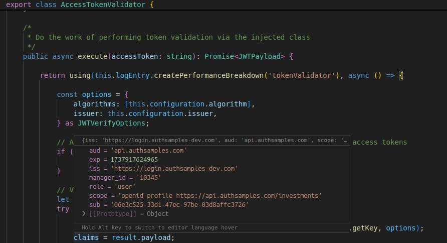

# Serverless API Code Details

Previously I described this blog’s <a href='serverless-api-deployment.mdx'>Serverless API Deployment</a>. Next we will explain how we have coded this blog’s lambda based APIs, to include the behaviours from this blog's <a href='api-journey-server-side.mdx'>API Journey – Server Side</a> blog post.

### Portable Code

In our earlier Node.js API we used the Express HTTP Server. As part of migrating to AWS Serverless, we have only changed the API’s host layer. The API logic classes are identical to the earlier API:

<div className='smallimage'>
    
</div>

Since the code is largely the same as our earlier Express based sample, this post will primarily explain the differences in setup and OAuth processing.

### Lambda Entry Points

The entry point to lambda functions is equivalent to our earlier *Rest Controller Classes* and looks like this:

- A service class is resolved and asked to do the work
- Cross cutting concerns execute before and after the lambda function's body

```typescript
const container = new Container();
const baseHandler = async (): Promise<APIGatewayProxyResult> => {

    const baseClaims = container.get<BaseClaims>(BASETYPES.BaseClaims);
    ScopeVerifier.enforce(baseClaims.scopes, 'transactions_read');

    const service = container.get<CompanyService>(SAMPLETYPES.CompanyService);
    const companies = await service.getCompanyList();

    return ResponseWriter.objectResponse(200, companies);
};

const configuration = new LambdaConfiguration();
const handler = configuration.enrichHandler(baseHandler, container);

export {handler};
```

### Applying Cross Cutting Concerns

Lambdas are enriched by injecting middleware classes to manage aspects such as authorization, logging and error handling:

```typescript
public enrichHandler(baseHandler: AsyncHandler, container: Container)
    : middy.MiddyfiedHandler<APIGatewayProxyEvent, APIGatewayProxyResult> | AsyncHandler {

    const configuration = this._loadConfiguration();

    const base = new BaseCompositionRoot(container)
        .useLogging(configuration.logging, loggerFactory)
        .useOAuth(configuration.oauth)
        .withCustomClaimsProvider(new SampleCustomClaimsProvider(), configuration.cache)
        .useHttpProxy(httpProxy)
        .register();

    const loggerMiddleware = base.getLoggerMiddleware();
    const exceptionMiddleware = base.getExceptionMiddleware();
    const authorizerMiddleware = base.getAuthorizerMiddleware();
    const customHeaderMiddleware = base.getCustomHeaderMiddleware();

    return middy(async (event: APIGatewayProxyEvent, context: Context) => {
        return baseHandler(event, context);

    })
        .use(loggerMiddleware)
        .use(exceptionMiddleware)
        .use(authorizerMiddleware)
        .use(customHeaderMiddleware);

}
```

Earlier Node.js samples used middleware built into Express, whereas for AWS Lambdas we are using the [Middy Library](https://github.com/middyjs/middy), to separate plumbing code from the API’s logic classes:


Middy provides interception points called before, after and error. As an example, our *LoggerMiddleware* class updates log entries using the following code:

```typescript
export class LoggerMiddleware implements middy.MiddlewareObj<APIGatewayProxyEvent, APIGatewayProxyResult> {

    private readonly _container: Container;
    private readonly _loggerFactory: LoggerFactoryImpl;

    public constructor(container: Container, loggerFactory: LoggerFactoryImpl) {
        this._container = container;
        this._loggerFactory = loggerFactory;
    }

    public before(request: middy.Request<APIGatewayProxyEvent, APIGatewayProxyResult>): void {

        const logEntry = this._loggerFactory.createLogEntry();
        this._container.rebind<LogEntryImpl>(BASETYPES.LogEntry).toConstantValue(logEntry);
        logEntry.start(request.event, request.context);
    }

    public after(request: middy.Request<APIGatewayProxyEvent, APIGatewayProxyResult>): void {

        const logEntry = this._container.get<LogEntryImpl>(BASETYPES.LogEntry);
        if (request.response && request.response.statusCode) {
            logEntry.setResponseStatus(request.response.statusCode);
        }
        logEntry.end();
        logEntry.write();
    }
}
```

### Middleware Classes

Our sample uses the following middleware classes, which are equivalent to those in our earlier Node.js code:

| Middleware Class | Responsibility |
| ---------------- | -------------- |
| LoggerMiddleware | Manages the log entry for each request, by logging request and response details
| OAuthFilter | JWT access token validation, creating the claims principal and identity logging
| CustomHeaderMiddleware | Allows advanced client side testing of APIs, to enable error rehearsal
| UnhandledExceptionHandler | A central place for adding error details to logs, and producing the client error

### Dependency Injection

With Serverless lambdas I continue to use modern and productive code based on dependency injection. This has benefits around code clarity, extensibility and testing:

```typescript
@injectable()
export class CompanyService {

    private readonly _repository: CompanyRepository;
    private readonly _claims: SampleCustomClaims;

    public constructor(
        @inject(SAMPLETYPES.CompanyRepository) repository: CompanyRepository,
        @inject(BASETYPES.CustomClaims) claims: SampleCustomClaims) {

        this._repository = repository;
        this._claims = claims;
    }
}
```

In AWS, the entire API is spun up on every single HTTP request. There is no need to implement the *Child Container Per Request* pattern, as used by the earlier Node.js API. If ever needed in future, the same technique of storing the child container in the request object would be used.

### JWT Access Token Validation

Previously we explained this blog’s approach to <a href='jwt-access-token-validation.mdx'>JWT Access Token Validation</a>, which involves caching the token signing public keys in-memory. For the Serverless API I needed to provide a custom key retriever to the JOSE library:

```typescript
const result = await jwtVerify(accessToken, this._jwksRetriever.getKey, options);
```

A function with the following method signature is required, and this blog’s implementation gets cached keys from DynamoDB, to avoid needing to call the authorization server on every API request:

```typescript
async getKey(
        protectedHeader: JWSHeaderParameters,
        token: FlattenedJWSInput): Promise<Uint8Array | KeyLike>;
```

This required a custom cache class to wrap DynamoDB, some of whose code is shown below:

```typescript
export class AwsCache implements Cache {

    private readonly _configuration: CacheConfiguration;
    private readonly _extraClaimsProvider: ExtraClaimsProvider;
    private readonly _database: DynamoDBClient;

    public constructor(configuration: CacheConfiguration, extraClaimsProvider: ExtraClaimsProvider) {

        try {

            this._configuration = configuration;
            this._extraClaimsProvider = extraClaimsProvider;
            this._database = new DynamoDBClient({region: configuration.region});

        } catch (e) {

            throw ErrorUtils.fromCacheError(BaseErrorCodes.cacheConnect, e);
        }
    }

    public async setJwksKeys(jwksText: string): Promise<void> {

        const params = {
            TableName: this._configuration.tableName,
            Item: {
                'CACHE_KEY' : {S: 'JWKS'},
                'CACHE_VALUE' : {S: jwksText},
                'TTL_VALUE': {N: `${this._getExpiry()}`},
            }
        };

        await this._putItem(params);
    }

    private async _putItem(params: PutItemInput): Promise<void> {

        try {

            const command = new PutItemCommand(params);
            await this._database.send(command);

        } catch (e: any) {

            throw ErrorUtils.fromCacheError(BaseErrorCodes.cacheWrite, e);
        }
    }
}
```

### OAuth Middleware Customisation

The API authorizes using this blog’s <a href='api-authorization-design.mdx'>API Authorization Behaviour</a>. This involves looking up and caching the following extra claims when an access token is first received.

```typescript
export class SampleExtraClaims extends ExtraClaims {
    private readonly _title: string;
    private readonly _regions: string[];
}
```

The earlier <a href='updated-api-coding-key-points.mdx'>Updated API Code Sample</a> blog post described how this was implemented in Node.js. To cache extra authorization values not included in the access token, the *AwsCache* class is again used.

Although DynamoDB caching works well enough for my demo purposes, it would be suboptimal for a real company, and also adds to code complexity. The ability to easily cache data in-memory between requests is an important API behaviour.

### Test Code

The API has some integration tests and utility classes to enable the API to be tested without an authorization server. During tests, the *input.txt* and *output.txt* files are updated with requests and responses in the lambda format:

<div className='smallimage'>
    
</div>

The following test verifies authorization to data based on the *regions* array value. The utility classes deal with boiler plate code such as running *sls invoke* as a child process:

```typescript
it ('Get transactions returns 404 for companies that do not match the regions claim', async () => {

    const accessToken = await tokenIssuer.issueAccessToken(guestUserId);

    const mockUserInfo = {
        given_name: 'Guest',
        family_name: 'User',
        email: 'guestuser@example.com',
    };
    await wiremockAdmin.registerUserInfo(JSON.stringify(mockUserInfo));

    const options = {
        httpMethod: 'GET',
        apiPath: '/investments/companies/3/transactions',
        lambdaFunction: 'getCompanyTransactions',
        accessToken,
        sessionId,
        pathParameters: {
            id: '3',
        }
    };
    const response = await LambdaChildProcess.invoke(options);

    assert.strictEqual(response.statusCode, 404, 'Unexpected HTTP status code');
    assert.strictEqual(response.body.code, 'company_not_found', 'Unexpected error code');

}).timeout(10000);
```

### Lambda Code Debugging

On a development computer, running *npm run build* produces *Source Maps* to enable debugging. The *launch.json* file can then point to a particular lambda to be debugged:

```json
{
    "version":"0.2.0",
    "configurations":[
        {
            "type":"node",
            "request":"launch",
            "name":"Launch API",
            "program":"${workspaceFolder}/node_modules/serverless/bin/serverless",
            "args":[
                "invoke",
                "local",
                "-f",
                "getCompanyList",
                "-p",
                "test/input.txt"
            ]
        }
    ]
}
```

This enables the *input.txt* file produced from a mocha test to be used to debug a lambda, then step through the original lines of TypeScript code and view the state of variables, such as OAuth and claims fields:



### Where Are We?

We have a productive setup for our cloud API, with modern techniques for coding, testing and deployment. This enables low cost cloud hosting, though earlier cloud native APIs had better API capabilities.

### Next

- Next we will discuss some future <a href='cloud--native-updates.mdx'>Cloud Native Updates</a> to this blog
- For a list of all blog posts see the <a href='index.mdx'>Index Page</a>
