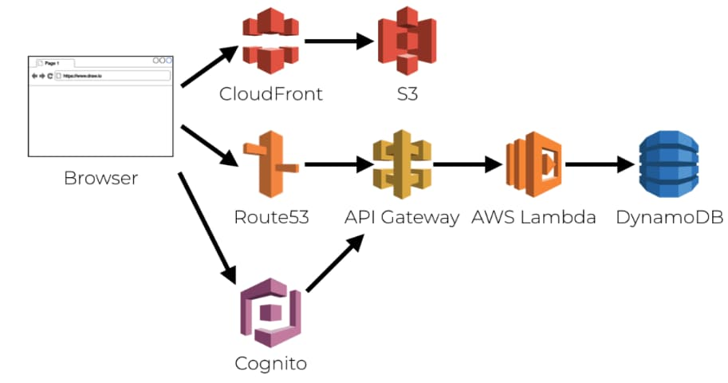

# Serverless API Deployment

Previously I provided a <a href='serverless-api-overview.mdx'>Serverless API Overview</a> and showed how to call the API locally. Next I explain how I deploy the Serverless API to the AWS cloud, to run as lambda functions. The API then provides data to my final SPA, mobile and desktop clients. I use the [Serverless Framework](https://github.com/serverless/serverless) to implement the API and the overall deployment uses the Serverless stack:



### Deployment Overview

The API has a number of commands in its *package.json* file, which point to scripts that run Serverless framework commands:

```json
{
  "scripts": {
    "login": "sls login",
    "lint": "npx eslint ./src ./webpack",
    "start": "./start.sh",
    "testsetup": "./test/scripts/testsetup.sh",
    "test": "./test/scripts/test.sh",
    "loadtest": "./test/scripts/loadtest.sh",
    "deploy": "./deploy.sh",
    "remove": "sls remove --stage deployed"
  }
}
```

The *deploy.sh* script first runs *sls package* to build a ZIP file, then runs *sls deploy* to push resources to the cloud. The deployment creates lambda functions, configures API gateway endpoints and limits CloudWatch log retention. The *serverless.yml* file references a custom domain mapping that I precreated before the first deployment. There is a single AWS deployment stage of *deployed*, though I also use a *dev* stage when I run lambdas locally:

```yaml
service: serverlessapi

provider:
  name: aws
  runtime: nodejs24.x
  region: eu-west-2
  apiGateway:
    shouldStartNameWithService: true

custom:
  customDomain:
    domainName: 'api.authsamples.com'
    certificateName: 'authsamples.com'
    basePath: investments
    endpointType: regional
```

### API Configuration

The Serverless API uses the same JSON based approach to configuration as earlier APIs, and runs with the following settings in AWS:

```json
{
    "api": {
        "useProxy": false,
        "proxyUrl": ""
    },
    "logging": {
        "apiName": "FinalApi",
        "loggers": [
            {
                "type": "request",
                "performanceThresholdMilliseconds": 500,
                "prettyPrint": false
            },
            {
                "type": "audit",
                "prettyPrint": false
            }
        ]
    },
    "oauth": {
        "issuer":                       "https://cognito-idp.eu-west-2.amazonaws.com/eu-west-2_CuhLeqiE9",
        "audience":                     "",
        "algorithm":                    "RS256",
        "scope":                        "https://api.authsamples.com/investments",
        "jwksEndpoint":                 "https://cognito-idp.eu-west-2.amazonaws.com/eu-west-2_CuhLeqiE9/.well-known/jwks.json",
        "delegationIdClaimName":        "origin_jti",
        "claimsCacheTimeToLiveMinutes": 15
    }
}
```

### Building API Code

For Node.js APIs I usually include multiple compiled *.js* files in a deployment image like a Docker container. For Serverless APIs it is instead recommended to bundle code, to reduce otherwise slow startup times in the AWS lambda environment. Therefore I use webpack with the following configuration, to build a monolithic bundle file for each lambda function, containing its code and dependencies.

```typescript
const config: webpack.Configuration = {

    target: 'node',
    mode: 'production',
    devtool: 'source-map',
    context: path.resolve(dirname, '.'),
    entry: {
        getUserInfo: './src/host/lambda/getUserInfo.ts',
        getCompanyList: './src/host/lambda/getCompanyList.ts',
        getCompanyTransactions: './src/host/lambda/getCompanyTransactions.ts',
    },
    module: {
        rules: [
            {
                test: /\.ts$/,
                use: 'ts-loader',
                exclude: /node_modules/,
            }
        ]
    },
    resolve: {
        extensions: ['.ts', '.js']
    },
    output: {
        path: path.resolve(dirname, './dist'),
        filename: '[name].js',
        library: {
            type: 'module'
        },
        module: true,
        clean: true,
    },
    experiments: {
        outputModule: true,
    },
};
```

To disable the Serverless default build I add the following entry to the *serverless.yml* file:

```yaml
build:
  esbuild: false
```

### Packaging Upload Resources

The GitHub repository's *deploy.sh* script initiates deployment. After doing a release build it runs an *sls package* command that creates zip files in the repository's *.serverless* folder, in advance of deploying assets to AWS. 


For each lambda I use the *serverless.yml* packaging settings to upload specific files, where the main file is the lambda's JavaScript bundle.

```yaml
functions:
  
  getUserInfo:
    handler: dist/getUserInfo.handler
    package:
      include:
        - dist/getUserInfo.js
        - api.config.json
        - package.json
    events:
      - http: 
          path: /userinfo
          method: get

  getCompanyList:
    handler: dist/getCompanyList.handler
    package:
      include:
        - dist/getCompanyList.js
        - data/companyList.json
        - api.config.json
        - package.json
    events:
      - http: 
          path: /companies
          method: get

  getCompanyTransactions:
    handler: dist/getCompanyTransactions.handler
    package:
      include:
        - dist/getCompanyTransactions.js
        - data/companyList.json
        - data/companyTransactions.json
        - api.config.json
        - package.json
    events:
      - http: 
          path: /companies/{id}/transactions
          method: get
          request: 
            parameters: 
              paths: 
                id: true

package:
  individually: true
  patterns:
  - '!/**'
```

The size of each upload zip file is around 100KB and each lambda bundle is around 400KB. The Serverless framework also adds [CloudFormation](https://docs.aws.amazon.com/AWSCloudFormation/latest/UserGuide/Welcome.html) artifacts that automate the creation of AWS resources.

### Registering an API Subdomain

In AWS you need some prerequisite setup before a deployment will work. I created the main hosting domain of *authsamples.com* and its external HTTPS certificate in the earlier <a href='cloud-domain-setup.mdx'>Cloud Domain Setup</a>. I preconfigured the API subdomain in the AWS API Gateway and linked it to a deployment stage under *API Mappings*:


In *Route 53 / Hosted Zones* I then created an *A Record* to map the generated domain name to the API's custom subdomain:

<div className='smallimage'>
    
</div>

### API Deployment

The *deploy.sh* script continues by running the *sls deploy* command to upload the zip files and CloudFormation resources to AWS:


The serverless deployment registers HTTPS internet endpoints for the API's lambda functions in the AWS API Gateway:


The deployment configures a *Lambda Integration* for each incoming HTTP request's REST path and method:


The API has three internet endpoints at the below URLs, where the third URL is a wildcard path with parameterised segments:

- *https://api.authsamples.com/investments/userinfo*
- *https://api.authsamples.com/investments/companies*
- *https://api.authsamples.com/investments/companies/id/transactions*

The CloudFormation resources automate deployment to the *Lambda* AWS service for the London region. I can use the AWS console to inspect the deployed resources for each lambda.


### API Immediate Logs

In CloudWatch, a log group is created for each lambda function and log retention is limited to a few days. The role of these logs is similar to that of the immediate log files in this blog's cloud native APIs. I can view log entries in the AWS console but CloudWatch is only used for immediate logging. In a real deployment, I would aggregate logs from CloudWatch to a more powerful log aggregation system with <a href='api-technical-support-analysis.mdx'>rich query capabilities</a>.


In order to write useful logs the API's code needs access to the full request and response details. Therefore I always use the [REST API Endpoint Type](https://docs.aws.amazon.com/apigateway/latest/developerguide/http-api-vs-rest.html) since any API should have access to its incoming request details.

### Troubleshooting Lambda Startup

Occasionally during development I deploy an invalid lambda function. One cause is an invalid lambda response format and another is failing to upload a required Node.js dependency, such as by including it in *devDependencies* instead of *dependencies*. The lambda fails but there is no information in CloudWatch logs.

You must activate [API Gateway CloudWatch Logs](https://aws.amazon.com/premiumsupport/knowledge-center/api-gateway-cloudwatch-logs) to get more information about the cause. First define an IAM role with log permissions and then activate extra logs under the *Logs/Tracing* tab for a particular stage. An extra CloudWatch log group then becomes available. Its log entries provide further information about the cause to enable problem resolution.

### Where Are We?

I ported this blog's earlier Node.js API to run with low cost and zero maintenance in AWS, which works well for my code samples. Note however that I have to accept certain limitations, like the use of the AWS API gateway and Cloudwatch. Instead, I prefer to make my own choices avoud which supporting components my APIs should use.

### Next

- Next I explain some <a href='serverless-api-coding-model.mdx'>Serverless API Code Details</a>.
- For a list of all blog posts see the <a href='index.mdx'>Index Page</a>.
