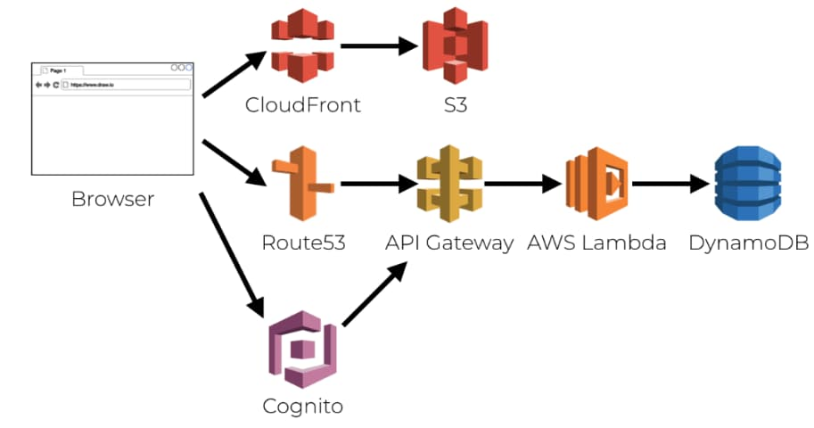

# Serverless API Deployment

Previously I provided a <a href='serverless-api-overview.mdx'>Serverless API Overview</a> and showed how to run its operations locally. Next I explain how I deploy the Serverless API to the AWS cloud, to run as lambda functions. The API then provides data to SPA, mobile and desktop clients. I use the [Serverless Framework](https://github.com/serverless/serverless) to implement the API and the overall deployment uses the Serverless stack:



### Deployment Overview

The API has a number of commands in its *package.json* file, which point to scripts that run Serverless framework commands:

```json
{
  "scripts": {
    "lint": "npx eslint . --ext .ts,.tsx",
    "build": "rm -rf dist && tsc",
    "buildRelease": "rm -rf dist && tsc --sourceMap false",
    "start": "./start.sh",
    "test": "./start.sh",
    "deploy": "./deploy.sh",
    "remove": "sls remove --stage deployed"
  }
}
```

The *deploy.sh* script first runs *sls package* to build a ZIP file, then runs *sls deploy* to push resources to the cloud. The deployment creates lambda functions, configures API gateway endpoints, creates a DynamoDB cache table and limits CloudWatch log retention.

The *serverless.yml* file points to a custom domain that I precreated before the first deployment. There is a single AWS deployment stage of *deployed*, though I also use a *local* stage used when running lambdas locally:

```yaml
service: serverlessapi

provider:
  name: aws
  runtime: nodejs20.x
  region: eu-west-2
  apiGateway:
    shouldStartNameWithService: true

custom:
  customDomain:
    domainName: 'api.authsamples.com'
    certificateName: 'authsamples.com'
    basePath: investments
    endpointType: regional
```

### API Configuration

The Serverless API uses the same JSON based approach to configuration as earlier APIs, and runs with the following settings in AWS:

```json
{
    "api": {
        "useProxy": false,
        "proxyUrl": ""
    },
    "logging": {
        "apiName": "FinalApi",
        "prettyPrint": false,
        "performanceThresholdMilliseconds": 500
    },
    "oauth": {
        "issuer":           "https://cognito-idp.eu-west-2.amazonaws.com/eu-west-2_CuhLeqiE9",
        "audience":         "",
        "algorithm":        "RS256",
        "scope":            "https://api.authsamples.com/investments",
        "jwksEndpoint":     "https://cognito-idp.eu-west-2.amazonaws.com/eu-west-2_CuhLeqiE9/.well-known/jwks.json"
    },
    "cache": {
        "isActive": true,
        "region": "eu-west-2",
        "tableName": "OAUTH_CACHE",
        "claimsCacheTimeToLiveMinutes": 15
    }
}
```

### Building API Code

I use *tsc* to build the lambda code from TypeScript to JavaScript with the following *tsconfig.json* settings:

```json
{
  "compilerOptions": {
    "strict": true,
    "target": "ES2023",
    "lib": ["ES2023"],
    "module":"Node16",
    "moduleResolution": "Node16",
    "allowSyntheticDefaultImports": true,
    "experimentalDecorators": true,
    "outDir": "dist",
    "sourceMap": true
  },
  "include": [
    "src/**/*.ts"
  ],
  "exclude": [
    "node_modules"
  ]
}
```

The deployment package saves to a *.serverless* folder and excludes files deselected in the *package/patterns* section of the *serverless.yml* file. The deployment also excludes Node.js development dependencies:


The size of each lambda is around 1.5MB, including dependencies for the JOSE library and HTTP requests. The Serverless framework includes [CloudFormation](https://docs.aws.amazon.com/AWSCloudFormation/latest/UserGuide/Welcome.html) artifacts that automate the creation of AWS resources.

### Registering an API Subdomain

I created the main hosting domain of *authsamples.com* and its external HTTPS certificate in the earlier <a href='cloud-domain-setup.mdx'>Cloud Domain Setup</a>. I preconfigured the API subdomain in the AWS API Gateway and linked it to a deployment stage under *API Mappings*:


In *Route 53 / Hosted Zones* I then created an *A Record* to map the generated domain name to the API's custom subdomain:

<div className='smallimage'>
    
</div>

### API Deployment

After it builds a ZIP package the *deploy.sh* script uploads it to AWS:


The CloudFormation registers HTTPS internet endpoints for the API's lambda functions in the AWS API Gateway:


The deployment configures a *Lambda Integration* for each incoming HTTP request's REST path and method:


The API has three internet endpoints at the below URLs, where the third URL is a wildcard that uses parameterised path segments:

- *https://api.authsamples.com/investments/userinfo*
- *https://api.authsamples.com/investments/companies*
- *https://api.authsamples.com/investments/companies/2/transactions*

The CloudFormation deploys the API implementation to the *Lambda* AWS service for the Lonfon region. I can inspect and even edit the compiled JavaScript of each lambda.


Although in lambda technology each individual function is its own microservice, that is rarely the desired behaviour. Instead, you typically want to deploy medium sized services that can share code. To enable this I deploy all API code for each individual lambda, so shared code and dependencies upload multiple times. Lambdas can be [packaged individually](https://www.serverless.com/framework/docs/providers/aws/guide/packaging#artifact) if you prefer, and it is possible to use [Serverless Plugin Scripts](https://github.com/mvila/serverless-plugin-scripts) to run custom packaging logic, such as excluding folders or dependencies for particular lambdas.

### API Caching

To enable OAuth related caching the *serverless.yml* file also creates a DynamoDB table called *OAUTH_CACHE*:

```yaml
resources:
  Resources:

    CacheTable:
      Type: AWS::DynamoDB::Table
      Properties:
        TableName: OAUTH_CACHE
        AttributeDefinitions:
          - AttributeName: CACHE_KEY
            AttributeType: S
        KeySchema:
          - AttributeName: CACHE_KEY
            KeyType: HASH
        TimeToLiveSpecification:
          AttributeName: TTL_VALUE
          Enabled: true
        BillingMode: PAY_PER_REQUEST
```

The table stores cached data as key value pairs. Lambdas look up the JSON Web Key Set (JWKS) once and then cache it to avoid load on the authorization server. When a user first sends an access token I cache extra authorization values against a hash of the incoming access token. Although this provides a working solution, it is less optimal and more complex than the in-memory caching that this blog's cloud native APIs use.


### API Immediate Logs

In CloudWatch, a log group is created for each lambda function and log retention is limited to a few days. The role of these logs is similar to that of the immediate log files in this blog's cloud native APIs. I can view log entries in the AWS console but CloudWatch is only used for immediate logging. In a real deployment, I would aggregate logs from CloudWatch to a more powerful log aggregation system with <a href='api-technical-support-analysis.mdx'>rich query capabilities</a>.


In order to write useful logs the API's code needs access to the full request and response details. Therefore I always use the [REST API Endpoint Type](https://docs.aws.amazon.com/apigateway/latest/developerguide/http-api-vs-rest.html) since any API should have access to its incoming request details.

### Troubleshooting Lambda Startup

Occasionally during development I deploy an invalid lambda function. One cause is an invalid lambda response format and another is failing to upload a required Node.js dependency, such as by including it in *devDependencies* instead of *dependencies*. The lambda fails but there is no information in CloudWatch logs.

You must activate [API Gateway CloudWatch Logs](https://aws.amazon.com/premiumsupport/knowledge-center/api-gateway-cloudwatch-logs) to get more information about the cause. First define an IAM role with log permissions and then activate extra logs under the *Logs/Tracing* tab for a particular stage. An extra CloudWatch log group then becomes available. Its log entries provide further information about the cause to enable problem resolution.

### Where Are We?

I ported this blog's earlier Node.js API to run with low cost and zero maintenance in AWS. This blog's frontend code samples all get their data from the Serverless API, which meets the requirements of my cloud connected demo apps to a fairly good level.

### Next

- Next I explain some <a href='serverless-api-coding-model.mdx'>Serverless API Code Details</a>.
- For a list of all blog posts see the <a href='index.mdx'>Index Page</a>.
