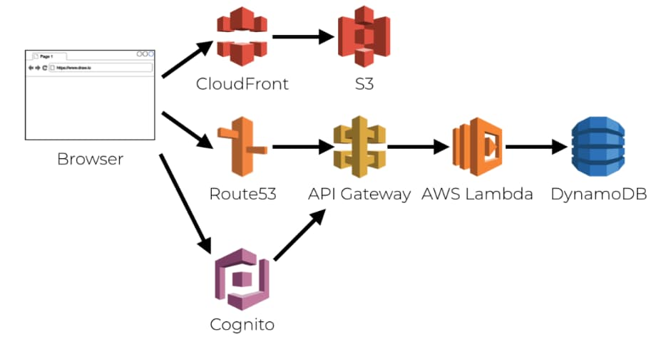

# Serverless API Deployment

Previously I provided a <a href='serverless-api-overview.mdx'>Serverless API Overview</a> and showed how to call the API locally. Next I explain how I deploy the Serverless API to the AWS cloud, to run as lambda functions. The API then provides data to my final SPA, mobile and desktop clients. I use the [Serverless Framework](https://github.com/serverless/serverless) to implement the API and the overall deployment uses the Serverless stack:



### Deployment Overview

The API has a number of commands in its *package.json* file, where scripts use Serverless framework commands:

```json
{
  "scripts": {
    "login": "sls login",
    "lint": "eslint .",
    "start": "rm -rf dist && tsx tools/start.ts",
    "build": "rm -rf dist && NODE_OPTIONS='--import tsx' npx rollup --config build/rollup.config.ts",
    "testsetup": "./test/scripts/testsetup.sh",
    "test": "./test/scripts/test.sh",
    "loadtest": "./test/scripts/loadtest.sh",
    "deploy": "./deploy.sh",
    "remove": "sls remove --stage deployed"
  }
}
```

The *deploy.sh* script first runs *sls package* to build a ZIP file, then runs *sls deploy* to push resources to the cloud. The deployment creates lambda functions, configures API gateway endpoints and limits CloudWatch log retention. The *serverless.yml* file starts with some base parameters.

```yaml
stages:
  deployed:
    params:
      domainName: 'api.authsamples.com'
      certificateArn: 'arn:aws:acm:eu-west-2:090109105180:certificate/953873fe-43f7-4e6f-90fe-3227ce194d6e'

# AWS base details
provider:
  name: aws
  runtime: nodejs24.x
  region: eu-west-2
  stage: deployed
```

### API Configuration

The Serverless API uses the same JSON based approach to configuration as earlier APIs, and runs with the following settings in AWS:

```json
{
    "api": {
        "useProxy": false,
        "proxyUrl": ""
    },
    "logging": {
        "apiName": "FinalApi",
        "loggers": [
            {
                "type": "request",
                "performanceThresholdMilliseconds": 500,
                "prettyPrint": false
            },
            {
                "type": "audit",
                "prettyPrint": false
            }
        ]
    },
    "oauth": {
        "issuer":                       "https://cognito-idp.eu-west-2.amazonaws.com/eu-west-2_CuhLeqiE9",
        "audience":                     "",
        "algorithm":                    "RS256",
        "scope":                        "https://api.authsamples.com/investments",
        "jwksEndpoint":                 "https://cognito-idp.eu-west-2.amazonaws.com/eu-west-2_CuhLeqiE9/.well-known/jwks.json",
        "delegationIdClaimName":        "origin_jti",
        "claimsCacheTimeToLiveMinutes": 15
    }
}
```

### Building API Code

For Node.js APIs I usually include multiple compiled *.js* files in a deployment image like a Docker container. For Serverless APIs it is instead recommended to bundle code, to reduce otherwise slow startup times in the AWS lambda environment. I use [Rollup](https://rollupjs.org/) to bundle code, with the following configuration, to build a monolithic bundle file for each lambda function, containing its code and dependencies.

```typescript
const lambdaFilenames = fs.readdirSync('./src/host/lambda');
export default lambdaFilenames.map((filename: string) => {

    const options: RollupOptions = {

        input: `./src/host/lambda/${filename}`,
        output: {

            dir: outputFolder,
            format: 'esm',
            entryFileNames: `${filename.replace('.ts', '')}.js`,

            sourcemap: true,
            sourcemapPathTransform: (relativeSourcePath, sourcemapPath) => {
                return path.resolve(path.dirname(sourcemapPath), relativeSourcePath);
            },
        },

        external: [
            ...builtinModules,
            ...builtinModules.map((m) => `node:${m}`),
            'aws-sdk',
        ],

        watch: {
            clearScreen: false,
        },

        plugins: [

            nodeResolve({
                preferBuiltins: true,
            }),

            commonjs(),
            
            esbuild({
                tsconfig: './tsconfig.json',
                target: 'es2022',
            }),

            ...(isDevelopment ? [] : [ terser() ]),
        ],
    };

    return options;
});
```

To disable the Serverless default build I add the following entry to the *serverless.yml* file:

```yaml
build:
  esbuild: false
```

### Packaging Upload Resources

For each lambda I use the *serverless.yml* packaging settings to configure a separate upload package for each lambda, to point to each lambda's built JavaScript bundle.

```yaml
functions:
  
  getUserInfo:
    handler: dist/getUserInfo.handler
    package:
      include:
        - dist/getUserInfo.js
        - api.config.json
        - package.json
    events:
      - http: 
          path: /userinfo
          method: get

  getCompanyList:
    handler: dist/getCompanyList.handler
    package:
      include:
        - dist/getCompanyList.js
        - data/companyList.json
        - api.config.json
        - package.json
    events:
      - http: 
          path: /companies
          method: get

  getCompanyTransactions:
    handler: dist/getCompanyTransactions.handler
    package:
      include:
        - dist/getCompanyTransactions.js
        - data/companyList.json
        - data/companyTransactions.json
        - api.config.json
        - package.json
    events:
      - http: 
          path: /companies/{id}/transactions
          method: get
          request: 
            parameters: 
              paths: 
                id: true

package:
  individually: true
  patterns:
  - '!/**'
```

The *serverless.yml* file includes resources to create an AWS API gateway reference to an API subdomain and map it to a *deployed* stage. The lambdas also get assigned Cloudwatch log groups.

```yaml
resources:
  Resources:

    ApiDomain:
      Type: AWS::ApiGateway::DomainName
      Properties:
        DomainName: ${param:domainName}
        EndpointConfiguration:
          Types:
            - REGIONAL
        RegionalCertificateArn: ${param:certificateArn}
        SecurityPolicy: SecurityPolicy_TLS13_1_3_2025_09
        EndpointAccessMode: STRICT

    ApiDomainMapping:
      Type: AWS::ApiGateway::BasePathMapping
      Properties:
        DomainName: !Ref ApiDomain
        BasePath: investments
        RestApiId:
          Ref: ApiGatewayRestApi
        Stage: deployed

    GetUserInfoLogGroup:
      Type: 'AWS::Logs::LogGroup'
      Properties:
        RetentionInDays: '5'
    GetCompanyListLogGroup:
      Type: 'AWS::Logs::LogGroup'
      Properties:
        RetentionInDays: '5'
    GetCompanyTransactionsLogGroup:
      Type: 'AWS::Logs::LogGroup'
      Properties:
        RetentionInDays: '5'
```

The GitHub repository's *deploy.sh* script runs the build and deployment process. After a release build, the script runs an *sls package* command that creates zip files in the repository's *.serverless* folder, in advance of deploying assets to AWS. The Serverless framework also adds [CloudFormation](https://docs.aws.amazon.com/AWSCloudFormation/latest/UserGuide/Welcome.html) artifacts that automate the creation of AWS resources.


### API Deployment

The *deploy.sh* script runs the *sls deploy* command, which uses packaged resources to upload the packaged API files, and runs CloudFormation to create AWS resources:


Once the deployment completes, the AWS API gateway provides an internet HTTPS endpoints base URL that references an API subdomain of *api.authsamples.com* and an external HTTPS certificate, created in the earlier <a href='cloud-domain-setup.mdx'>Cloud Domain Setup</a>. 


In *Route 53 / Hosted Zones* I map the generated domain name to the API subdomain:

<div className='smallimage'>
    
</div>

### Lambda APIs

Within the API base URL, the AWS API gateway creates routes to AWS lambda functions:


The deployment configures a *Lambda Integration* for each incoming HTTP request's REST path and method:


The API has three internet endpoints at the below URLs, where the third URL is a wildcard path with parameterised segments:

- *https://api.authsamples.com/investments/userinfo*
- *https://api.authsamples.com/investments/companies*
- *https://api.authsamples.com/investments/companies/id/transactions*

The CloudFormation resources automate deployment to the *Lambda* AWS service for the London region. I can use the AWS console to inspect the deployed resources for each lambda.


### API Immediate Logs

In CloudWatch, a log group is created for each lambda function and log retention is limited to a few days. The role of these logs is similar to that of the immediate log files in this blog's cloud native APIs. I can view log entries in the AWS console but CloudWatch is only used for immediate logging. In a real deployment, I would aggregate logs from CloudWatch to a more powerful log aggregation system with <a href='api-technical-support-analysis.mdx'>rich query capabilities</a>.


In order to write useful logs the API's code needs access to the full request and response details. Therefore I always use the [REST API Endpoint Type](https://docs.aws.amazon.com/apigateway/latest/developerguide/http-api-vs-rest.html) since any API should have access to its incoming request details.

### Troubleshooting Lambda Startup

Occasionally during development I deploy an invalid lambda function. One cause is an invalid lambda response format and another is failing to upload a required Node.js dependency, such as by including it in *devDependencies* instead of *dependencies*. The lambda fails but there is no information in CloudWatch logs.

You must activate [API Gateway CloudWatch Logs](https://aws.amazon.com/premiumsupport/knowledge-center/api-gateway-cloudwatch-logs) to get more information about the cause. First define an IAM role with log permissions and then activate extra logs under the *Logs/Tracing* tab for a particular stage. An extra CloudWatch log group then becomes available. Its log entries provide further information about the cause to enable problem resolution.

### Where Are We?

I ported this blog's earlier Node.js API to run with low cost and zero maintenance in AWS, which works well enough for my code samples. Note however that I have to accept certain limitations, like the use of the AWS API gateway and Cloudwatch. Instead, I prefer to make my own choices on the supporting components my APIs should use.

### Next

- Next I explain some <a href='serverless-api-coding-model.mdx'>Serverless API Code Details</a>.
- For a list of all blog posts see the <a href='index.mdx'>Index Page</a>.
