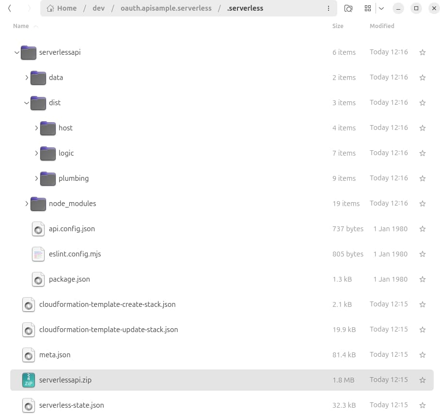
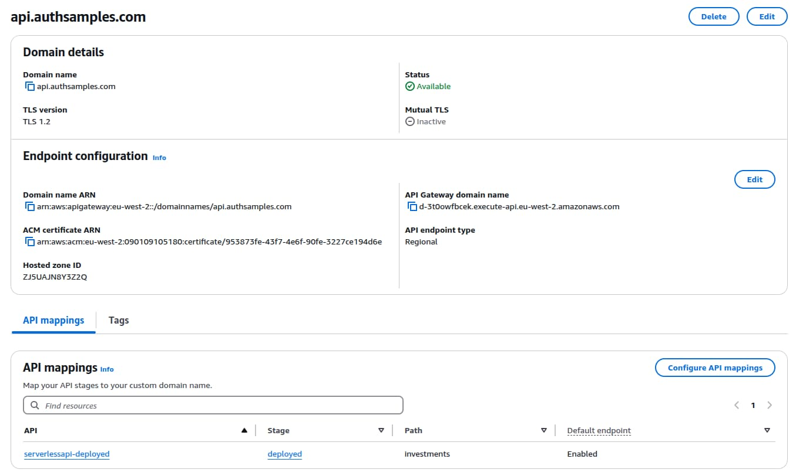
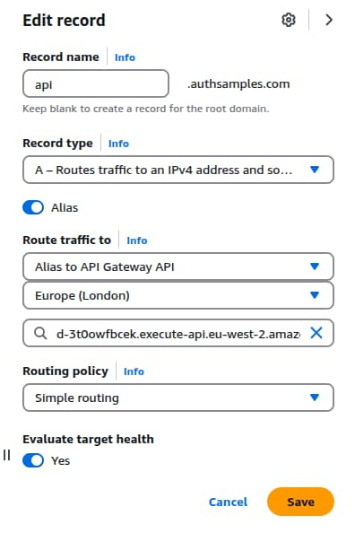
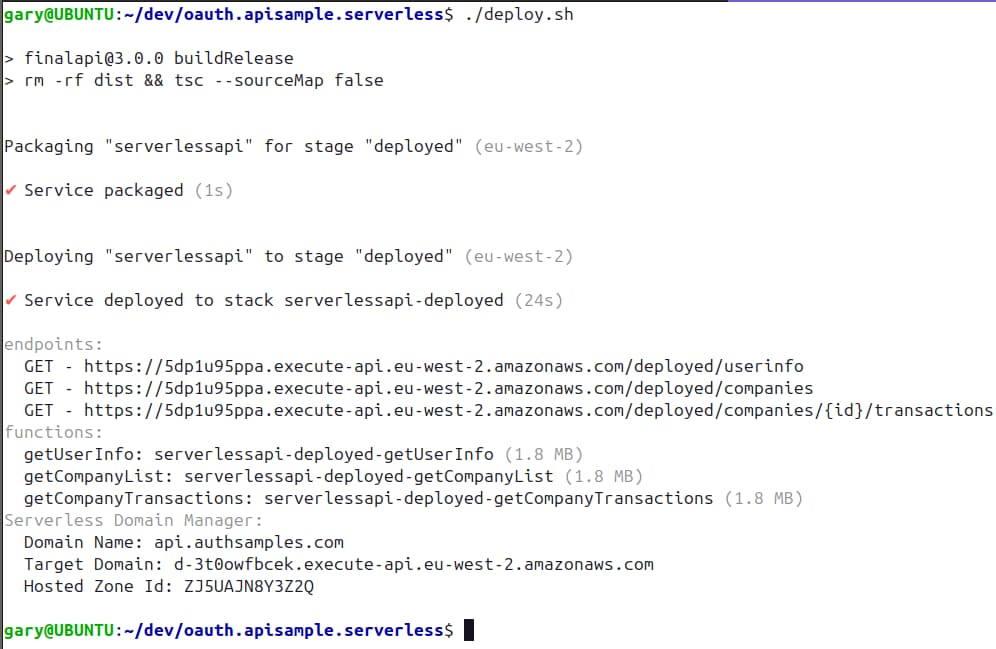
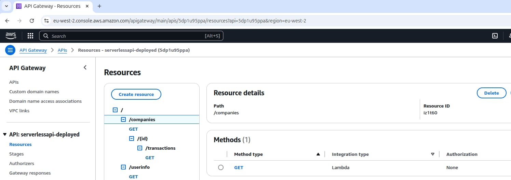
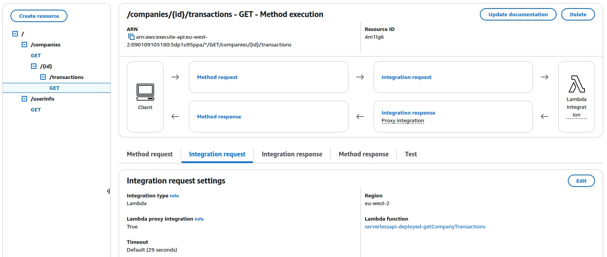
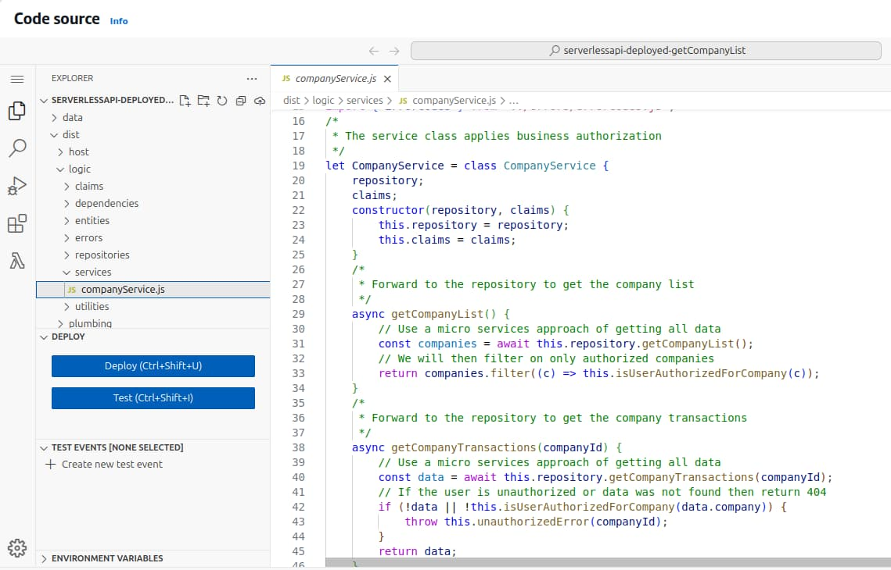
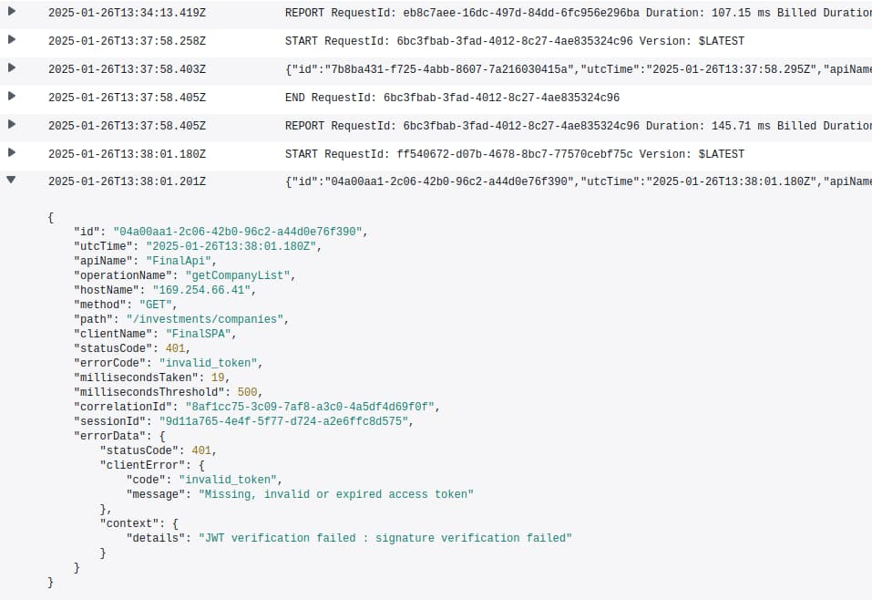

# Serverless API Deployment

Previously we provided a <a href='serverless-api-overview.mdx'>Serverless API Overview</a> and explained how to run its operations locally. Next we will explain how this API is deployed to the AWS cloud, to run as lambda functions.

### Serverless Deployment Stack

Our Cloud API is implemented using the [Serverless Framework](https://github.com/serverless/serverless) and lambda functions. In this post we will deploy the API to the AWS API Gateway, and our overall cloud architecture will then use the whole Serverless stack:


The Serverless API will provide data to SPA, mobile and desktop clients. Although the final <a href='final-spa-overview.mdx'>Single Page Application</a> uses secure cookies, the API will only need to deal with JWT access tokens, for all types of clients.

### Cloud Base URLs

Previously we hosted our final SPA at the below CloudFront URL:

- [https://www.authsamples.com](https://www.authsamples.com)

Next the Serverless API will be deployed to the following AWS API Gateway URL:

- *https://api.authsamples.com/investments*

### Prerequisite Setup

In earlier posts we ensured that prerequisites were in place, and these are needed in order for the below API deployment to work:

- Install [Node.js](https://nodejs.org/en/download/) for your Operating System
- Create an AWS upload account according to the <a href='cloud-domain-setup.mdx'>Cloud Domain Setup</a>
- Install and configure the [AWS Command Line Interface](https://aws.amazon.com/cli/)

### Deployment Overview

The API has a number of commands in its package.json file, which point to scripts that run Serverless framework commands:

```json
{
  "scripts": {
    "lint": "npx eslint . --ext .ts,.tsx",
    "build": "rm -rf dist && tsc",
    "buildRelease": "rm -rf dist && tsc --sourceMap false",
    "start": "./start.sh",
    "test": "./start.sh",
    "deploy": "./deploy.sh",
    "remove": "sls remove --stage deployed"
  }
}
```

The deployment script first runs *sls package* to build a ZIP file, then runs *sls deploy* to push resources to the cloud. This creates lambda functions, configures API gateway endpoints, and enables CloudWatch logging.

The *serverless.yml* file points to a custom domain that needs to be precreated before the first deployment. The sample uses a single AWS deployment stage of *deployed*, though I also use a *local* stage used when running lambdas locally:

```yaml
service: serverlessapi

provider:
  name: aws
  runtime: nodejs20.x
  region: eu-west-2
  stage: ${self:custom.config.settings.stage}
  apiGateway:
    shouldStartNameWithService: true

custom:
  customDomain:
    domainName: ${self:custom.config.settings.apiHostName}
    certificateName: '*.${self:custom.config.settings.certificateDomainName}'
    basePath: investments
    stage: ${self:custom.config.settings.stage}
    endpointType: regional
```

### API Configuration

The Serverless API uses the same JSON based approach to configuration as earlier APIs, and uses these settings when deployed to AWS:

```json
{
    "api": {
        "useProxy": false,
        "proxyUrl": ""
    },
    "logging": {
        "apiName": "FinalApi",
        "prettyPrint": false,
        "performanceThresholdMilliseconds": 500
    },
    "oauth": {
        "issuer":           "https://cognito-idp.eu-west-2.amazonaws.com/eu-west-2_CuhLeqiE9",
        "audience":         "",
        "algorithm":        "RS256",
        "scope":            "https://api.authsamples.com/investments",
        "jwksEndpoint":     "https://cognito-idp.eu-west-2.amazonaws.com/eu-west-2_CuhLeqiE9/.well-known/jwks.json"
    },
    "cache": {
        "isActive": true,
        "region": "eu-west-2",
        "tableName": "OAUTH_CACHE",
        "claimsCacheTimeToLiveMinutes": 15
    }
}
```

### Building Code

Our earlier Node.js API ran on a development computer using [tsx](https://github.com/privatenumber/tsx), then built to JavaScript for release builds. Lambdas must instead always be built to JavaScript, so *tsc* is used, with the following *tsconfig.json* settings:

```json
{
  "compilerOptions": {
    "strict": true,
    "target": "ES2023",
    "lib": ["ES2023"],
    "module":"Node16",
    "moduleResolution": "Node16",
    "allowSyntheticDefaultImports": true,
    "experimentalDecorators": true,
    "outDir": "dist",
    "sourceMap": true
  },
  "include": [
    "src/**/*.ts"
  ],
  "exclude": [
    "node_modules"
  ]
}
```

### Deployment Package

The deployment package is output to a *.serverless* folder, and files that should not be deployed are excluded via the *serverless.yml* file. Only  production Node.js dependencies are included, and those in the *devDependencies* section of *package.json* do not get uploaded to AWS:



The size of each lambda is around 1MB, including dependencies for JWT libraries that make HTTP requests to the authorization server. The Serverless framework uses [CloudFormation](https://docs.aws.amazon.com/AWSCloudFormation/latest/UserGuide/Welcome.html) to automate the creation of AWS resources.

### Configure the API Subdomain

The main hosting domain of *authsamples.com* was created in the earlier <a href='cloud-domain-setup.mdx'>Cloud Domain Setup</a>. An API custom domain must also be pre-created in the AWS API Gateway. This points to the wildcard certificate generated earlier, and is linked to the deployment stage under *API Mappings*:



In *Route 53 / Hosted Zones*, the initial generated domain name is then mapped to an *A Record* for the custom domain name, pointing to the generated value:



### API Deployment

The deployment script then continues by deploying the ZIP file to AWS, which will create cloud HTTPS endpoints that route to the API’s lambda functions:



Once deployed our API is created in the gateway, and we can view results in the AWS console:



The deployment configures an *Integration Request* for each incoming HTTP request, to invoke the relevant lambda:



Our API has three endpoints that exist at the below internet URLs, and the third of these is parameterised via path segments:

- *https://api.authsamples.com/investments/userinfo*
- *https://api.authsamples.com/investments/companies*
- *https://api.authsamples.com/investments/companies/2/transactions*

### Deployed Lambdas

In the AWS Console, I can then view the deployed lambda functions, which run in the London region:


The compiled JavaScript of each lambda can also be inspected. I deploy all API code for each individual lambda, which enables lambdas to share common classes.



Lambdas can be [packaged individually](https://www.serverless.com/framework/docs/providers/aws/guide/packaging#artifact) if you prefer, and it is possible to use [Serverless Plugin Scripts](https://github.com/mvila/serverless-plugin-scripts) to run custom packaging logic. This might involve excluding certain folders or dependencies for certain lambdas.

### DynamoDB Resources

In order to enable OAuth related caching, the *serverless.yml* file also creates some DynamoDB resources:

```yaml
resources:
  Resources:

    CacheTable:
      Type: AWS::DynamoDB::Table
      Properties:
        TableName: OAUTH_CACHE
        AttributeDefinitions:
          - AttributeName: CACHE_KEY
            AttributeType: S
        KeySchema:
          - AttributeName: CACHE_KEY
            KeyType: HASH
        TimeToLiveSpecification:
          AttributeName: TTL_VALUE
          Enabled: true
        BillingMode: PAY_PER_REQUEST
```

This creates a table that contains key value pairs, for both the JWKS data and custom claims, looked up when a Cognito access token is first received. In particular, this prevents the API from calling the critical authorization server on every API request.


Although this works, it is less optimal than the in-memory caching used previously for cloud native APIs.

### API Immediate Logs

In CloudWatch, log groups have been added for each of the lambdas, and log retention is configured to lasts only a few days. The role of these logs is similar to that of the immediate log files in our earlier Node.js APIs.


Log entries can be viewed in the AWS console, but CloudWatch is only used for immediate logging. In a real company setup, logs should be aggregated to a more powerful log analysis system with <a href='api-technical-support-analysis.mdx'>good querying capabilities</a>.



In order to perform the above logging, the API’s code needs access to the full request and response details. Therefore I would recommend always using the *REST API* option, since any API should have access to this data:


### Troubleshooting Lambda Startup

Errors that prevent AWS from calling the lambda entry point are not reported in CloudWatch logs. Instead you must activate *API Gateway Logging* when needed. First define an IAM role with [log permissions](https://aws.amazon.com/premiumsupport/knowledge-center/api-gateway-cloudwatch-logs):


From the API gateway, the extra logging can then be temporarily activated when needed. An extra *CloudWatch Log Group* is then available, with further info on the startup error.


A common cause of this type of error is when a Node.js dependency is included in *devDependencies* when it should be in *dependencies*. In this case the dependency is not deployed and the lambda fails to start.

### Where Are We?

We have ported our earlier Node.js API to run with low cost and zero maintenance in AWS. Serverless lambdas are interesting to know about, and in the next post we will explain more about the lambda OAuth security.

### Next

- Next we will explain some <a href='serverless-api-coding-model.mdx'>Serverless API Code Details</a>
- For a list of all blog posts see the <a href='index.mdx'>Index Page</a>
