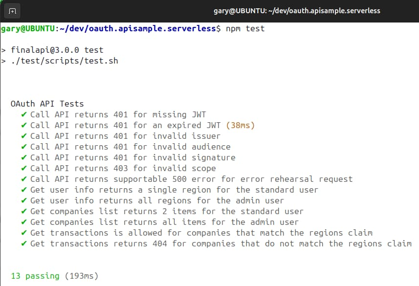
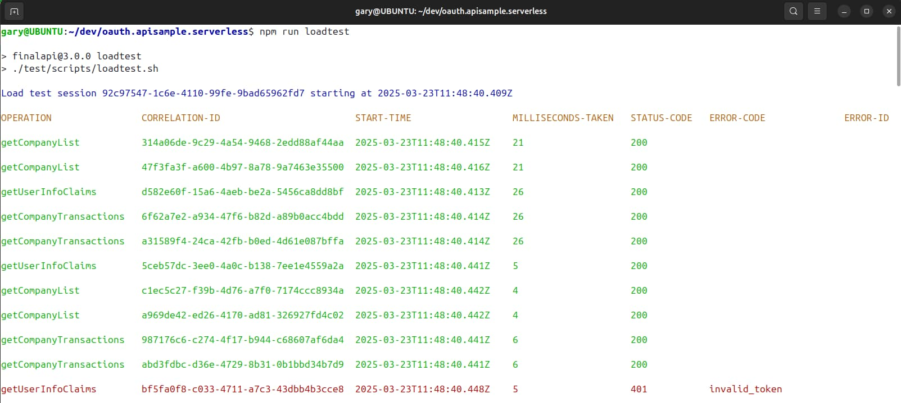

# Serverless API Overview

Previously I explained this blog's <a href='cdn-static-content-delivery.mdx'>Web Content Delivery</a> to many AWS regions. Next I provide an overview of a Node.js API with low cost cloud hosting, that I implement using the [Serverless Framework](https://github.com/serverless/serverless). I also show how to take control over OAuth security in a zero trust manner and test the API productively with user level access tokens.

### Serverless API Overview

The Serverless API behaves equivalently to the earlier <a href='api-architecture-node.mdx'>Node.js Express API</a>. The API has a couple of simple endpoints that return mock data for a money-based theme of investments. The API aims to be visual and serves this blog's apps, such as the <a href='how-to-run-the-react-js-spa.mdx'>Final SPA</a> below. Running both together ensures that the API is client-focused and enables you to focus on API logs that the client generates.


### API URLs

During development the API runs as a standalone component. You can use either mocha tests or a load test as the API client. These tests get user-level access tokens to call the API and verify some OAuth security use cases. The API accepts mock access tokens when you point it to a mock authorization server:

| Component | Base URL |
| --------- | -------- |
| API | *https://api.authsamples-dev.com:446* |
| Mock Authorization Server | *https://login.authsamples-dev.com:447* |

### Prerequisite 1: Domain Setup

First update your computer's hosts file to create domains for local development. Include the web domain and local backend-for-frontend domain if you run the SPA and API together:

```markdown
127.0.0.1 api.authsamples-dev.com login.authsamples-dev.com www.authsamples-dev.com bfflocal.authsamples-dev.com
```

### Prerequisite 2: Install OpenSSL

Install OpenSSL 3+ so that you can create development certificates and run the API over HTTPS.

### Prerequisite 3: Install Node.js

Download [Node.js](https://nodejs.org/en/download) for your operating system, which runs the API and also builds the SPA's JavaScript bundles.

### Prerequisite 4: Install Docker

To run API tests, or the full SPA and API solution, you use Docker utility components, so install a local engine such as [Docker Desktop](https:/www/.docker.com/products/docker-desktop).

### Step 1: Get the Code

Close the GitHub repository with the following command:

```bash
git clone https://github.com/gary-archer/oauth.apisample.serverless
```


### Step 2: View the Code

The code structure matches that used in all of this blog's earlier cloud native APIs, developed in <a href='api-architecture-node.mdx'>Node.js</a>, <a href='net-core-code-sample-overview.mdx'>.NET</a> and <a href='java-spring-boot-api-overview.mdx'>Java</a>:

<div className='smallimage'>
    
</div>

The *serverless.yml* file lists the API's operations. Entry points are lambda functions which have the same role as a REST controller.

```yaml
functions:
  
  getUserClaims:
    handler: dist/host/lambda/getUserInfo.handler
    events:
      - http: 
          path: /userinfo
          method: get

  getCompanyList:
    handler: dist/host/lambda/getCompanyList.handler
    events:
      - http: 
          path: /companies
          method: get

  getCompanyTransactions:
    handler: dist/host/lambda/getCompanyTransactions.handler
    events:
      - http: 
          path: /companies/{id}/transactions
          method: get
          request: 
            parameters: 
              paths: 
                id: true
```

By default, the Serverless Framework requires you to use the *sls invoke* command to run lambdas on a development computer. Input and output payloads must use a lambda specific format. When the API runs in the cloud, real clients instead send standard HTTP requests.

### Step 3: Understand OAuth Security

In AWS it is common to use a [Lambda Authorizer](https://docs.aws.amazon.com/apigateway/latest/developerguide/http-api-jwt-authorizer.html) to implement security only at the internet entry point. Secure values such as claims are then simply forwarded to lambdas in plain HTTP headers. This is not the most secure design. APIs also lose track of the incoming access token, so the security does not scale correctly, since a lambda cannot call an upstream API with the correct access token. To resolve these issues the serverless API code sample implements OAuth security within the lambda function's code.

### Step 4: Run the API

Rather than working with *sls invoke* I follow the same approach as for this blog's cloud native APIs. I use [Serverless Offline](https://github.com/dherault/serverless-offline) to expose local HTTPS endpoints. You can run the API locally with the following command:

```bash
./start.sh
```

Serverless Offline then exposes the API's HTTPS endpoints on port 446:


You can then use local URLs such as the following to call the API:

```markdown
https://api.authsamples-dev.com:446/investments/companies
```

### Step 5: Run Integration Tests

To run mocha tests, you must run the API with a configuration that points to a mock authorization server. Stop the API if it is running, then re-run it via this command:

```bash
npm run testsetup
```

Then run tests with the following command:

```bash
npm test
```

The test setup spins up a JWKS URI with an HTTPS endpoint that the Wiremock utility provides. A number of tests then make OAuth-secured API requests. These tests focus on the API's main security behaviours:



### Step 6: Run a Basic Load Test

While the API runs with a test configuration you can also run a basic load test that sends parallel API requests. This helps to ensure that the API code has no concurrency bugs:

```bash
npm run loadtest
```

The test fires batches of 5 concurrent requests at a time and also intentionally rehearses certain types of error. The expected result is 3 errors from a total of 100 requests:



The <a href='api-automated-tests.mdx'>API Automated Tests</a> post explains how tests get user level tokens without running a full authorization code flow.

### Step 6: Run a Frontend Client

You can run any of this blog's final frontend clients against the API:

- <a href='final-spa-overview.mdx'>Final SPA</a>
- <a href='final-desktop-sample-overview.mdx'>Final Desktop App</a>
- <a href='android-code-sample-overview.mdx'>Final Android App</a>
- <a href='ios-code-sample-overview.mdx'>Final iOS App</a>

To do so, follow the instructions to run the client against a local API, for example by using a *LOCALAPI* environment variable to override the default usage of a cloud API. When the frontend runs a code flow you can authenticate with this blog's test credential:

- User: *guestuser@example.com*
- Password: *GuestPassword1*

### Main Feature 1: Extensible Authorization

The API implements its security according to these two blog posts, using a JOSE library and some custom claims handling:

- <a href='jwt-access-token-validation.mdx'>JWT Access Token Validation</a>
- <a href='api-authorization-design.mdx'>API Authorization Design</a>

The overall behaviour manages OAuth security correctly while setting up the API's business logic with the authorization values it needs. These values may originate from multiple data sources and may not always be issued to tokens:

```typescript
@injectable()
export class CompanyService {

    private readonly repository: CompanyRepository;
    private readonly claims: ClaimsPrincipal;

    public constructor(
        @inject(SAMPLETYPES.CompanyRepository) repository: CompanyRepository,
        @inject(BASETYPES.ClaimsPrincipal) claims: ClaimsPrincipal) {

        this.repository = repository;
        this.claims = claims;
    }
}
```

The API uses the same OAuth integration and claims handling techniques as this blog's second code sample, explained earlier in the <a href='updated-api-coding-key-points.mdx'>Updated API Code Details</a> blog post.

### Main Feature 2: Production Supportability

The other main objective of the API code sample is JSON logging of API requests, to produce both technical support and audit logs. Logging output writes to files called *api-request.log* and *api-audit.log* on a local computer or to Cloudwatch in AWS.

```json
{
  "type": "request",
  "id": "57b5b054-55bc-2515-65f9-cd7f66919788",
  "utcTime": "2022-12-10T12:57:52.451Z",
  "apiName": "FinalApi",
  "operationName": "getUserInfo",
  "hostName": "UBUNTU",
  "method": "GET",
  "path": "/investments/userinfo",
  "clientId": "FinalSPA",
  "userId": "a6b404b1-98af-41a2-8e7f-e4061dc0bf86",
  "statusCode": 200,
  "millisecondsTaken": 372,
  "correlationId": "8debe475-41bb-6c9f-7fc6-7395d79a4b67",
  "sessionId": "f54f1734-aeba-d9a5-550c-e8c74ad3fbf9"
}
```

You could follow the <a href='log-aggregation-setup.mdx'>Log Aggregation Setup</a> to run a Docker-based deployment of the Elastic Stack that aggregates the API's logs to Elasticsearch. You can then run <a href='api-technical-support-analysis.mdx'>Technical Support Queries</a> against the API's logs. This would be useful in a production system, to make sense of large volumes of API requests.

### Where Are We?

The Serverless API uses portable code to meet requirements articulated in the <a href='api-platform-design.mdx'>API Architecture Goals</a> post. Next I explain how I deploy the Serverless lambdas to AWS and expose endpoints using the AWS API gateway.

### Next

- I explain the <a href='serverless-api-deployment.mdx'>Serverless API Deployment</a>.
- For a list of all blog posts see the <a href='index.mdx'>Index Page</a>.