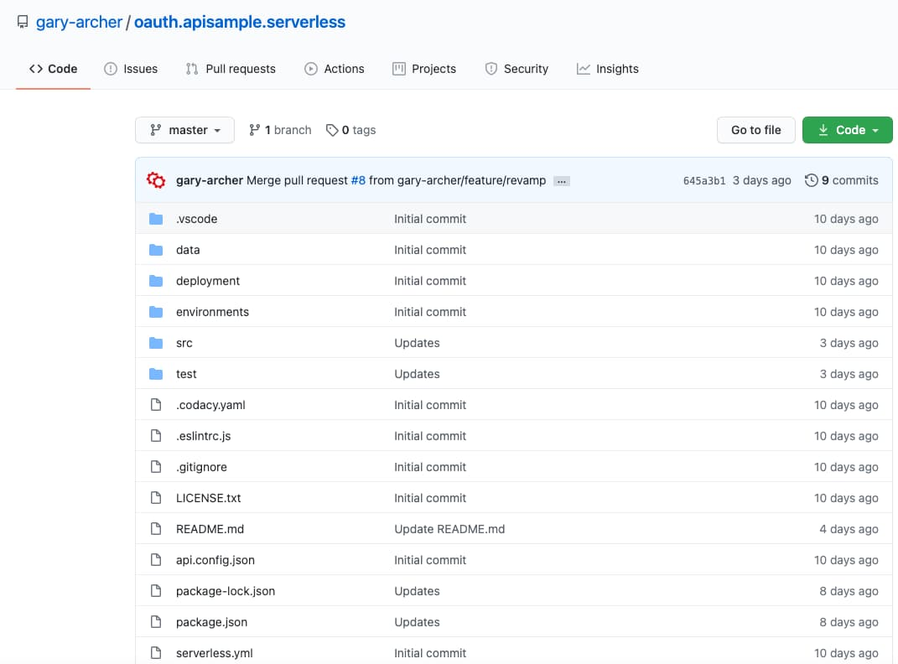
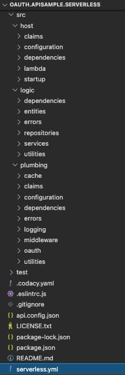
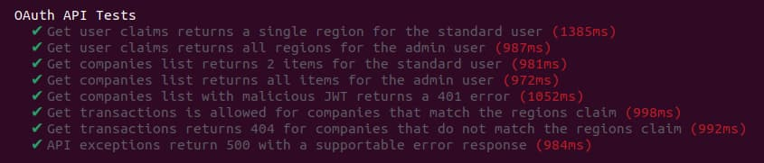
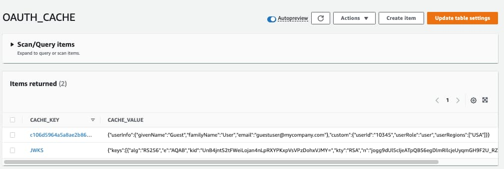

# Serverless API Overview

Previously we explained this blog’s <a href='cdn-static-content-delivery.mdx'>Web Content Delivery</a> to AWS. Next we will provide an overview of an API implemented with the [Serverless Framework](https://github.com/serverless/serverless), and show how to run its lambda functions locally.

### API Features

The main behaviour to aim for is summarised below, where code is identical to that in our earlier Node.js API, which was hosted by the Express HTTP server:

| Behaviour | Description |
| --------- | ----------- |
| Zero Trust | Our API performs JWT access token validation on every request, via a JOSE security library |
| Extensible Authorization | Our API is in full control of authorization values from both the access token and other sources |
| Supportable | Our API will use this blog’s designs for logging and error handling to ensure good technical support qualities |
| Scalable | The same coding techniques, and any common code, can be used for many APIs in a software platform |
| Productive | The API code is modern and portable across mainstream languages |

### Preferred Local Setup

Ideally we would like an equivalent setup to our earlier APIs, where we listen for HTTP requests on a development computer, and can run a frontend client against the API:


Technologies such as [Serverless Offline](https://github.com/dherault/serverless-offline) do not yet support this reliably though, so we are limited to local execution of lambda functions and will only be able to run an integrated setup after deployment to AWS.

### Get the API

The Serverless API project is available [here](https://github.com/gary-archer/authguidance.apisample.serverless) and can be downloaded / cloned to your local computer with this command:

```bash
git clone https://github.com/gary-archer/oauth.apisample.serverless
```



### View the Code

We will take a closer look at the code in a couple of posts time, but for now, notice that the code structure matches that used in all of this blog’s earlier APIs, for <a href='api-architecture-node.mdx'>Node.js</a>, <a href='net-core-code-sample-overview.mdx'>.NET</a> and <a href='java-spring-boot-api-overview.mdx'>Java</a>:

<div className='smallimage'>
    
</div>

The *serverless.yml* file lists the API’s operations, and the entry point are lambda functions, which have the same role as an API controller operation.

```yaml
functions:
  
  getUserClaims:
    handler: dist/host/lambda/getUserInfo.handler
    events:
      - http: 
          path: /userinfo
          method: get

  getCompanyList:
    handler: dist/host/lambda/getCompanyList.handler
    events:
      - http: 
          path: /companies
          method: get

  getCompanyTransactions:
    handler: dist/host/lambda/getCompanyTransactions.handler
    events:
      - http: 
          path: /companies/{id}/transactions
          method: get
          request: 
            parameters: 
              paths: 
                id: true
```

With the Serverless Framework, these are run on a development computer using the *sls invoke* command. This requires input and output payloads that use a lambda specific format. Once the API is deployed, real clients will instead just use HTTP requests.

### Test the API

Our earlier page on <a href='api-automated-tests.mdx'>API Automated Tests</a> covered some techniques for testing OAuth secured APIs. Providing the input for an API request is tricky, since a user level access token is required, containing a subject claim.

The Serverless API tests use a technique of mocking the authorization server. The same [mocha](https://mochajs.org) based integration tests as the earlier Node.js API are used, with some code to wire up *sls invoke* with request and response payloads. This enables the API to be tested productively.

To run the tests, ensure that a Docker engine is installed in addition to an up to date version of Node.js, then run this command:

```bash
./start.sh
```

Tests create a keypair and expose the token signing public key at a JWKS URI provided by a Docker instance of [Wiremock](https://github.com/tomasbjerre/wiremock-npm). The API's JWKS URI is then pointed to Wiremock's address. Integration tests use a JWT library and the corresponding private key  to issue access tokens for tests, to send to the API.

This enables the API’s OAuth security code paths to be tested productively, though local lambda execution is a little slow.



### Zero Trust API Security

In AWS it is common to read about solutions that use [Lambda Authorizers](https://docs.aws.amazon.com/apigateway/latest/developerguide/http-api-jwt-authorizer.html) to implement security only at the internet entry point. Secure values such as claims are then simply forwarded to lambdas in HTTP headers, over a trusted connection.

A more cutting edge security option in line with OAuth best practices is for each lambda to receive and <a href='jwt-access-token-validation.mdx'>Validate the JWT Access Token</a>. This also helps to keep the API’s code closer to OAuth standards.

### API Authorization

The overall authorization used by the Serverless API was summarised earlier in our <a href='api-authorization-design.mdx'>API Authorization Behaviour</a>. The API collects both token claims and extra claims into a claims principal, then caches extra claims for future requests with the same access token:


The claims principal is then injected into service logic classes, which have all of the values needed to apply their authorization.

### Lambdas and In-Memory Caching

JWT validation requires in-memory caching of token signing public keys, and the above authorization uses in-memory caching of extra claims. Yet with lambda technology this is not possible, since a new lambda instance is spun up on every request.

To resolve this problem we need to use a distributed cache. The best-fit Serverless option is to use DynamoDB, which supports saving data with a time to live, similar to the in-process caches used by earlier APIs:



This is awkward though, since the code becomes more complex, and the Serverless API requires more out of process calls than it should, so performance is also not optimal.

### Client Specific Security Differences

The API serves this blog’s final frontend code samples which you can run as explained in the <a href='quick-start.mdx'>Quick Start</a> page. Each frontend has its own client best practices. The SPA uses *HttpOnly SameSite=strict Secure* cookies when calling the Serverless API.

The Serverless API does not contain any cookie logic though, so that its usage is identical for web and native clients. Instead, cookies during API requests are dealt with by an *OAuth Proxy* component, as described in the <a href='spa-back-end-for-front-end.mdx'>SPA Backend for Frontend</a> post.

### API Request Logging

The API uses our <a href='effective-api-logging.mdx'>Effective API Logging</a> design, and writes JSON logs that are shipped to Elasticsearch. When tests are run, the logging output is redirected to a *lambdatest.log* file:

```json
{
  "id": "14d694e1-d7dd-fa46-7fd5-7cef812e4a6a",
  "utcTime": "2023-03-20T18:19:55.674Z",
  "apiName": "FinalApi",
  "operationName": "getCompanyTransactions",
  "hostName": "UBUNTU",
  "method": "GET",
  "path": "/investments/companies/2/transactions",
  "resourceId": "2",
  "clientName": "ServerlessTest",
  "userId": "a6b404b1-98af-41a2-8e7f-e4061dc0bf86",
  "statusCode": 200,
  "millisecondsTaken": 21,
  "correlationId": "88686b82-f578-2e64-d716-9e1f35c6e1f0",
  "sessionId": "931f42c1-9060-786e-2c9a-d4f07335814e"
}
```

In AWS these log entries are output to CloudWatch, then could be aggregated to a cloud log aggregation system, to enable <a href='api-technical-support-analysis.mdx'>Technical Support Queries</a> on the log data.

### API Supportability

As for other APIs, we also implement this blog’s <a href='error-handling-and-supportability.mdx'>Error Handling and Supportability</a> design. One interesting behaviour is the ability to perform error rehearsal, by sending in a custom header that allows testers to *choose an API to break*.

The final test exercises this behaviour, and results in the following log entry. The error returned to the API client includes a *fairly unique error identifier*. This enables fast lookup of API logs, to reduce problem resolution times:

```json
{
  "id": "faa151ac-6006-8b4d-4c11-8a2e0b6a4aa8",
  "utcTime": "2023-03-20T18:19:58.376Z",
  "apiName": "FinalApi",
  "operationName": "getCompanyTransactions",
  "hostName": "UBUNTU",
  "method": "GET",
  "path": "/investments/companies/4/transactions",
  "resourceId": "4",
  "clientName": "ServerlessTest",
  "userId": "a6b404b1-98af-41a2-8e7f-e4061dc0bf86",
  "statusCode": 500,
  "errorCode": "exception_simulation",
  "errorId": 28603,
  "millisecondsTaken": 19,
  "correlationId": "1fe8296d-37a1-943a-c33e-3464191d1a79",
  "sessionId": "931f42c1-9060-786e-2c9a-d4f07335814e",
  "performance": {
    "name": "total",
    "millisecondsTaken": 19,
    "children": [
      {
        "name": "validateToken",
        "millisecondsTaken": 14
      },
      {
        "name": "userInfoLookup",
        "millisecondsTaken": 3
      }
    ]
  },
  "errorData": {
    "statusCode": 500,
    "clientError": {
      "code": "exception_simulation",
      "message": "An exception was simulated in the API",
      "id": 28603,
      "area": "FinalApi",
      "utcTime": "2023-03-20T18:19:58.395Z"
    },
    "serviceError": {
      "details": "",
      "stack": [
        "Error: An exception was simulated in the API",
        "at ErrorFactory.createServerError (file:///home/gary/dev/oauth.apisample.serverless/dist/plumbing/errors/errorFactory.js:12:16)",
        "at CustomHeaderMiddleware.before (file:///home/gary/dev/oauth.apisample.serverless/dist/plumbing/middleware/customHeaderMiddleware.js:21:40)",
        "at runMiddlewares (file:///home/gary/dev/oauth.apisample.serverless/node_modules/@middy/core/index.js:119:27)",
        "at process.processTicksAndRejections (node:internal/process/task_queues:95:5)",
        "at async runRequest (file:///home/gary/dev/oauth.apisample.serverless/node_modules/@middy/core/index.js:79:9)"
      ]
    }
  }
}
```

### API Architecture

Our Serverless API has reduced vendor lock-in as much as possible, by implementing some non-functional logic to ensure portable code. OAuth processing is managed securely, and code is extensible in the important places.

We have also seen that the *Platform as a Service* model for APIs has some downsides. These include an inability to run a fully integrated setup locally, or to use in-memory caching between requests.

### Where Are We?

We have explained the Serverless API’s key behaviour, which follows the same portable concepts as earlier APIs. Next we will describe how the Serverless lambdas are deployed to AWS and called via its API gateway.

### Next

- Next we will explain the <a href='serverless-api-deployment.mdx'>Serverless API Deployment</a>
- For a list of all blog posts see the <a href='index.mdx'>Index Page</a>