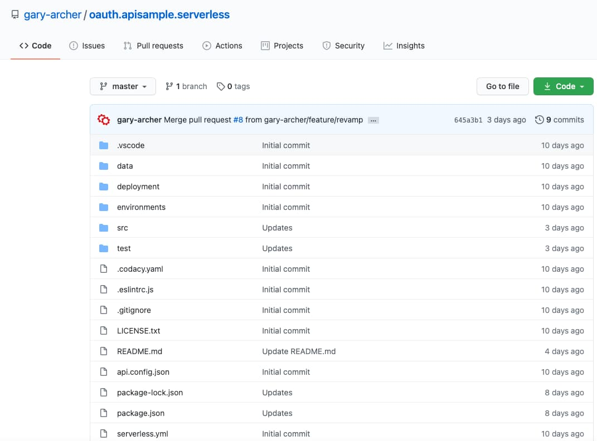
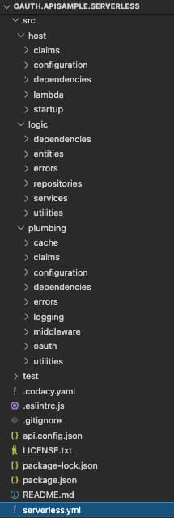
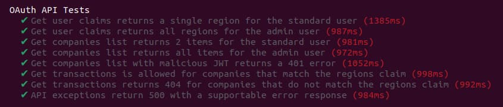

# Serverless API Overview

Previously I explained this blog's <a href='cdn-static-content-delivery.mdx'>Web Content Delivery</a> to many AWS regions. Next I provide an overview of a Node.js API with low cost cloud hosting, that I implement using the [Serverless Framework](https://github.com/serverless/serverless). I also show how to take control over OAuth security in a zero trust manner and test the API productively with user level access tokens.

### API Features

I continue to meet this blog's essential API behaviours. The code is as close as possible to that in the earlier <a href='api-architecture-node.mdx'>Node.js Express API</a>:

| Requirement | Description |
| ----------- | ----------- |
| Zero Trust | The API implements JWT access token validation on every request using a JOSE security library. |
| Standards Based | I use the same standards-based design patterns for OAuth security across Node.js, .NET and Java APIs. |
| Best Security | The [jose](https://github.com/panva/jose) library enables the most up to date and specialised security algorithms when dealing with JWTs. |
| Extensible Claims | APIs are in full control of the claims principal and are not forced to only use the authorization server's claims. |
| Supportable | Errors and logs use custom formats and identity-related error details are included in the API's logs. |

### Preferred Local Setup

Ideally I would like the same local setup as this blog's cloud native APIs, to listen for HTTP requests on a development computer and run frontend clients against the API when required. I should also be able to test reliability concerns, like views making concurrent API requests to the API.


Technologies such as [Serverless Offline](https://github.com/dherault/serverless-offline) do not fully support this. Developer end-to-end testing therefore requires frequent cloud redeployments. When working locally I am limited to local execution of lambda functions and must deploy to AWS to run an integrated setup.

### Get the API

The Serverless API project is available [here](https://github.com/gary-archer/authguidance.apisample.serverless) and can be downloaded / cloned to your local computer with the following command:

```bash
git clone https://github.com/gary-archer/oauth.apisample.serverless
```



### View the Code

The code structure matches that used in all of this blog's earlier cloud native APIs, developed in <a href='api-architecture-node.mdx'>Node.js</a>, <a href='net-core-code-sample-overview.mdx'>.NET</a> and <a href='java-spring-boot-api-overview.mdx'>Java</a>:

<div className='smallimage'>
    
</div>

The *serverless.yml* file lists the API's operations. Entry points are lambda functions which have the same role as a REST controller.

```yaml
functions:
  
  getUserClaims:
    handler: dist/host/lambda/getUserInfo.handler
    events:
      - http: 
          path: /userinfo
          method: get

  getCompanyList:
    handler: dist/host/lambda/getCompanyList.handler
    events:
      - http: 
          path: /companies
          method: get

  getCompanyTransactions:
    handler: dist/host/lambda/getCompanyTransactions.handler
    events:
      - http: 
          path: /companies/{id}/transactions
          method: get
          request: 
            parameters: 
              paths: 
                id: true
```

With the Serverless Framework you run lambdas on a development computer with the *sls invoke* command. This requires input and output payloads that use a lambda specific format. When the API runs in the cloud, real clients instead send standard HTTP requests.

### Zero Trust API Security

In AWS it is common to use a [Lambda Authorizer](https://docs.aws.amazon.com/apigateway/latest/developerguide/http-api-jwt-authorizer.html) to implement security only at the internet entry point. Secure values such as claims are then simply forwarded to lambdas in plain HTTP headers. This is not the most secure design. APIs also lose track of the incoming access token, so the security does not scale correctly, since a lambda cannot call an upstream lambda with the correct access token. To resolve these issues the serverless API code sample implements OAuth security within the lambda function's code.

### Test the API

The post on <a href='api-automated-tests.mdx'>API Automated Tests</a> explains some techniques for testing OAuth secured APIs. Providing the input for an API request is tricky, since requests must contain a user level access token. Therefore, the API tests mock the authorization server to enable productive integration testing. The tests also wire up *sls invoke* with request and response payloads. To run the tests, ensure that a Docker engine is installed in addition to an up to date version of Node.js, then run the following command:

```bash
./start.sh
```

Tests create an asymmetric keypair and expose the token signing public key at a JWKS URI provided by a Docker instance of [Wiremock](https://github.com/tomasbjerre/wiremock-npm). The API's JWKS URI then points to Wiremock. Integration tests use a JWT library and the corresponding private key  to issue access tokens for tests, to send to the API. The API then runs a suite of tests to test its security logic, though lambda execution is a little slow.



### Client Specific Security Differences

The API serves this blog's final frontend code samples that I summarize in the <a href='quick-start.mdx'>Quick Start</a> page. Each frontend has its own client best practices. The SPA uses *HttpOnly SameSite=strict Secure* cookies when calling the Serverless API. The Serverless API does not contain any cookie logic though, so that its code is identical for web and native clients. Instead, an *OAuth Proxy* component processes cookies during API requests. You can read more about that in the <a href='spa-back-end-for-front-end.mdx'>SPA Backend for Frontend</a> post.

### API Request Logging

The API uses this blog's <a href='effective-api-logging.mdx'>Effective API Logging</a> design and writes JSON logs in a schema based manner. When tests run, the API writes its logging output to a *lambdatest.log* file with a readable format. In AWS these log entries are instead output as a bare JSON line and saved to CloudWatch. Logs could be shipped from CloudWatch to a log aggregation system like Elasticsearch. The end result is to enable useful <a href='api-technical-support-analysis.mdx'>Technical Support Queries</a> on the log data.

```json
{
  "id": "14d694e1-d7dd-fa46-7fd5-7cef812e4a6a",
  "utcTime": "2023-03-20T18:19:55.674Z",
  "apiName": "FinalApi",
  "operationName": "getCompanyTransactions",
  "hostName": "UBUNTU",
  "method": "GET",
  "path": "/investments/companies/2/transactions",
  "resourceId": "2",
  "clientName": "ServerlessTest",
  "userId": "a6b404b1-98af-41a2-8e7f-e4061dc0bf86",
  "statusCode": 200,
  "millisecondsTaken": 21,
  "correlationId": "88686b82-f578-2e64-d716-9e1f35c6e1f0",
  "sessionId": "931f42c1-9060-786e-2c9a-d4f07335814e"
}
```

### API Supportability

The Serverless API also implements this blog's <a href='error-handling-and-supportability.mdx'>Error Handling and Supportability</a> design. One interesting behaviour is the ability to perform error rehearsal, by sending in a custom header that allows testers to *choose an API to break*. One of the integration tests exercises this behaviour and results in the following log entry. The error returned to the API client includes a *fairly unique error identifier*. This enables fast lookup of API logs to reduce problem resolution times:

```json
{
  "id": "faa151ac-6006-8b4d-4c11-8a2e0b6a4aa8",
  "utcTime": "2023-03-20T18:19:58.376Z",
  "apiName": "FinalApi",
  "operationName": "getCompanyTransactions",
  "hostName": "UBUNTU",
  "method": "GET",
  "path": "/investments/companies/4/transactions",
  "resourceId": "4",
  "clientName": "ServerlessTest",
  "userId": "a6b404b1-98af-41a2-8e7f-e4061dc0bf86",
  "statusCode": 500,
  "errorCode": "exception_simulation",
  "errorId": 28603,
  "millisecondsTaken": 19,
  "correlationId": "1fe8296d-37a1-943a-c33e-3464191d1a79",
  "sessionId": "931f42c1-9060-786e-2c9a-d4f07335814e",
  "errorData": {
    "statusCode": 500,
    "clientError": {
      "code": "exception_simulation",
      "message": "An exception was simulated in the API",
      "id": 28603,
      "area": "FinalApi",
      "utcTime": "2023-03-20T18:19:58.395Z"
    },
    "serviceError": {
      "details": "",
      "stack": [
        "Error: An exception was simulated in the API",
        "at ErrorFactory.createServerError (file:///home/gary/dev/oauth.apisample.serverless/dist/plumbing/errors/errorFactory.js:12:16)",
        "at CustomHeaderMiddleware.before (file:///home/gary/dev/oauth.apisample.serverless/dist/plumbing/middleware/customHeaderMiddleware.js:21:40)",
        "at runMiddlewares (file:///home/gary/dev/oauth.apisample.serverless/node_modules/@middy/core/index.js:119:27)",
        "at process.processTicksAndRejections (node:internal/process/task_queues:95:5)",
        "at async runRequest (file:///home/gary/dev/oauth.apisample.serverless/node_modules/@middy/core/index.js:79:9)"
      ]
    }
  }
}
```

### Where Are We?

The Serverless API uses portable code to meet requirements articulated in the <a href='API Architecture Goals'>API Architecture Goals</a> post. Next I explain how I deploy the Serverless lambdas to AWS and expose endpoints using the AWS API gateway.

### Next

- I explain the <a href='serverless-api-deployment.mdx'>Serverless API Deployment</a>.
- For a list of all blog posts see the <a href='index.mdx'>Index Page</a>.