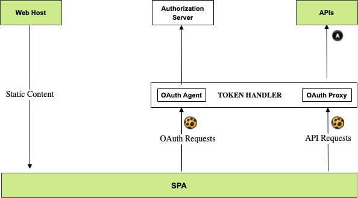

# SPA Backend for Frontend

In the previous post I ran a <a href='azure-ad-troubleshooting.mdx'>Microsoft Entra ID SPA and API OAuth Flow</a>. This blog's example SPA now needs hardening before it is final, to follow security best practices in the browser and to minimize threats. The SPA must also resolve its <a href='user-sessions-and-token-renewal.mdx'>Token Renewal Usability and Reliability Issues</a>.

### Security Best Practices for SPAs

The definitive document on security best practices is [OAuth 2.0 for Browser Based Apps](https://datatracker.ietf.org/doc/html/draft-ietf-oauth-browser-based-apps). The likelihood of security mistakes that malicious JavaScript could exploit, and the potential time of exploits, are both greater when JavaScript code uses tokens directly. 

The option with the strongest security guarantees is to use the browser's built in defences, namely SameSite cookies, cross-origin resource sharing (CORS) and a strong Content Security Policy (CSP). Combine the use of browser defences with XSS prevention best practices. In most cases, an XSS exploit is then limited to a session riding attack against APIs, which ends when the user stops using the SPA.

The big change from a web development viewpoint is that SPAs should use *HttpOnly SameSite=strict Secure* cookies to transport access tokens to APIs. The cookie requirement is an awkward one for SPAs, where you want to maintain a <a href='web-technology-setup.mdx'>Modern Web Technology Setup</a> and should not need to return to older website technology stacks. 

### High Level Requirements

At a higher level, there were three main requirements I wanted to meet for this blog's final SPA. When first writing this blog I struggled for quite some time to meet all of them.

| Requirement | Description |
| ----------- | ----------- |
| Strong Browser Security | Follow current best practices, with only the latest and most secure cookies used in the browser. |
| Globally Equal Performance | Deploy the SPA to a content delivery network, so that web latency is roughly the same at any global location. |
| Pure SPA Development | Web developers use production security but work only on modern frontends, with small code bases and usability control. |

### This Blog's Backend for Frontend

The key technique to maintain an SPA architecture and meet all three requirements is to use API-driven cookie issuing, In 2021 I adopted the *Token Handler Pattern* which consists of the following API components that implement cookie security. These components do not need to run on development computers. They are also stateless and easy to manage, since cookies contain all state.

| Component | Description |
| --------- | ----------- |
| OAuth Agent | A REST API that acts as a backend for frontend to simplify OAuth work for the SPA and manage a backend client credential. The BFF also issues cookies to the SPA that contain encrypted tokens. |
| OAuth Proxy | A plugin that runs in a high-performance API gateway. During API requests the plugin decrypts cookies and forwards JWT access tokens to APIs. |

This architecture requires extra moving parts. There is a learning curve to understand the deployment and its configuration settings. The reward once you get deployment working is to maintain a modern web architecture and a productive setup for all future web development.

### Backend for Frontend Solutions to Avoid

There are other types of cookie issuing solutions for web applications, but they deliver suboptimal solutions since they are not tailored to an SPA's requirements. The following notes explain the two most common types:

- **Reverse Proxy**. Development setups and deployments use a reverse proxy that implements security. When requests for HTML files do not have a session cookie the browser is abrubtly redirected. In some implementations, fetch requests may also experience abrupt redirects, or APIs may not receive access tokens. You therefore lose technical control.

- **Website**. Developers run a complex local setup where their web host comes into contact with sensitive API data and typically uses a website cookie framework. The web host may use server-side rendering to return HTML and data together. It requires a runtime and other server dependencies that limits developer setups and deployments, and the frontend loses technical control.

Instead, my BFF uses a separation of concerns to meet my requirements, where both the SPA and APIs retain full technical control. The frontend can reliably handle API 401 responses and use short-lived cookies, even when 401s occur for concurrent API requests.

### Security Components

I illustrate the overall components here, where the token handler acts as an advanced reverse proxy. Calls from the SPA to APIs must be SameSite so that cookies are classified as first-party, to ensure that the browser does not drop them during API requests due to third-party cookie restrictions.



I deploy the final SPA's web content as an [AWS CloudFront Distribution](https://aws.amazon.com/cloudfront/) and static web files do not need securing. The SPA calls a business API that does not do any cookie processing. The API uses exactly the same code to handle requests from web, desktop and mobile clients.

### API Driven Cookie Issuing

The final SPA calls APIs via a dedicated *bff* subdomain that runs in the same parent site as the SPA's web origin. The deployment ensures that the browser sends cookies when the SPA calls APIs. CORS restricts the use of cookies to the SPA's precise web origin. The cookie sent to APIs uses the following properties and contains an encrypted short-lived access token.

- HttpOnly
- SameSite=strict
- Secure
- Path=/

Although there is a cookie layer, the overall architecture and key behaviours of the important components (the SPA and API) remain the same as this blog's early code samples. They continue to use all of the productivity benefits that OAuth's core design enables.

### Cloud Environment

I designed the following URLs for the deployed AWS environment. The */spa* path for the SPA indicates that you could deploy additional micro-frontends for the same business area alongside it and share the same cookies. Similarly, you could deploy additional APIs under the API base URL:

| Component | Base URL |
| --------- | -------- |
| SPA | *https://www.authsamples.com/spa/* |
| Investments API | *https://api.authsamples.com/investments* |
| Investments API Web Route | *https://bff.authsamples.com/investments* |
| OAuth Agent | *https://bff.authsamples.com/oauth-agent* |
| Authorization Server | *https://login.authsamples.com* |

### Web Development Environment

Even more important than deployed environments is the local development environment, since this is where most work is done. You therefore need a productive setup that helps to enable a fast time to market for web development. I designed the following URLs for local development of the final SPA. Developers run a local web static content host, with all API components running in the AWS cloud.

| Component | Base URL |
| --------- | -------- |
| SPA | *https://www.authsamples-dev.com/spa/* |
| Investments API | *https://api.authsamples.com/investments* |
| Investments API Web Route | *https://bff.authsamples-dev.com/investments* |
| OAuth Agent | *https://bff.authsamples-dev.com/oauth-agent* |
| Authorization Server | *https://login.authsamples.com* |

For local development URLs I used a hostname suffix of *-dev*. The *authsamples-dev.com* site represents components that run on the local computer. Yet the *bff* subdomain runs in AWS, solely to support local SPA development. For the web origin and API routes to work together, you must alias the web domain to *localhost* in your computer's hosts file:

```markdown
127.0.0.1 www.authsamples-dev.com
```

To run the SPA during development you use a domain-based URL of *https://www.authsamples-dev.com*. Even though you use cookie security, there is a pure SPA development setup, where you focus only on React code and running it in the browser.


### Full Stack Development Environment

It gets more complicated when you need to run both the SPA and APIs locally, which you should avoid most of the time. Such a setup is possible but you need to invest in a local BFF setup and deal with port limitations. The final SPA has a full stack local deployment that uses docker containers, where an API gateway runs on port 444. The API then runs locally on port 446:

| Component | Base URL |
| --------- | -------- |
| SPA | *https://www.authsamples-dev.com/spa/* |
| Investments API | *https://api.authsamples-dev.com:446/investments* |
| Investments API Web Route | *https://bfflocal.authsamples-dev.com:444/investments* |
| OAuth Agent | *https://bfflocal.authsamples-dev.com:444/oauth-agent* |
| Authorization Server | *https://login.authsamples.com* |

Developers must then also add the *bfflocal* subdomain to the hosts file. You can then run a more complete local setup, which is useful for developers who want to focus on end-to-end API and client journeys.


More generally there can be reliability and productivity benefits when you invest in setups that enable development and testing together. You can decide to run some components locally from code, with other components running in deployed environments or in docker.

### Token Handlers

I do not explain the token handler pattern in this blog, but you can study the following resources to understand the SPA's cookie layer. The full stack token handler demonstrates the preferred implementation, where the OAuth Proxy logic executes in a high performance API gateway:

- [OAuth Agent](https://github.com/curityio/cloud-native-oauth-security-examples/tree/main/chapter-13-browser-based-apps/backend-for-frontend/oauth-agent)
- [OAuth Proxy](https://github.com/curityio/cloud-native-oauth-security-examples/tree/main/resources/apigateway/curity-oauth-proxy)

My online demo APIs use <a href='serverless-api-overview.mdx'>Serverless Hosting</a> due to its low costs. I must therefore use the AWS API gateway, whose authorizer logic does not support the following requirements:

- At the web route, run logic in the API gateway to process cookies and enforce web specific security.
- Then update the request's HTTP authorization header with a JWT access token and route to the API lambda.

To work around this I implemented a [Serverless Token Handler](https://github.com/gary-archer/oauth.tokenhandler.serverless) that works as follows during API requests:

- A wildcard lambda runs at *https://bff.authsamples.com/investments* to process cookies and enforce web specific security.
- The wildcard lambda uses the Axios library to explicitly call *https://api.authsamples.com/investments* with an access token.

Although this works well enough to meet this blog's basic requirements, it is in effect a home grown API gateway that is a little suboptimal in a number of areas, including performance, reliability and code complexity.

### Where Are We?

I explained the deployment variations for this blog's final SPA. When you use cookies in browser based apps you should spend some time thinking through URLs for current and future deployment scenarios. The early focus on deployment enables you to verify and de-risk many production behaviours early and think through how you will scale the architecture in future.

### Next

- I provide a <a href='final-spa-overview.mdx'>Final SPA</a> that uses cookies to call APIs.
- For a list of all blog posts see the <a href='index.mdx'>Index Page</a>.