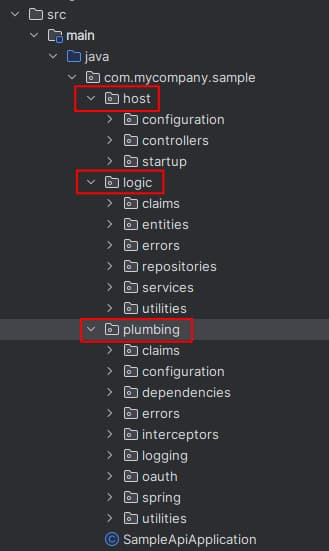
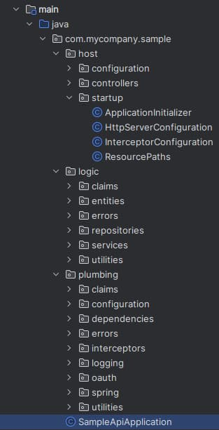
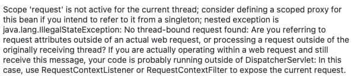
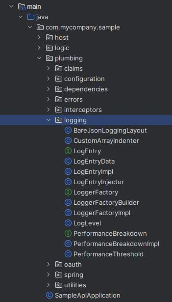

# Java API – Code Details

In our previous post we described our <a href='spring-boot-api-oauth-integration.mdx'>Spring Boot API OAuth Integration</a>. We will now drill into some final implementation details.

### Code Structure

Our advanced Java API consists of three main areas:

- REST Host
- API Business Logic
- Common Code (plumbing)

<div className='smallimage'>
    
</div>

In a real API platform, much of the plumbing folder could be extracted into one or more shared library references and there would be far less code.

### Application Startup Logic

Our API entry point is the below *FinalApiApplication* class:

<div className='smallimage'>
    
</div>

We use standard Spring Boot extensibility points via the following classes, which run when our API starts:

| Class | Description |
| ----- | ----------- |
| ApplicationInitializer | Logic before Spring’s component system is initialised |
| HttpServerConfiguration | Logic after Spring’s component system is initialised |

### Dependency Composition

The main responsibility of these classes is to read the API’s JSON configuration and to set up *Cross Cutting Concerns* which includes registering dependencies:

```java
@Override
public void initialize(final ConfigurableApplicationContext context) {

    var reader = new JsonFileReader();
    var configuration = reader.readFile("api.config.json", Configuration.class).join();

    loggerFactory.configure(configuration.getLogging());

    this.configurePort(configuration.getApi());
    this.configureHttpDebugging(configuration.getApi());
    this.configureSsl(configuration);

    var container = context.getBeanFactory();
    container.registerScope(CustomRequestScope.NAME, new CustomRequestScope());

    new BaseCompositionRoot(container)
            .useOAuth(configuration.getOauth())
            .withClaimsProvider(new SampleCustomClaimsProvider())
            .withLogging(configuration.getLogging(), loggerFactory)
            .register();

    container.registerSingleton("ApiConfiguration", configuration.getApi());
}
```

### Middleware

Startup code creates various middleware classes and Spring calls most of them *interceptors*. These are natural singletons, and some of them need to be registered with the container:

```java
@Override
    public void addInterceptors(final InterceptorRegistry registry) {

        var loggingInterceptor = new LoggingInterceptor(this.context.getBeanFactory());
        registry.addInterceptor(loggingInterceptor)
                .addPathPatterns(ResourcePaths.ALL);

        var headerInterceptor = new CustomHeaderInterceptor(this.loggingConfiguration.getApiName());
        registry.addInterceptor(headerInterceptor)
                .addPathPatterns(ResourcePaths.ALL);
}
```

The role of each of these middleware classes is summarised below:

| Middleware Class | Responsibility |
| ---------------- | -------------- |
| LoggingInterceptor | Manage the log entry for each API request, then log request and response details |
| CustomHeaderInterceptor | Allow advanced client side testing of APIs via custom headers |
| UnhandledExceptionHandler | A central place for handling exceptions, adding error details to logs, and producing the client error response |

### Single Threaded Code

For APIs with small dependency graphs, I like to reduce the likelihood of parallel requests  impacting each other. I do this by giving each request its own independent object instances. The API uses a request scope for REST specific objects, or a prototype scope for domain logic classes:

```java
@RestController()
@Scope(value = CustomRequestScope.NAME)
@RequestMapping(value = "api/companies")
public class CompanyController {
    ...    
}

@Service
@Scope(value = ConfigurableBeanFactory.SCOPE_PROTOTYPE)
public class CompanyService {
    ...
}
```

### High Throughput Requirement

Our earlier Node.js and .NET APIs were [Non Blocking](https://medium.com/@vimalma1093/java-springboot-blocking-vs-non-blocking-rest-api-implementation-fe5643840287) via an async await syntax, to prevent threads being tied up during I/O completion, and the same requirement exists for our Java API:


Our Node.js API used *Promises* to achieve this, with only a small impact on its overall code. In Java we will aim for an equivalent solution.

### Java Non Blocking API Solutions

There are a few approaches to using async await code in Java, summarised below. Each of these has very different behaviour:

| Solution | Characteristics |
| -------- | --------------- |
| [Reactor](https://projectreactor.io/docs/core/release/reference/#context) | A streaming interface to return large collections of resources to clients in chunks |
| [Completable Futures](https://www.baeldung.com/java-completablefuture) | Non blocking I/O in line with Node.js and .NET |
| [Virtual Threads](https://www.azul.com/blog/jdk-21-delivers-virtual-threads-other-new-features-and-long-term-support/) | Virtual threads in Java 21+ are used to only block a lightweight thread and return the main OS thread to the thread pool |

The code sample uses virtual threads, with the following setting in the *application properties file*:

```markdown
spring.threads.virtual.enabled=true
```

### Async Await

Most languages, including Kotlin, have an await keyword, which creates a state machine object that captures variables in closures, but Java does not support this. In Kotlin you can write non-blocking code like this and code remains readable when there are multiple async calls.

```kotlin
import kotlinx.coroutines.future.await

class JsonFileReader {

    private suspend fun readJsonFromFile(filePath: String): String {

        val path = Paths.get(filePath)
        val bytes = AsyncFiles.readAllBytes(path).await()
        return String(bytes)
    }
}
```

Before upgrading to Java 21 and Spring Boot 3.2, the API ran asynchronously using completable futures, which led to complex code with nested callbacks. Over time, this type of unreadable syntax would lead to bugs in a real API:

```java
public CompletableFuture<CompanyTransactions> getCompanyTransactions(final int companyId) {

    var breakdown = this.logEntry.createPerformanceBreakdown("getCompanyTransactions");

    return this.jsonReader.readFile("data/companyList.json", Company[].class)
            .handle((companies, companiesException) ->
                    this.getAndFilterCompanies(
                            companyId,
                            companies,
                            breakdown,
                            companiesException))
            .thenCompose(foundCompany ->
                    this.jsonReader.readFile("data/companyTransactions.json", CompanyTransactions[].class)
                    .handle((transactions, transactionsException) ->
                            this.getAndFilterTransactions(
                                    companyId,
                                    foundCompany,
                                    transactions,
                                    breakdown,
                                    transactionsException)));
}
```

With virtual threads the code is written synchronously and is much more readable, yet continues to manage I/O efficiently:

```java
public CompanyTransactions getCompanyTransactions(final int companyId) {

    try (var breakdown = this.logEntry.createPerformanceBreakdown("getCompanyTransactions")) {

        var companies = this.jsonReader.readFile("data/companyList.json", Company[].class);
        var foundCompany = this.getAndFilterCompanies(companyId, companies);

        var transactions = this.jsonReader.readFile("data/companyTransactions.json", CompanyTransactions[].class);
        return this.getAndFilterTransactions(companyId, foundCompany, transactions);
    }
}
```

### Custom Request Scope

When using completable futures, the code switched threads during the lifecycle of a request, whereas with virtual threads the thread ID remains the same for the entire request.

When using completable futures, the default request scope does not work after async completion, when a thread with a different ID will resume processing. This is because the *RequestContextHolder* class uses thread local storage for request scoped objects:


This means you can never resolve request scoped objects when an await call resumes on another thread. If you try to do so you will receive the following cryptic error:



To solve this problem I created a [Spring Boot Custom Scope](https://www.baeldung.com/spring-custom-scope) that stores request scoped objects in the *HttpServletRequest* object. The custom scope is no longer strictly needed, but I left it in place, so that the API manages  request scoped objects in the same way as Node.js and .NET APIs.

### Logging Implementation

API logging is also implemented via plumbing code, and the end goal is to enable <a href='api-technical-support-analysis.mdx'>platform wide technical support queries by people</a>.

<div className='smallimage'>
    
</div>

The log entry is a natural request scoped object so we use the following factory method to create it when another class first accesses it during the lifetime of an API request, then make it injectable:

```java
@Component
@Scope(value = ConfigurableBeanFactory.SCOPE_SINGLETON)
public class LogEntryInjector {

    private final LoggerFactoryImpl loggerFactory;

    public LogEntryInjector(final LoggerFactoryImpl loggerFactory) {
        this.loggerFactory = loggerFactory;
    }

    @Bean
    @Scope(value = CustomRequestScope.NAME)
    public LogEntryImpl createLogEntry() {
        return this.loggerFactory.createLogEntry();
    }
}
```

The log entry is then accessed by interceptor classes, which contribute data to logs at various points during the request life-cycle:

```java
public final class LoggingInterceptor implements HandlerInterceptor {

    private final BeanFactory container;

    public LoggingInterceptor(final BeanFactory container) {
        this.container = container;
    }

    @Override
    public boolean preHandle(
            final @NonNull HttpServletRequest request,
            final @NonNull HttpServletResponse response,
            final @NonNull Object handler) {

        var logEntry = this.container.getBean(LogEntryImpl.class);
        logEntry.start(request);
    }
}
```

It is also possible to inject the log entry into business logic, so that extra data can be included in logs, as for the  below repository class, which contributes performance instrumentation:


```java
@Repository
@Scope(value = ConfigurableBeanFactory.SCOPE_PROTOTYPE)
public class CompanyRepository {

    private final JsonFileReader jsonReader;
    private final LogEntry logEntry;

    public CompanyRepository(final JsonFileReader jsonReader, final LogEntry logEntry) {
        this.jsonReader = jsonReader;
        this.logEntry = logEntry;
    }

    public CompletableFuture<List<Company>> getCompanyList() {

        try (var breakdown = this.logEntry.createPerformanceBreakdown("getCompanyList")) {

            var companies = await(this.jsonReader.readFile("data/companyList.json", Company[].class));
            return completedFuture(Arrays.stream(companies).collect(Collectors.toList()));
        }
    }
}
```

The logging classes write to a log file and, if this blog’s <a href='log-aggregation-setup.mdx'>Log Aggregation Setup</a> is followed, logs will automatically flow to Elasticsearch:


The sample API uses fixed appenders and fixed JSON output formats. In a real API you may instead prefer to use [logback XML configuration](https://logback.qos.ch/manual/configuration.html), to enable logging behaviour to be dynamically altered without code changes.

### Error Handling Implementation

The API implements this blog’s <a href='error-handling-and-supportability.mdx'>Error Handling and Supportability</a> design. By default all errors escape to the global exception handler class, whose role is to log errors and return an error response to the caller:

```java
@RestControllerAdvice
public final class UnhandledExceptionHandler {

    private final BeanFactory container;
    private final String apiName;

    public UnhandledExceptionHandler(
            final BeanFactory container,
            final LoggingConfiguration configuration) {

        this.container = container;
        this.apiName = configuration.getApiName();
    }

    @ExceptionHandler(value = Throwable.class)
    public ResponseEntity<String> handleException(final HttpServletRequest request, final Throwable ex) {

        var logEntry = this.container.getBean(LogEntryImpl.class);
        var clientError = this.handleError(ex, logEntry);
        return new ResponseEntity<>(clientError.toResponseFormat().toString(), clientError.getStatusCode());
    }
}
```

This is very standard, but the art of good error handling is to design good error objects that contain useful fields to both callers of the API and your technical support staff.

Error output has a productive and readable format, and production logs will also be rendered like this, including context such as which user, session, API and operation was involved:

```json
{
  "id" : "2bcf50e1-8a11-4c3e-ae59-c3265693de00",
  "utcTime" : "2022-12-10T18:38:14.233698634Z",
  "apiName" : "FinalApi",
  "operationName" : "getCompanyTransactions",
  "hostName" : "WORK",
  "method" : "GET",
  "path" : "/investments/companies/4/transactions",
  "resourceId" : "4",
  "clientName" : "FinalSPA",
  "userId" : "a6b404b1-98af-41a2-8e7f-e4061dc0bf86",
  "statusCode" : 500,
  "errorCode" : "exception_simulation",
  "errorId" : 15203,
  "millisecondsTaken" : 4,
  "correlationId" : "37a79d57-2085-e024-37d8-d7adbd577175",
  "sessionId" : "22139781-e2c1-9672-0712-ff46a72a8283",
  "performance" : {
    "name" : "total",
    "millisecondsTaken" : 4,
    "children" : [
      {
        "name" : "validateToken",
        "millisecondsTaken" : 0
      }
    ]
  },
  "errorData" : {
    "statusCode" : 500,
    "clientError" : {
      "code" : "exception_simulation",
      "message" : "An exception was simulated in the API",
      "area" : "FinalApi",
      "id" : 15203,
      "utcTime" : "2022-12-10T18:38:14.236384348Z"
    },
    "serviceError" : {
      "errorCode" : "exception_simulation",
      "stack" : [
        "com.authsamples.api.plumbing.errors.ErrorFactory.createServerError(ErrorFactory.java:20)",
        "com.authsamples.api.plumbing.interceptors.CustomHeaderInterceptor.preHandle(CustomHeaderInterceptor.java:35)",
        "org.springframework.web.servlet.HandlerExecutionChain.applyPreHandle(HandlerExecutionChain.java:148)",
        "org.springframework.web.servlet.DispatcherServlet.doDispatch(DispatcherServlet.java:1066)",
        "org.springframework.web.servlet.DispatcherServlet.doService(DispatcherServlet.java:964)",
        "org.springframework.web.servlet.FrameworkServlet.processRequest(FrameworkServlet.java:1006)",
        "org.springframework.web.servlet.FrameworkServlet.doGet(FrameworkServlet.java:898)",
        "javax.servlet.http.HttpServlet.service(HttpServlet.java:670)",
        "org.springframework.web.servlet.FrameworkServlet.service(FrameworkServlet.java:883)",
        "javax.servlet.http.HttpServlet.service(HttpServlet.java:779)",
        "org.apache.catalina.core.ApplicationFilterChain.internalDoFilter(ApplicationFilterChain.java:227)",
        ...
      ]
    }
  }
}
```

By default our exception handler treats unknown errors as general exceptions and returns a 500 response. For closer control of the response, the API’s code can throw a *ServerError* or *ClientError* derived instance:

```java
private ClientError unauthorizedError(final int companyId) {

    var message = String.format("Transactions for company %d were not found for this user", companyId);
    return ErrorFactory.createClientError(
            HttpStatus.NOT_FOUND,
            SampleErrorCodes.COMPANY_NOT_FOUND,
            message);
}
```

### Portability

The Java code has met some common and mainstream requirements, with code that should be easy to port to other technologies. This blog’s Node.js and .NET APIs were coded almost identically.

### Where Are We?

We have implemented some foundational code in Java. The plumbing is separated from other code, and in a real API we would next focus on growing the business logic.

### Next

- Next we will run some <a href='api-automated-tests.mdx'>API Automated Tests</a>
- For a list of all blog posts see the <a href='index.mdx'>Index Page</a>
