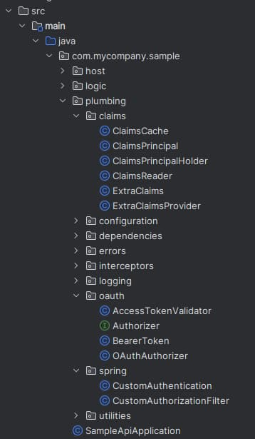
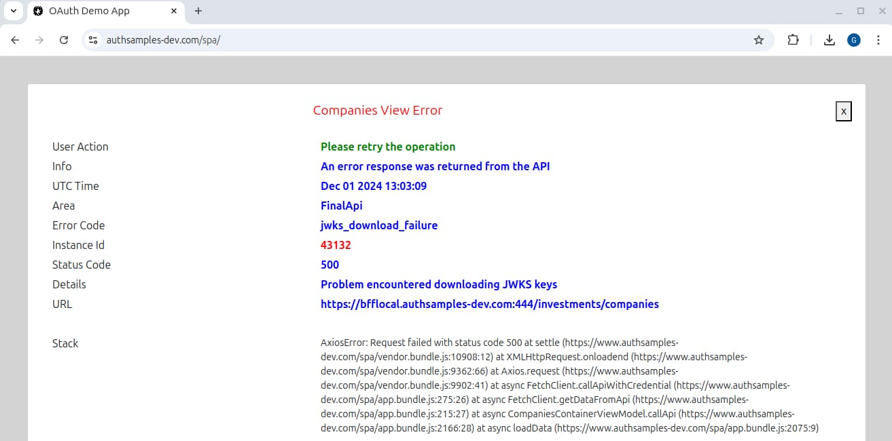

# Java API – OAuth Integration

In our previous post we explained how to run this blog’s <Link href='/posts/java-spring-boot-api-overview'>Final Java Code Sample</Link> and explained its main behaviours. Next we will explain the main  details of the OAuth integration.

### Spring API Defaults

By default Spring Security uses a framework based approach to OAuth security. Add the *spring-boot-starter-oauth2-resource-server* and *spring-security-starter-web* dependencies to your project and configure the API in a fluent manner:

```java
@Configuration
public class SecurityConfiguration {
    
	@Bean
	public SecurityFilterChain filterChain(final HttpSecurity http) throws Exception {

        http
            .securityMatcher(new AntPathRequestMatcher("/**"))
            .authorizeHttpRequests(authz -> authz
                .anyRequest().authenticated()
            )
            .oauth2ResourceServer(rs -> rs
                .jwt(jwt -> jwt
                    .jwkSetUri(myJwksUri)
                )
            )
        return http.build();
    }
}
```

You can also add an entry such as this to an *application properties file* when you need to troubleshoot failures.

```markdown
logging.level.org.springframework.security=DEBUG
```

When getting started with OAuth secured APIs you should use these defaults. Yet this blog’s Java API focuses on some deeper requirements.

### Deeper Requirements

This blog’s Java API will focus on customising Spring’s default behaviour in order to meet the following requirements:

| Requirement | Description |
| ----------- | ----------- |
| <span style={{color:'green'}}>**Standards Based**</span> | We will use the same standards-based design patterns for OAuth security across Node.js, .NET and Java APIs. |
| <span style={{color:'green'}}>**Best Security**</span> | The [jose4j library](https://bitbucket.org/b_c/jose4j/wiki/Home) will enable the most up to date and specialised security algorithms when dealing with JWTs. |
| <span style={{color:'green'}}>**Extensible Claims**</span> | APIs are in full control of the claims principal, to work around authorization server limitations or add values that should not be issued to access tokens. |
| <span style={{color:'green'}}>**Supportable**</span> | Identity and error details will be captured and included in logs, and JSON error responses will be customisable. |

In Java our API’s OAuth code will follow the same two phases that we used in Node.js and .NET APIs:

| Task | Description |
| ---- | ----------- |
| <span style={{color:'green'}}>**JWT Access Token Validation**</span> | Downloading a JSON Web Key Set and verifying received JWTs |
| <span style={{color:'green'}}>**API Authorization**</span> | Creating a ClaimsPrincipal that includes useful claims, then applying them during authorization |

### Your Java Secured API?

This API’s security implementation is meant to be thought provoking, to provide techniques for taking finer control over claims and error handling during secured requests. Some of these may be of interest to readers.

The API contains quite a bit of plumbing code though, to make the API code feel the same across technology stacks. For your own solution you may be able to meet similar requirements in alternative ways.

### OAuth API Configuration

The API uses a JSON configuration file with the following OAuth settings, which are the same as those used by the final Node.js API:

```json
{
  "oauth": {
    "issuer":                       "https://cognito-idp.eu-west-2.amazonaws.com/eu-west-2_CuhLeqiE9",
    "audience":                     "",
    "scope":                        "https://api.authsamples.com/investments",
    "jwksEndpoint":                 "https://cognito-idp.eu-west-2.amazonaws.com/eu-west-2_CuhLeqiE9/.well-known/jwks.json",
    "claimsCacheTimeToLiveMinutes": 15
  }
}
```

The meaning of each field is summarised in the following table:

| Field | Description |
| ----- | ----------- |
| <span style={{color:'green'}}>**issuer**</span> | The expected authorization server to be received in access tokens |
| <span style={{color:'green'}}>**audience**</span> | The audience in JWT access tokens represents a set of related APIs |
| <span style={{color:'green'}}>**scope**</span> | The business area for the API |
| <span style={{color:'green'}}>**jwksEndpoint**</span> | The location from which jose4j will use token signing public keys |
| <span style={{color:'green'}}>**claimsCacheTimeToLiveMinutes**</span> | The time for which extra claims, not present in access tokens, are cached |

### API Authorization

The API receives an access token with a payload of the following form. The scope of access is limited to *investments* data. The user’s business identity is a custom claim of *manager_id*, for a party who manages investments. Another custom claim for *role* is also issued to the access token:

```json
{
  "iss": "https://login.authsamples-dev.com",
  "aud": "api.authsamples.com",
  "scope": "openid profile investments",
  "sub": "a6b404b1-98af-41a2-8e7f-e4061dc0bf86",
  "manager_id": "10345",
  "role": "user",
  "exp": 1715630456.455
}
```

The API receives the main claims by processing the access token JWT, then does some more advanced work to deal with additional claims in an extensible way. The goal is to set up the API’s business logic with the most useful claims principal.

### Custom Authorization Filter

The *HttpServerConfiguration* class wires up our API’s custom OAuth behaviour. This returns a *SecurityFilterChain* class, which configures a custom resource server implementation:

```java
@Bean
public SecurityFilterChain filterChain(final HttpSecurity http) throws Exception {

    var container = this.context.getBeanFactory();
    var authorizationFilter = new CustomAuthorizationFilter(container);

    http
            .securityMatcher(new AntPathRequestMatcher(ResourcePaths.ALL))
            .authorizeHttpRequests(authorize ->
                    authorize.dispatcherTypeMatchers(DispatcherType.ASYNC).permitAll()
                    .anyRequest().authenticated()
            )
            .addFilterBefore(authorizationFilter, AbstractPreAuthenticatedProcessingFilter.class);

    return http.build();
}
```

In this blog’s architecture, web specific concerns are not dealt with in APIs. Instead, APIs are designed to be callable equally from web and mobile clients. Therefore this blog’s SPA’s web security is managed by the following components, and Spring’s web security is disabled:

| Component | Description |
| --------- | ----------- |
| <span style={{color:'green'}}>**Web Host**</span> | Manages returning static content and recommended web headers to the browser |
| <span style={{color:'green'}}>**Backend for Frontend**</span> | Manages OpenID Connect concerns such as logins and logouts, and issuing of application level cookies |
| <span style={{color:'green'}}>**API Gateway**</span> | Deals with web security concerns during API requests, including CSRF, cookie and CORS handling |

### OAuth and Claims Code

A number of small classes are used to implement the desired behaviour from this blog’s <Link href='/posts/api-authorization-design'>API Authorization Design</Link>. The main work is to validate the JWT received in the HTTP request, then return a *ClaimsPrincipal* that is useful to the rest of the API’s code.

<div className='smallimage'>
    
</div>

### JWT Access Token Validation

The *AccessTokenValidator* class deals with direct calls to the authorization server and its main code is to validate access tokens using jose4j. This includes checking for the API’s required scope:

```java
public JwtClaims execute(final String accessToken) {

    try {
        var builder = new JwtConsumerBuilder()
            .setVerificationKeyResolver(this.jwksResolver)
            .setJwsAlgorithmConstraints(
                AlgorithmConstraints.ConstraintType.PERMIT,
                this.configuration.getAlgorithm()
            )
            .setExpectedIssuer(this.configuration.getIssuer());

        if (StringUtils.hasLength(this.configuration.getAudience())) {
            builder.setExpectedAudience(this.configuration.getAudience());
        }

        var jwtConsumer = builder.build();
        var claims = jwtConsumer.processToClaims(accessToken);

        var scopes = ClaimsReader.getStringClaim(claims, "scope").split(" ");
        var foundScope = Arrays.stream(scopes).filter(s -> s.contains(this.configuration.getScope())).findFirst();
        if (!foundScope.isPresent()) {
            throw ErrorFactory.createClientError(
                    HttpStatus.FORBIDDEN,
                    ErrorCodes.INSUFFICIENT_SCOPE,
                    "The token does not contain sufficient scope for this API");
        }

        return claims;

    } catch (InvalidJwtException ex) {
        throw ErrorUtils.fromAccessTokenValidationError(ex, this.configuration.getJwksEndpoint());
    }
}
```

There are a number of responsibilities that the library implements for us:

| Responsibility | Description |
| -------------- | ----------- |
| <span style={{color:'green'}}>**JWKS Key Lookup**</span> | Downloading token signing public keys from the authorization server’s JWKS endpoint |
| <span style={{color:'green'}}>**JWKS Key Caching**</span> | Caching the above keys and automatically dealing with new lookups when the signing keys are recycled |
| <span style={{color:'green'}}>**Signature Checks**</span> | Cryptographically verifying the JSON Web Signature of received JWTs |
| <span style={{color:'green'}}>**Field Checks**</span> | Checking that the token has the correct issuer and audience, and that it is not expired |

### Claims Principal

The claims principal for the sample API deals with some custom fields shown here:

| Claim | Represents |
| ----- | ---------- |
| <span style={{color:'green'}}>**Scope**</span> | The scope for the API, which in this blog will be a  high level business area of *investments* |
| <span style={{color:'green'}}>**Subject**</span> | The user’s technical OAuth identity, generated by the authorization server |
| <span style={{color:'green'}}>**Manager ID**</span> | The business identity for a user, and in my example a manager is a party who administers investment data |
| <span style={{color:'green'}}>**Role**</span> | A role from which business permissions would be derived, about the level of access |
| <span style={{color:'green'}}>**Title**</span> | A business title for the user, which is displayed by frontend applications |
| <span style={{color:'green'}}>**Regions**</span> | An array claim meant to represent a more detailed business rule that does not belong in access tokens |

In code the ClaimsPrincipal class is represented like this:

```java
public class ClaimsPrincipal implements AuthenticatedPrincipal {

    @Getter
    private final JwtClaims jwtClaims;

    @Getter
    private final ExtraClaims extraClaims;

    public ClaimsPrincipal(final JwtClaims jwtClaims, final ExtraClaims extraClaims) {
        this.jwtClaims = jwtClaims;
        this.extraClaims = extraClaims;
    }
}
```

It can then be injected into business focused classes and used for authorization. This is a little tricky, since Spring may resolve and create all request scoped dependencies at the start of an HTTP request, before the OAuth middleware runs. Therefore a holder object is injected:

```java
public CompanyService(final CompanyRepository repository, final ClaimsPrincipalHolder claimsHolder) {
    this.repository = repository;
    this.claimsHolder = claimsHolder;
}
```

When the filter runs successfully, it update the holder object with the claims principal. When the controller logic runs, the claims principal can be resolved, and this works even if the request uses child threads. The API can then easily implement its authorization logic:

```java
private boolean isUserAuthorizedForCompany(final Company company) {

    var claims = (SampleClaimsPrincipal) this.claimsHolder.getClaims();

    var isAdmin = claims.getRole().equalsIgnoreCase("admin");
    if (isAdmin) {
        return true;
    }

    var isUser = claims.getRole().equalsIgnoreCase("user");
    if (!isUser) {
        return false;
    }

    var extraClaims = (SampleExtraClaims) claims.getExtraClaims();
    return Arrays.stream(extraClaims.getRegions()).anyMatch(ur -> ur.equals(company.getRegion()));
}
```

### OAuth Middleware Customisation

An *OAuthFilter* class encapsulates the overall OAuth work and deals with injecting claims into the claims principal when needed. In Spring it is also possible to add extra claims in a custom [JwtAuthenticationConverter](https://www.baeldung.com/spring-security-map-authorities-jwt#using_custom_jwtauthenticationconverter).

```java
public ClaimsPrincipal execute(final HttpServletRequest request) {

    String accessToken = BearerToken.read(request);
    if (accessToken == null) {
        throw ErrorFactory.createClient401Error("No access token was supplied in the bearer header");
    }

    var jwtClaims = this.tokenValidator.execute(accessToken);

    String accessTokenHash = DigestUtils.sha256Hex(accessToken);
    var extraClaims = this.cache.getExtraUserClaims(accessTokenHash);
    if (extraClaims != null) {
        return this.extraClaimsProvider.createClaimsPrincipal(jwtClaims, extraClaims);
    }

    extraClaims = this.extraClaimsProvider.lookupExtraClaims(jwtClaims);
    this.cache.setExtraUserClaims(accessTokenHash, extraClaims, ClaimsReader.getExpiryClaim(jwtClaims));
 
    return this.extraClaimsProvider.createClaimsPrincipal(jwtClaims, extraClaims);
}
```

This technique adds complexity and is best avoided in most APIs. Yet this type of design can prove useful if you  run into productivity problems, where many fine-grained authorization values are managed in the authorization server.

If so, this is one possible way to ensure a stable access token and avoid needing to frequently deploy APIs and the authorization server together. It keeps the claims principal useful to the API’s logic, and reduces the need for access token versioning.

### OAuth Error Responses

The API implements this blog’s <Link href='/posts/error-handling-and-supportability'>Error Handling Design</Link>, starting by handling invalid tokens in the standard way. We can simulate a 401 error by clicking our UI’s *Expire Access Token* button followed by the *Reload Data* button:


This results in an invalid access token being sent to the API, which returns an error response in its standard format:

| Data | Description |
| ---- | ----------- |
| <span style={{color:'green'}}>**HTTP Status**</span> | The appropriate HTTP status is returned |
| <span style={{color:'green'}}>**Payload**</span> | A JSON error object containing *code* and *message* fields |

In total the following security related HTTP status codes may be returned:

| Status | Description |
| ------ | ----------- |
| <span style={{color:'red'}}>401</span> | Access token is missing, invalid or expired |
| <span style={{color:'red'}}>403</span> | The access token does not contain a required scope |
| <span style={{color:'red'}}>404</span> | A *Not Found for User* error is returned if a resource is requested that domain specific claims do not allow |
| <span style={{color:'red'}}>500</span> | A technical problem during OAuth processing, such as a network error downloading JWKS keys |

A 500 error is shown below in an <Link href='/posts/http-debugging-setup'>HTTP Proxy Tool</Link>, and this type of error includes additional fields to help enable fast problem resolution:


The client can then take various types of action based on HTTP status and error code returned. For server errors the UI displays details that may be useful for technical support staff:



### Identity and API Logs

API logs include details about OAuth errors, which helps when there is a configuration problem:

```json
{
  "id": "b3629a0d-fc73-46b7-a3ca-6115963e8e43",
  "utcTime": "2022-12-10T13:17:28",
  "apiName": "FinalApi",
  "operationName": "GetCompanyTransactions",
  "hostName": "UBUNTU",
  "method": "GET",
  "path": "/investments/companies/2/transactions",
  "resourceId": "2",
  "clientName": "FinalSPA",
  "statusCode": 200,
  "errorCode": "invalid_token",
  "millisecondsTaken": 43,
  "correlationId": "b091ec8e-a1d0-dbf9-f764-012cc730c925",
  "sessionId": "004d32bc-9755-b50e-6315-5be09f277ebe",
  "errorData": {
    "statusCode": 401,
    "body": {
      "code": "invalid_token",
      "message": "Missing, invalid or expired access token"
    },
    "context": "JWT verification failed: Invalid signature."
  }
}
```

Once a JWT is validated, its generated subject claim, most commonly a UUID, is also written to logs. This can potentially help to track users in benign ways, for technical support purposes. This requires care, and is discussed further in the <Link href='/posts/effective-api-logging'>Effective API Logging</Link> post.

### Where Are We?

We have implemented Java API Security in a requirements first manner, to implement behaviour that is likely to be important for any OAuth secured API, regardless of technology.

### Next

- Next we will describe other details of our <Link href='/posts/spring-boot-api-coding-model'>Java API Code Details</Link>
- For a list of all blog posts see the <Link href='/posts/index'>Index Page</Link>
