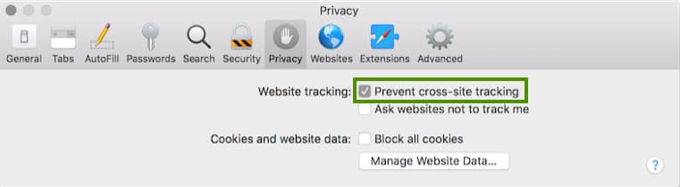

# Iframe-Based Access Token Renewal

In the previous post I summarised this blog’s <a href='federated-logins.mdx'>User Authentication Behaviour</a>. Next I explain iframe-based access token renewal for SPAs. This flow is now problematic, due to recent browser restrictions.

### Traditional SPA Token Renewal

The traditional SPA token renewal solution relied on returning only a short lived access token to the browser, and storing the access token in-memory, as the most secure JavaScript option. To refresh the token, the authorization server’s HttpOnly SSO cookie was used, which is shared across all browser tabs. Therefore any browser tab should be able to reliably get a new access token by sending the cookie.

### Iframe Token Renewal Requests

In this flow, a security library dynamically creates a hidden iframe and sets its *src* to an authorization request URL. This request uses an extra query parameter of *prompt=none* to prevent any user prompts, since the frame is invisible. The request should also send the SSO cookie.

If the authorization server receives a valid SSO cookie it returns a new authorization code in the browser response. The SPA then sends the code to the token endpoint in an authorization code grant request and gets a new set of tokens. Eventually the session cookie expires and iframe renewal returns a *login_required* response. The SPA must interpret this response as *end of session* and initiate user re-authentication:

When you use iframe-based token renewal, the request can take a second or two to complete, so the user impact must be considered. If you instead use 
refresh tokens to renew access tokens, the time taken is much quicker, such as 100 milliseconds, and the user impact is usually negligible. 

### Access Token Refresh Before Expiry

Another technique you can use is to refresh access tokens in the background using a timer. When the timer fires, you compare the *expires_in* value from the last token response to the current time. When the access token is close to expiry, you send a token renewal request. This keeps access tokens up to date without any slowness for the user.

Yet this does not promote correct handling of API 401 responses, which can occur for multiple reasons in addition to expiry. These might include token revocation, token signing key renewal and load balancing failover events with some types of infrastructure. Instead, I prefer to allow 401s to occur frequently in APIs, so that I am sure that both clients and APIs handle expiry conditions reliably.

### In-Memory Access Token Storage

This blog’s next code sample uses an SPA that stores access tokens only in-memory. The SPA therefore needs to renew the access token when any of these conditions occur:

- API returns a 401 response.
- User reloads the browser page.
- User opens an SPA view in a new browser tab.

When storing access tokens in memory, you need to renew the access token when the user reloads the page or opens a new browser tab and the user must wait for the response. 

### Visualizing Token Renewal

To enable visualization of token renewal, the next SPA code sample enables you to test access token renewal by clicking *Expire Token* followed by *Reload Data*:

This is a test mechanism that adds characters to the access token to get the API to return a 401 response. The important behaviour is to ensure that the SPA handles expiry conditions reliably.

### Dropped Cookie Problems

Recent same site cookie restrictions mean there are now limits on how the browser will send authorization server SSO cookies. For cross domain iframe requests, cookies are dropped by default in the Safari browser, or in incognito windows from other browsers. All browsers are expected to adopt the Safari behaviour in the short or medium term:

These cookie restrictions help to prevent unwelcome website tracking of users by advertisers and other parties. Yet they have a side effect that traditional OpenID Connect silent token renewal is no longer reliable.

In addition, some authorization servers may not support the silent renewal flow correctly. The authorization server SSO cookie should use the *SameSite=none* property, yet this blog's default authorization server produces cookies that use the *SameSite=lax* property. This results in all current browsers refusing to send its cookies from an iframe:

The authorization server also does not support the OpenID Connect *prompt=none* parameter. Instead, it returns an HTML response to render the login page when it does not receive an SSO cookie, instead of returning the expected *login_required* error response:

This results in a poor user experience where the browser hangs for 10 or so seconds. The *oidc-client-ts* security library then times out and the updated code sample reports an iframe timeout error.

### Low Security Options

You can solve some usability and reliability problems by lowering security, yet these provide least protection against XSS threats, which can easily read your tokens and may be able to send them to a malicious host that calls your APIs. This blog's code examples avoids these options whenever possible:

| Behavior | Description |
| -------- | ----------- |
| Access Tokens in Local Storage | If you store access tokens in local storage, you no longer need to perform a token refresh when the user reloads the page or opens a new browser tab. |
| Refresh Tokens in Local Storage | If you store refresh tokens in local storage, you can avoid the use of SSO cookies and get a new access token with a simple Ajax request from JavaScript. |

Note that an SPA can use PKCE to protect its authorization code grant requests. Yet the refresh token grant for an SPA has no protection, since the SPA has nowhere secure to store a client credential. An example request is shown here:

### Second Code Sample

The <a href='updated-spa-coding-key-points.mdx'>Updated SPA – Code Details</a> explains some code complexities if you attempt to implement iframe-based access token renewal with in-memory storage. Even with careful code there are security, reliability and usability issues due to cookie issues.

### Backend for Frontend

In 2021 the preferred option is to use a Backend for Frontend approach. This provides the best protection against the JavaScript threats described in the [OAuth for Browser Based Apps](https://datatracker.ietf.org/doc/html/draft-ietf-oauth-browser-based-apps#name-the-threat-of-malicious-jav) document. The SPA can then perform token renewal in the most secure way, with good reliability. This blog's <a href='final-spa-overview.mdx'>Final SPA</a> uses an API-driven BFF to achieve the best all-round solution.

### Where Are We?
 
I briefly described how the traditional SPA token renewal flow works and why you should no longer use it. However, the second code sample shows how to implement iframe based token renewal, since it is remains useful to know about the OAuth techniques.

### Next

- I summarise <a href='logout.mdx'>Logout</a> behaviours as part of your SPA's session management.
- For a list of all blog posts see the <a href='index.mdx'>Index Page</a>.
