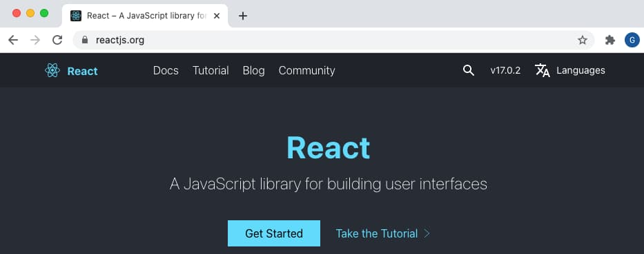
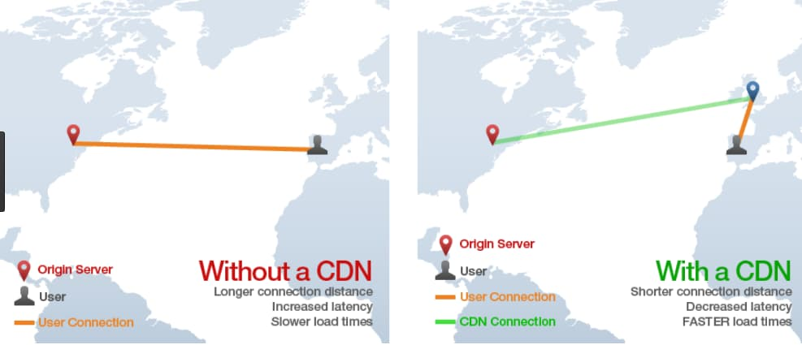

# Web Architecture Goals

The <a href='home.mdx'>Home Page</a> described OAuth in terms of overall goals for a software platform. In this post I explain qualities to look for in an optimal web architecture, which is not just about security. This post briefly summarises some goals and concerns for web apps.

### Best User Experience

Client-side web apps separate HTML and data concerns to deliver a fast experience for users. A *Single Page Application (SPA)* puts the frontend in control. Modern technologies such as React provide an ecosystem with many tools and techniques for building modern apps.

### Productive Frontend Development

Technologies such as React are typically easier to manage from a development viewpoint than older website solutions. Developers no longer need to battle with a web backend that dictates frontend behaviour. OAuth also enables web apps to externalise their security to the authorization server, and to libraries written by experts. This results in simplified application code, due to the outsourced security.

### Good Global Performance

You are likely to want good global performance for your internet web applications. A *Content Delivery Network (CDN)* is the standard solution for managing web latency. It is harder to enable for web backends that execute code such as cookie issuing, leading to restricted hosting options.

### Best Security Capabilities

Single page applications must be able to interact with APIs, so need an API message credential. APIs must return only correct and allowed data for each user, so the user must be authenticated first. *OAuth 2.0* and *OpenID Connect* are the standards that provide the most powerful options to issue access tokens as API message credentials, and authenticate the user in many possible ways.

### Prevent Browser Threats

By following web security best practices, vetted by experts, companies will avoid most vulnerabilities and perform better in security reviews. For web apps, [Cross Site Scripting (XSS)](https://owasp.org/www-community/attacks/xss/a) is a particular concern that you should address, separate to the OAuth implementation.

If an app has XSS vulnerabilities, then an attacker may be able to access secured data in exactly the same way as the real web app. Therefore, reducing the impact of XSS exploits is now a major consideration when designing web solutions.

### Best Login Usability

OpenID Connect can provide multiple ways for users to sign in to an SPA, and this can include options that are both user friendly and secure. In addition, an SPA should be in full control of its usability behaviour:

- Session Behaviour: the UI should be in control of navigation and expiry events rather than being abruptly redirected.
- Multi-Tab Browsing: the user should be able to use multiple browser tabs for the same application.

### Good Search Results

For unsecured web apps, it is common to want to achieve good *Search Engine Optimization (SEO)* results by pre-rendering data. For secured web apps that get data from APIs, such as those used in this blog, it is not usually secure to pre-render data, and search bots cannot reach protected views. Therefore different web architectures should be considered for unsecured and secured views.

### Partner Web Integrations

It used to be common for web apps to show a mix of content. The host application imported JavaScript from various third parties, who provided widgets and mashups, accessed using iframe or div HTML elements.

Yet this type of solution now has major security concerns for the host application, related to XSS and user privacy. Any partner integrations should now be designed to run only same-site views and call only same-site APIs.

### Scalable Code

Web applications can quickly become large code bases with many pages, that become difficult to manage over time, and adapt to new technologies. You are likely to need a code splitting design, so that multiple teams can work on micro-frontends at different paths within the same web domain.

The attack surface also needs to be considered, for each web domain. This should consider both the scope of API credentials and the scope of XSS threats. Larger platforms should use distinct web domains per business area, so that a low security app cannot impact a high security app.

### Portable Architecture

Portability is often overlooked, but it is common to want to keep your options open. These options are relevant to SPAs:

| Aspect | Description |
| ------ | ----------- |
| Portable Apps | Implement OpenID Connect in the SPA in a standard way rather than being locked into one authorization server. |
| Portable Hosting | You should only need to upload web static content to a CDN to deploy SPAs, so avoid designs that prevent this. |

### This Blog's SPA Code Samples

This blog's posts and the accompanying code samples explain OAuth features and design patterns gradually:

| Stage | Description |
| ----- | ----------- |
| <a href='basicspa-overview.mdx'>Basics</a> | Getting an SPA, API and authorization server working together, with a developer friendly setup. |
| <a href='improved-spa-code-sample-overview.mdx'>Updated</a> | SPA session management for a complete user experience, and flexible API authorization to protect data. |
| <a href='final-spa-overview.mdx'>Final</a> | A security hardened SPA that runs from a content delivery network and interacts with cloud deployed APIs. |

### Where Are We?

I articulated some desired behaviour, and next I provide a code sample to get started on the journey of achieving it.

### Next

- I provide an <a href='basicspa-overview.mdx'>Initial SPA Code Sample Overview</a>
- For a list of all blog posts see the  <a href='index.mdx'>Index Page</a>
