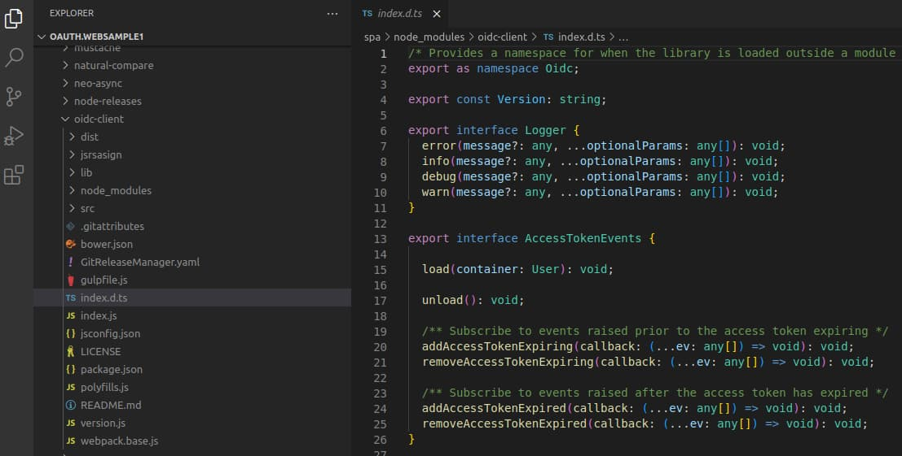
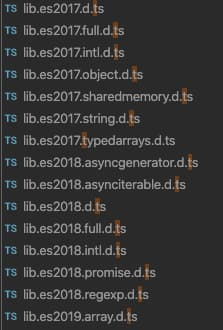
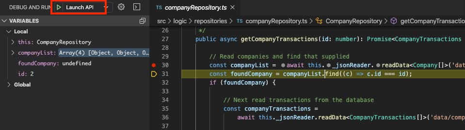
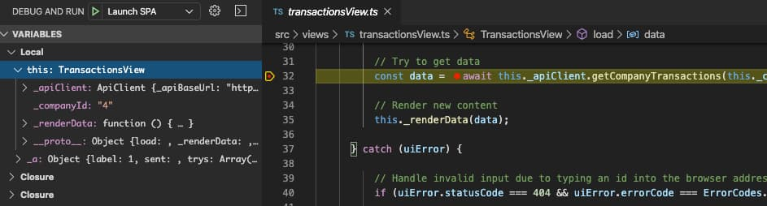
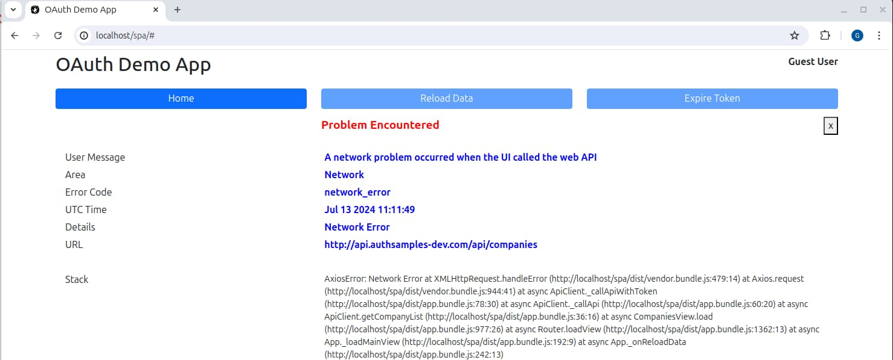
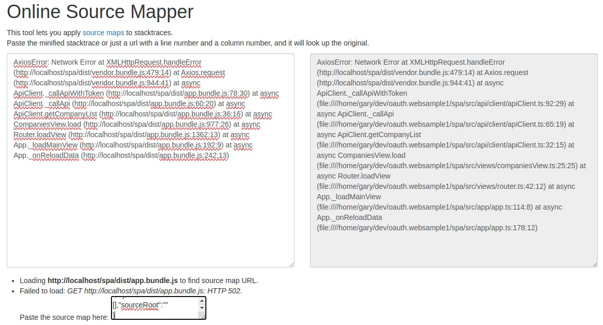

# JavaScript Technology Setup

Previously I suggested an <a href='oauth-infrastructure-setup.mdx'>OAuth Infrastructure Setup</a>. In this post I explain how this blog uses JavaScript technology, for Node.js APIs, browser based apps and Electron desktop apps. I summarise a way to think about web technology so that it meets your requirements.

### Modern Productive Code

Single page applications should focus on frontend-only concerns. The goal should be modern, productive code that provides a great customer experience with a fast time to market. Your technology choices should enable this.

The main ingredient of an SPA is its logic. Choose a language that remains close to the browser's default language, to reduce complexity. Also use clean code and a separation of concerns. I use TypeScript since I like the extensions to JavaScript in these areas:

- Expressive types including interfaces and private class members.
- Data contracts can represent API requests and responses.
- Convenient refactoring when you rename or removed items.

### Web Development Pipeline

I summarise the main stages of the web development pipeline in the below table. It can be useful to articulate desired behaviour at each stage, in your own efforts to reduce complexity:

| Stage	| Description |
| ----- | ----------- |
| Download Dependencies | Before you write any real code you typically need to download libraries. |
| Write Code | To write TypeScript code you need to import third party libraries and use their classes and functions. |
| Execute Tasks | You sometimes need to execute arbitrary tasks as part of development, such as code quality checks. |
| Build Code | You need to build code so that it runs in browsers, which involves compiling TypeScript. |
| Execute Code | You execute compiled code in the browser, which is different to the code you develop. |
| Decompile Code | When there is a problem, or to support debugging, you want to get back to the original TypeScript code. |

### Downloading Dependencies: Package Manager

You use the *npm* tool to specify libraries used by your application in its *package.json* file. The built code uses the entries in the *dependencies* section at runtime. You typically require a number of plumbing entries in the *devDependencies* section to produce the built code.

```json
{
  "dependencies": {
    "axios": "^1.7.2",
    "mustache": "^4.2.0",
    "oidc-client-ts": "^3.0.1"
  },
  "devDependencies": {
    "@eslint/js": "^9.5.0",
    "@types/eslint__js": "^8.42.3",
    "@types/mustache": "^4.2.5",
    "eslint": "^8.57.0",
    "ts-loader": "^9.5.0",
    "typescript": "^5.5.2",
    "typescript-eslint": "^7.14.1",
    "webpack": "^5.91.0",
    "webpack-cli": "^5.1.4",
    "webpack-merge": "^5.10.0"
  }
}
```

You need to think about the potential for security vulnerabilities when you include dependencies. Only use respected libraries, keep them up to date and ensure that you have a process for vulnerability scanning. Make technology choices that keep the number of dependencies to a minimum, since you are responsible for the correctness of each depdendency over time.

### Downloading Dependencies:  Node Modules

When you run *npm install* your dependencies get downloaded to a *node_modules* folder from which you import classes and functions:



You consume each library as JavaScript, even if it is coded in TypeScript. Each library should include an *index.d.ts* file for TypeScript consumers, which enables type checking and intellisense for its public interface.

### Writing Code: Resolving Imports

You import libraries in our own source files using one of the following syntaxes. The first of these imports a newer *ECMAScript* module, whereas you use the second to import older *CommonJS* modules.

```typescript
import {UserManager, UserManagerSettings} from 'oidc-client';
import mustache from 'mustache';
```

This blog’s APIs use Node.js 20 or later, with the following *tsconfig.json* configuration. You use some of these settings when you import modules and you use other settings when you build code:

```json
{
  "compilerOptions": {
    "strict": true,
    "target": "ES2023",
    "lib": ["ES2023"],
    "module":"Node16",
    "moduleResolution": "Node16",
    "allowSyntheticDefaultImports": true,
    "outDir": "dist",
    "sourceMap": true
  },
  "include": [
    "./src"
  ],
  "exclude": [
    "node_modules"
  ]
}
```

You use the following settings when you import modules:

| Setting | Desired Behaviour |
| ------- | ----------------- |
| [moduleResolution](https://www.typescriptlang.org/tsconfig#moduleResolution) | Use modern rules to resolve external modules. |
| [allowSyntheticDefaultImports](https://www.typescriptlang.org/tsconfig#allowSyntheticDefaultImports) | Enable the cleanest import syntax for older CommonJS modules. |

You also need to tell the compiler that the project’s own source files use ECMAScript modules. To do so, specify *type=module* in the *package.json* file. For Node.js APIs that use *type=module*, a *.js* suffix is required when you import other classes. During coding this is a TypeScript file, though it becomes JavaScript when executed:

```typescript
import {CompanyRepository} from '../repositories/companyRepository.js';
```

### Writing Code: Using Type Definition Files

The *index.d.ts* file sometimes exists at a non-standard location. You then use options such as [typeRoots](https://www.typescriptlang.org/tsconfig#typeRoots) to resolve paths. In some cases, you use a separate type definitions file from [Definitely Typed](https://github.com/DefinitelyTyped/DefinitelyTyped). These are recognised by *package.json* entries that begin with *@types*.

For libraries with no type definitions, you can add a typings.d.ts file at the root level, then use a *declare module* statement. This gets past compiler errors, though you lose type checking or intellisense. If you prefer, you can instead add your own type definitions for the library.

```typescript
declare module 'some-js-lib';
```

### Writing Code: Using TypeScript Libraries

The *tsconfig.json* file for the SPA is a little different to that for the Node.js API. The *lib: DOM* option brings in browser type definitions and also enables the most modern coding syntax:

```json
{
  "compilerOptions": {
    "strict": true,
    "target": "ES2017",
    "lib": ["ES2023", "DOM"],
    "module":"ES2022",
    "moduleResolution": "Bundler",
    "allowSyntheticDefaultImports": true,
    "outDir": "dist",
    "sourceMap": true
  },
  "include": [
    "./src"
  ],
  "exclude": [
    "node_modules"
  ]
}
```

You can find browser types under the *node_modules/typescript/lib* folder and then use objects such as *HTMLInputElement*.

<div className='smallimage'>
    
</div>

### Writing Code: Efficient Imports

When you import ECMAScript modules you should import only the functionality needed. This [reduces the size of built code](https://developers.google.com/web/fundamentals/performance/optimizing-javascript/tree-shaking/#finding_opportunities_to_shake_a_tree). For browser-based applications this reduces download times for users:

```typescript
import {SmallUtility} from 'LargeLibrary';
```

### Writing Code: TypeScript Development

I  use a class-based development model, to encapsulate data, behaviour and dependencies together in the most standard way. Constructor injection is used for inter-class dependencies:

```typescript
export class CompaniesView {

    private readonly _apiClient: ApiClient;

    public constructor(apiClient: ApiClient) {
        this._apiClient = apiClient;
    }

    public async load(): Promise {

        const data =  await this._apiClient.getCompanyList();
        this._renderData(data);
    }
}
```

Strong typing during coding allows the environment to make more checks during development. When using ECMAScript modules, the compiled code remains closest to the original TypeScript syntax.

### Writing Code: Styling

The blog uses only basic CSS with the [Bootstrap](https://getbootstrap.com/docs/4.0/getting-started/introduction/) library. I use its built-in styles for both presentation and a grid-based layout:

```html
<div class='row listRow'>
    <div class='col-2 my-auto text-center'>
        {{name}}
    </div>
    <div class='col-2 my-auto text-center'>
        {{region}}
    </div>
    <div class='col-2 my-auto text-center'>
        <a href='#company={{id}}'>View Transactions</a>
    </div>
    <div class='col-2 my-auto moneycolor fw-bold text-end'>
        {{formattedTargetUsd}}<br/>
    </div>
    <div class='col-2 my-auto moneycolor fw-bold text-end'>
        {{formattedInvestmentUsd}}
    </div>
    <div class='col-2 my-auto fw-bold text-end'>
        {{noInvestors}}
    </div>
</div>
```

My application CSS file is therefore small, containing only padding, colours and minor adjustments to support mobile layouts:

```css
.row
{
    margin-top: 5px;
}
.listRow
{
    height: 80px;
}
.valuecolor
{
    color: blue;
}
.moneycolor
{
    color:green;
}
.largetext
{
    font-size: larger;
}
.errorcolor
{
    color:red;
}
.errorlinecolor
{
    color:darkblue;
}

@media all and (max-width: 992px)
{
    body
    {
        font-size: 0.85em;
    }
}
@media all and (max-width: 768px)
{
    body
    {
        font-size: 0.45em;
    }
}
```

### Executing Tasks

My code samples also use *npm* as a task runner. Often, I use bash scripts to control the finer behaviour and to handle any differences across Linux, macOS and Windows:

```bash
cd "$(dirname "${BASH_SOURCE[0]}")"

if [ ! -d 'node_modules' ]; then
  npm install
fi

npm run lint
npm start
read -n 1
```

### Building Code: Linting

My first build task checks code quality. The [typescript-eslint](https://github.com/typescript-eslint/typescript-eslint) library is used. The underlying [eslint](https://eslint.org/) library requires its own JavaScript configuration file. I import recommended rulesets as well as activating rules that reflect my own coding preferences:

```javascript
import eslint from '@eslint/js';
import tseslint from 'typescript-eslint';

export default tseslint.config({
    files: ['**/*.ts', '**/*.mjs'],
    extends: [
        eslint.configs.strict,
        ...tseslint.configs.strict,
    ],
    rules: {
        '@typescript-eslint/explicit-module-boundary-types': ['error', {
            'allowArgumentsExplicitlyTypedAsAny': true,
        }],
        '@typescript-eslint/no-explicit-any': 'off',
        '@typescript-eslint/no-extraneous-class': 'off',
        'brace-style': ['error', '1tbs'],
        'indent': 'error',
        'max-len': ['error', { 'code': 120 }],
        'no-multiple-empty-lines': ['error', {'max': 1}],
        'no-trailing-spaces': 'error',
        'quotes': ['error', 'single'],
        'semi': 'error',
    },
});
```

This provides warnings, mostly about little things, that helps to keep code maintainable and consistent:

```markdown
/home/gary/dev/oauth.websample1/spa/src/plumbing/oauth/authenticator.ts
   42:1  error  More than 1 blank line not allowed              no-multiple-empty-lines

/home/gary/dev/oauth.websample1/spa/src/views/titleView.ts
  20:6  error  Opening curly brace does not appear on the same line as controlling statement  brace-style
```

### Building Code: SPA Bundles

For the SPA, a build phase is essential, for the following reasons:

| Reason | Description |
| ------ | ----------- |
| Browser Support | Produce JavaScript code that browsers can execute. |
| Web Performance | Reduce code size so that bundle sizes stay small, and the SPA performs well. |

The [webpack](https://webpack.js.org/) tool is used. I use it for one main task, to produce the JavaScript bundles expressed in the final *index.html* file:

```html
<!DOCTYPE html>
<html lang='en'>
    <head>
        <meta charset='utf-8'>
        <base href='/spa/' />
        <title>OAuth Demo App</title>

        <link rel='stylesheet' href='css/bootstrap.min.css'>
        <link rel='stylesheet' href='css/app.css'>
    </head>
    <body>
        <div id='root' class='container' />
        
        <script type='module' src='dist/vendor.bundle.js'></script>
        <script type='module' src='dist/app.bundle.js'></script>
    </body>
</html>
```

### Building Code: Webpack Configuration

Webpack requires a configuration object and the syntax can seem a little cryptic at first. Mostly though, you just need to specify the SPA’s entry point source file, then provide an output folder for compiled bundles:

```javascript
import path from 'path';

const dirname = process.cwd();
export default {
  
  context: path.resolve(dirname, './src'),
  target: ['web'],
  devtool: 'source-map',

  entry: {
    app: ['./app/app.ts']
  },
  module: {
    rules: [
      {
        test: /\.ts$/,
        use: 'ts-loader',
        exclude: /node_modules/
      }
    ]
  },
  resolve: {
    
    extensions: ['.ts', '.js']
  },
  output: {
    
    path: path.resolve(dirname, './dist'),
    filename: '[name].bundle.js'
  },
  optimization: {

    splitChunks: {
      cacheGroups: {
        vendor: {
          chunks: 'initial',
          name: 'vendor',
          test: /node_modules/,
          enforce: true
        },
      }
    }
  }
}
```

Webpack has its own rules for resolving imports. You have to use *extensions* to tell it to include extensions from both the SPA’s TypeScript code, and JavaScript code consumed from the *node_modules* folder.

### Building Code: Processing TypeScript

The SPA’s application code builds to an *app.bundle.js* file. When compiling the SPA, the [ts-loader](https://github.com/TypeStrong/ts-loader) library uses the settings from the *tsconfig.json* file. I configure webpack to build a second, larger bundle, called *vendor.bundle.js*, containing third-party code from the *node_modules* folder.

### Building Code: Web Compilation

The build result produces the following files to a *dist* folder. The source map files can be used later to through code in a debugger, or to diagnose exception stack traces:

```markdown
vendor.bundle.js
vendor.bundle.js.map
app.bundle.js
app.bundle.js.map
```

For SPAs, I ensure that output works in mainstream browsers for the last 5 years or so. I also want to produce clean production JavaScript code, without the need for excessive [polyfilling](https://javascript.info/polyfills). I use the following *tsconfig.json* output settings:

| Setting | Description |
| ------- | ----------- |
| [target](https://www.typescriptlang.org/tsconfig#target) | Building to ES2017 means built code runs in all mainstream desktop and mobile browsers and *await* statements are output to the built code. |
| [module](https://www.typescriptlang.org/tsconfig#module) | ES2022 means bundled code uses the ECMAScript module format, which browser hosts support, and may output top level await statements to the built code. |

Since the SPA builds to ES2017 JavaScript, the development build results remain close to the SPA’s TypeScript code, with types removed. Keeping the built code similar to the developed code makes decompilation easier later.

```typescript
class CompaniesView {
    constructor(apiClient) {
        this._apiClient = apiClient;
    }
    async load() {
        const data = await this._apiClient.getCompanyList();
        this._renderData(data);
    }
}
```

Support for ES2017 features were added to all main mobile and desktop browsers in around 2017. You can use online websites to check browser compatibility for any newer syntax:

- [Can I use await in browser code?](https://caniuse.com/?search=await)
- [Can I use top level await in browser code?](https://caniuse.com/?search=top-level%20await)

### Building Code: API Compilation

During development of TypeScript APIs, I avoid producing JavaScript files, since doing so adds confusion when you search the code base. Instead, Node.js can be asked to execute TypeScript files directly with the [tsx](https://github.com/privatenumber/tsx) tool. The Node.js runtime then uses ECMAScript modules built in-memory:

```bash
tsx watch src/host/startup/app.ts
```

Deployed builds for Node.js APIs should instead run JavaScript code, for best performance. The initial API also has an *npm run buildRelease* command to produce deployable files to its *dist* folder. The most up to date Node.js options can be used for the API build. I avoid using bundle files for API code. By keeping built code easier to read, you are better able to diagnose potential production problems, and understand exception stack traces.

### Executing Code: Recompiling after Code Changes

The SPA code recompiles automatically when you change code, via webpack’s *watch* parameter:


### Decompiling Code: Debugging the API

To step through API code in a debugger, first open the root level workspace file. The *api/.vscode/launch.json* configuration file enables you to debug the API's code from the *Run and Debug* tab of Visual Studio Code:

```json
{
    "version": "0.2.0",
    "configurations": [
        {
            "type": "node",
            "request": "launch",
            "name": "Launch API",
            "runtimeArgs": ["--import", "tsx"],
            "args": ["src/host/startup/app.ts"],
            "outputCapture": "std",
            "skipFiles": [
                "<node_internals>/**"
            ]
        }
    ]
}
```

You can then step through TypeScript code and inspect the state of variables:



### Decompiling Code: Debugging the SPA

There is a similar configuration file at *spa/.vcscode/launch.json*. The setup is a little more complex since the debugger uses source map files that webpack outputs to the *dist* folder:

```json
{
    "version": "0.2.0",
    "configurations": [
        {
            "type": "chrome",
            "request": "launch",
            "name": "Launch SPA",
            "url": "http://www.authsamples-dev.com/spa/",
            "webRoot": "${workspaceRoot}/src/*",
            "sourceMaps": true,
            "sourceMapPathOverrides":{
                "webpack:///./*": "${workspaceRoot}/dist/*"
            }
        }
    ]
}
```

You can then step through the actual lines of TypeScript code, while the browser executes the corresponding JavaScript code:



### Decompiling Code: SPA Exception Stack Traces

The webpack setup uses separate development and production configurations. The development configuration includes a property that enables code debugging, and also a property to let JavaScript know whether it should run in debug mode:

```javascript
import webpack from 'webpack';
import {merge} from 'webpack-merge';
import baseConfig from './webpack.config.base.mjs';

export default merge(baseConfig, {

  mode: 'development',
  devtool: 'source-map',
  
  output: Object.assign({}, baseConfig.output, {
    devtoolModuleFilenameTemplate: 'file:///[absolute-resource-path]'
  }),
  
  plugins:[
    new webpack.DefinePlugin({
      IS_DEBUG: 'true',
    })
  ]
});
```

To prevent TypeScript compilation errors, I reference the *IS_DEBUG* variable in the SPA’s *typings.d.ts* file. The SPA's error handling code uses the variable to decide whether to render stack traces:

```typescript
public static getErrorStack(error: UIError): ErrorLine | null {

    if (IS_DEBUG) {
        if (error.stack) {
            return ErrorFormatter._createErrorLine('Stack', error.stack);
        }
    }

    return null;
}
```

I intentionally render SPA stack trace data in a raw format. In production apps, I would use a *Send Home* feature to receive this data:



You should save a backup of source map files for each application release. When a user experiences an error you can use tools like the [Online Source Mapper](https://sourcemaps.info) to find the original source location of an error. To do so, paste stack trace data into the left hand pane and the source map data into the small edit box:



The right pane then displays an updated stack trace based on the original TypeScript lines of code. In the following example output you can see that the failure is at *line 55* of the *ApiClient* source file:

```markdown
Error: simulating an exception at ApiClient._callApi (webpack:///./api/client/apiClient.ts:55:18)
at async ApiClient.getCompanyList (webpack:///./api/client/apiClient.ts:31:15)
at async CompaniesView.load (webpack:///./views/companiesView.ts:25:25)
at async Router.loadView (webpack:///./views/router.ts:43:12)
at async App._loadMainView (webpack:///./app/app.ts:118:8)
at async App.execute (webpack:///./app/app.ts:51:12)
```

Stack traces are most useful when there is a bug in the SPA's code that you cannot reproduce. If you verify that stack trace lookups work during development, you have solid options for resolving production problems later.

### Web Deployment

I explained how to manage a web pipeline on a development computer. Later in this blog I apply some finishing touches to the [web deployment pipeline](/posts/cdn-static-content-delivery/) and host the SPA's static content on a content delivery network.

### Electron Desktop Apps

In the native apps section of this blog I use [Electron](https://www.electronjs.org/) to develop OAuth-secured cross-platform desktop apps. An Electron app can also be built to ECMAScript modules, though doing so is a little tricky to figure out. The <a href='desktop-app-coding-key-points.mdx'>Desktop App - Code Details</a> post explains the techniques I use.

### Where Are We?

I explained a modern and productive setup and aimed to keep the web technology understandable. I use the same technical approach when I switch to the React framework for this blog's <a href='final-spa-overview.mdx'>Final SPA</a>.

### Next

- I explain a <a href='http-debugging-setup.mdx'>Development HTTP Proxy Setup</a>.
- For a list of all blog posts see the <a href='index.mdx'>Index Page</a>.
