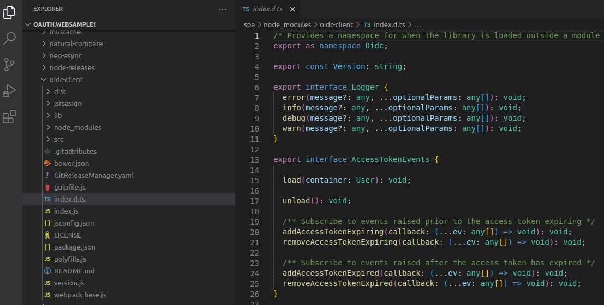
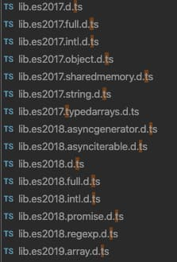
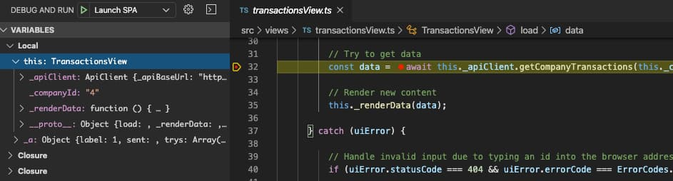
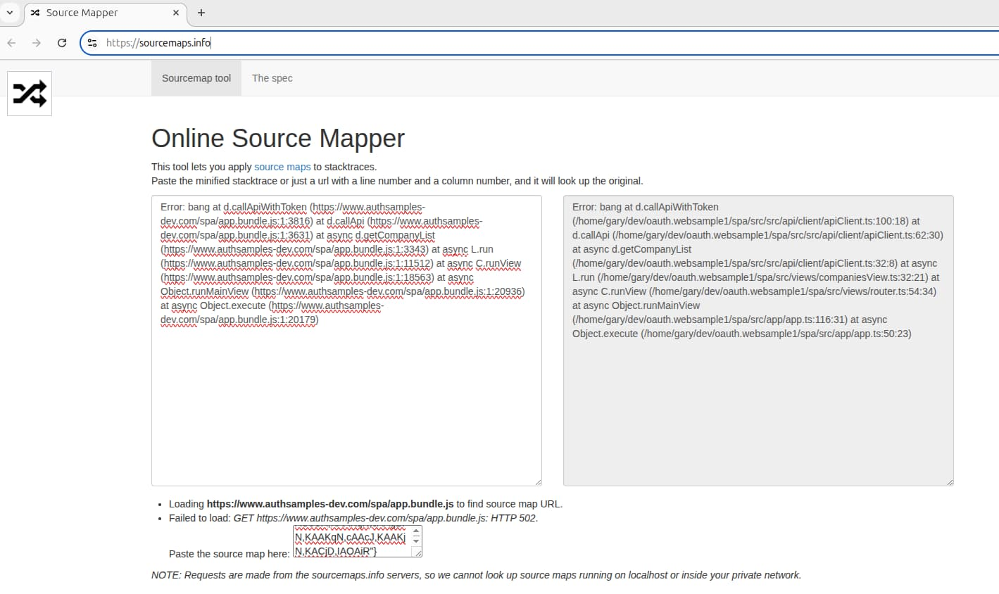

# Web Technology Setup

Previously I summarized an <a href='oauth-infrastructure-setup.mdx'>OAuth Infrastructure Setup</a>. In this post I explain a business-like SPA development setup, where web asset delivery and web security works the same for both local development and in production systems. I also highlight some minor differences between my SPA setup and Node.js API setup.

### Web Application Code

The main ingredient of an SPA is its coded logic to present views with data from APIs. Choose a language that remains close to the browser's default language, to reduce complexity. Also use clean code and a separation of concerns. I use TypeScript since I like the extensions to JavaScript in these areas.

- Expressive types including interfaces and private class members.
- Data contracts to represent API request and response payloads.
- Convenient refactoring when you change types.

### Web Development Pipeline

You then need to implement a web development pipeline, where the application code is central but there are a number of related behaviours. Modern web technology changes often and can feel overwhelming at times. I therefore like to articulate my important requirements at each stage of processing and ensure that I understand how they are met.

| Stage	| Behaviours |
| ----- | ---------- |
| Download Dependencies | Before you write any real code you typically need a way to download third party libraries as dependencies. |
| Write Code | To write non-trivial TypeScript code you need to import third party libraries and use their classes and functions. |
| Execute Tasks | You sometimes need to execute arbitrary tasks as part of development, such as code quality checks or running tests. |
| Build Code | You need to build code so that it runs reliably and efficiently in browsers, which involves compiling TypeScript. |
| Execute Code | You execute compiled code in the browser, which is different to the code you develop. |
| Decompile Code | When there is a problem, or to support debugging, you want to decompile JavaScript to the original TypeScript code. |

### Downloading Dependencies: Package Manager

Node.js uses the *npm* tool to specify libraries in your application's *package.json* file. The built code uses the entries in the *dependencies* section at runtime. You also need a number of entries in the *devDependencies* section, to work with TypeScript code. I use the [Node.js workspaces](https://docs.npmjs.com/cli/v8/using-npm/workspaces) feature to manage build and tool dependencies in child folders, to keep the SPA's functional dependencies easy to understand.

```json
{
  "dependencies": {
    "mustache": "^4.2.0",
    "oidc-client-ts": "^3.5.0",
    "tailwindcss": "^4.3.0"
  },
  "devDependencies": {
    "@eslint/js": "^10.0.1",
    "@types/mustache": "^4.2.5",
    "eslint": "^10.5.0",
    "tsx": "^4.22.4",
    "typescript": "^6.0.3",
    "typescript-eslint": "^8.61.0"
  },
  "workspaces": [
    "build",
    "tools"
  ]
}
```

You need to think about the potential for security vulnerabilities when you include dependencies. Only use respected libraries, keep them up to date and ensure that you have a process for vulnerability scanning. Make technology choices that keep the number of dependencies to a minimum, since you are responsible for the correctness of each dependency over time.

### Downloading Dependencies:  Node Modules

When you run *npm install*, your dependencies get downloaded to a *node_modules* folder from which you import classes and functions. The following screenshot shows some type definitions for the *oidc-client-ts* library.



You consume each library as JavaScript, even if it is coded in TypeScript. Each library should include an *index.d.ts* file for TypeScript consumers, which enables type checking and intellisense for its public interface.

### Writing Code: Resolving Imports

You import third-party libraries in source files using one of the following syntaxes. The first syntax imports a subset of capabilities from a module, whereas you use the second syntax to import the whole of a module.

```typescript
import {UserManager, UserManagerSettings} from 'oidc-client';
import mustache from 'mustache';
```

I inform the compiler that the project's own source files use ECMAScript classes. To do so, I specify *type=module* in the *package.json* file and then use ECMAScript rules for importing modules.

In SPA code, the *tsconfig.json* file uses *moduleResolution=Bundler*, and I import files without an extension:

```typescript
import {ApiClient} from '../api/client/apiClient';
```

In API code, the *tsconfig.json* file uses *moduleResolution=Node16* and I import files with a *.js* extension. During coding the referenced file uses TypeScript, though it becomes JavaScript when executed.

```typescript
import {CompanyService} from '../../logic/services/companyService.js';
```

### Writing Code: Using Type Definition Files

To use some libraries without compilation errors, TypeScript requires type definition files from [Definitely Typed](https://github.com/DefinitelyTyped/DefinitelyTyped). These are recognised by *package.json* entries that begin with *@types*. You can find their latest versions with commands of the following form.

```bash
npm view @types/node --json | grep '"24.' | sort -rV | head -n 1
```

I use a *typings.d.ts* file to inform the SPA that certain statements, like CSS imports or development-specific flags, should not cause a TypeScript error. For libraries without type definitions, I could use a *declare module* statement to get past compiler errors.

```typescript
declare module '*.css';
declare const IS_DEBUG: boolean;
declare module 'some-legacy-library';
```

### Writing Code: Using TypeScript Libraries

The SPA's *tsconfig.json* uses *lib: DOM*, to bring in browser type definitions, and *ES2025* enables the most modern coding syntax.

```json
{
  "compilerOptions": {
    "strict": true,
    "target": "ES2017",
    "lib": ["ES2025", "DOM"],
    "module":"ES2020",
    "moduleResolution": "Bundler",
    "outDir": "dist",
    "sourceMap": true,
    "rootDir": "src"
  },
  "include": [
    "src"
  ],
  "exclude": [
    "node_modules"
  ]
}
```

You can find browser types under the *node_modules/typescript/lib* folder and then use objects such as *HTMLInputElement*.

<div className='smallimage'>
    
</div>

### Writing Code: TypeScript Development

I  use a class-based development model, to encapsulate data, behaviour and dependencies together in the most standard way. I use constructor injection for most inter-class dependencies.

```typescript
export class CompaniesView {

    private readonly apiClient: ApiClient;

    public constructor(apiClient: ApiClient) {
        this.apiClient = apiClient;
    }

    public async load(): Promise<void> {

        try {
            const data =  await this.apiClient.getCompanyList();
            this.renderData(data);
        } catch (e: any) {
            ...
        }
    }
}
```

Strong typing during coding allows the environment to make more checks and simplifies refactoring. The use of ECMAScript modules means that the compiled code that runs in the browser remains largely the same as the original TypeScript code.

### Writing Code: Styling

I use [tailwindcss](https://tailwindcss.com/) as a utility CSS solution. I keep styling pretty simple, mostly using built-in styles. TypeScript views use a layout that arranges the SPA's UI elements into rows and columns.

```html
<div class='grid grid-cols-12 bg-gray-100 p-3'>
    <div class='col-span-2 font-bold text-center'>Account</div>
    <div class='col-span-2 font-bold text-center'>Region</div>
    <div class='col-span-2'></div>
    <div class='col-span-2 font-bold text-right'>Target USD</div>
    <div class='col-span-2 font-bold text-right'>Investment USD</div>
    <div class='col-span-2 font-bold text-right'># Investors</div>
</div>
```

My *app.css* file consists primarily of a tailwind import:

```css
@import 'tailwindcss';
```

I then import the CSS into my JavaScript code. This mechanism enables the web build to produce a final *app.css* file, without tailwindcss styles that I do not use.

```typescript
import './app.css';
```

### Executing Tasks

My code samples also use *npm* tasks that call bash scripts, which handle some finer details, including any environmental differences between Linux, macOS and Windows. The following example script runs build tasks and serves the SPA's built code using a static web content server.

```bash
npm install
if [ $? -ne 0 ]; then
  echo 'Problem encountered installing SPA dependencies'
  read -n 1
  exit 1
fi

npm run lint
if [ $? -ne 0 ]; then
  echo 'Problem encountered running SPA code quality checks'
  read -n 1
  exit 1
fi

npm start
if [ $? -ne 0 ]; then
  echo 'Problem encountered running the SPA'
  read -n 1
  exit 1
fi
```

### Building Code: Linting

My first build task checks code quality using the [typescript-eslint](https://github.com/typescript-eslint/typescript-eslint) library. The underlying [eslint](https://eslint.org/) library requires its own JavaScript configuration file. I import standard JavaScript and TypeScript rulesets as well as activating rules that reflect my coding preferences.

```javascript
import {defineConfig, globalIgnores} from 'eslint/config'
import js from '@eslint/js';
import tseslint from 'typescript-eslint';

export default defineConfig([
    globalIgnores(['dist']),
    {
        files: ['**/*.ts'],
        extends: [
            js.configs.recommended,
            tseslint.configs.strict,
        ],
        rules: {
            'brace-style': ['error', '1tbs'],
            'max-len': ['error', { 'code': 120 }],
            'no-multiple-empty-lines': ['error', {'max': 1}],
            'no-trailing-spaces': 'error',
            'quotes': ['error', 'single', { 'avoidEscape': true }],
            'semi': 'error',
            '@typescript-eslint/no-explicit-any': 'off',
            '@typescript-eslint/no-extraneous-class': 'off',
            '@typescript-eslint/explicit-module-boundary-types': ['error', {
                'allowArgumentsExplicitlyTypedAsAny': true,
            }],
        },
    },
]);
```

This provides warnings, mostly about little things, that helps to keep code maintainable and consistent.

```markdown
/home/gary/dev/oauth.websample1/spa/src/plumbing/oauth/oauthClient.ts
   42:1  error  More than 1 blank line not allowed              no-multiple-empty-lines

/home/gary/dev/oauth.websample1/spa/src/views/titleView.ts
  20:6  error  Opening curly brace does not appear on the same line as controlling statement  brace-style
```

### Building Code: SPA Bundles

For the SPA, a build phase is essential, for the following reasons:

| Reason | Description |
| ------ | ----------- |
| Browser Support | Produce JavaScript code that browsers can execute. |
| Web Performance | Reduce code to small bundles, so that the SPA performs well. |

I use a web bundler, to produce optimized JavaScript bundles that I express in the final *index.html* file:

```html
<!DOCTYPE html>
<html lang='en'>
    <head>
        <meta charset='utf-8'>
        <base href='/spa/'>
        <title>OAuth Demo App</title>
        <link rel='stylesheet' href='app.css'>
    </head>
    <body>
        <div id='root'></div>

        <script type='module' src='vendor.bundle.js'></script>
        <script type='module' src='app.bundle.js'></script>
    </body>
</html>

```

### Building Code: Bundler Configuration

This blog uses the [rollup](https://rollupjs.org/) bundler, since it produces the most modern ECMAScript final code from my TypeScript code. This bundler also gives me technical control and allows me to run with a restrictive content security policy during development. For rollup I use a number of additional dependencies that I express in the SPA's *build/package.json* file.

```json
{
  "devDependencies": {
    "@rollup/plugin-commonjs": "^29.0.2",
    "@rollup/plugin-node-resolve": "^16.0.3",
    "@rollup/plugin-replace": "^6.0.3",
    "@rollup/plugin-terser": "^1.0.0",
    "@tailwindcss/postcss": "^4.3.0",
    "@types/node": "^24.10.3",
    "cssnano": "^8.0.1",
    "open": "^11.0.0",
    "postcss": "^8.5.15",
    "rollup": "^4.60.4",
    "rollup-plugin-copy": "^3.5.0",
    "rollup-plugin-esbuild": "^6.2.1",
    "rollup-plugin-postcss": "^4.0.2"
  }
}
```

With rollup, you essentially create a *rollup.config.ts* file that points the bundler to the SPA's entry point TypeScript file and express rules for producing output bundles to a *dist* folder.

```typescript
const isDevelopment = process.env.ROLLUP_WATCH === 'true';
const outputFolder = 'dist';
const options: RollupOptions = {

    input: 'src/app.ts',
    output: {

        dir: outputFolder,
        format: 'esm',
        entryFileNames: 'app.bundle.js',
        chunkFileNames: '[name].bundle.js',
        manualChunks: (id: string) => {

            if (!id.includes('node_modules')) {
                return null;
            }

            return 'vendor';
        },
    },
};
export default defineConfig(options);
```

This blog's SPA build also runs a series of plugins, to perform a number of tasks. These tasks process the *node_modules* folder, include only used code from dependencies, then build that code to ECMAScript output for the browser. The tasks also set an *IS_DEBUG* variable for development builds and use the [ESBuild](https://esbuild.github.io/) tool to compile the SPA's TypeScript code.

```typescript
{
    plugins: [

        nodeResolve({
            browser: true,
        }),

        commonjs(),

        replace({
            'IS_DEBUG': JSON.stringify(isDevelopment),
            preventAssignment: true,
        }),

        esbuild({
            tsconfig: './tsconfig.json',
            target: 'es2020',
        }),

        copy({
            targets: [
                { src: 'favicon.ico', dest: outputFolder },
                { src: 'index.html', dest: outputFolder },
                { src: 'spa.config.json', dest: outputFolder },
            ],
        }),

        ...(isDevelopment ? [
            notifyBrowser(),
        ] : [
            terser(),
        ]),
    ],
}
```

Web bundlers are a little daunting when you are new to modern web technology. The use of plugins may seem complex but they provide technical control that enables optimal web builds.

### Building Code: Running the Bundler

To run the bundler for development I use the following commands. ESBuild then compiles code using the settings from the SPA's *tsconfig.json* file. The *target=ES2017* setting supports mainstream desktop and mobile browsers, and *module=ES2020* setting enables the use of bundle splitting as a mechanism to improve the download efficiency of web assets.

```bash
rm -rf dist && NODE_OPTIONS='--import tsx' rollup --config build/rollup.config.ts --watch
```

Rollup outputs the following files to the *dist* folder, in a deployment-ready structure. The *app.bundle.js* bundle contains the SPA's built code and the *vendor.bundle.js* bundle contains the built code for dependencies from the *node_modules* folder. The source map files enable stepping through the SPA's code in a debugger, and the ability to get the original TypeScript line of code from an exception stack trace.

```markdown
app.bundle.js
app.bundle.js.map
app.css
favicon.ico
index.html
livereload.bundle.js
livereload.bundle.js.map
spa.config.json
vendor.bundle.js
vendor.bundle.js.map
```

Since the SPA builds to ECMAScript modules, the development build results remain close to the SPA's TypeScript code, with types removed. Keeping the built code similar to the developed code makes decompilation easier later.

```javascript
class CompaniesView {
    constructor(apiClient) {
        this.apiClient = apiClient;
    }
    async run() {
        
        try {
            const data = await this.apiClient.getCompanyList();
            this.renderData(data);
        } catch (e) {
            ...
        }
    }
}
```

### Building Code: Bundle Splitting

When users first run an SPA they trigger a download of all *initial* bundles that the *index.html* file references. If you keep initial bundles small you get a fast time to first render. In TypeScript code you can then use dynamic imports to enable users to download additional bundles after a navigation event.

```typescript
const module1 = await import('component1');
const module2 = await import('component2');
const component1 = new module.SharedComponent1();
const component2 = new module.SharedComponent1();
```

Rollup produces new *non-initial* bundles when you use dynamic imports, where *initial* bundles contain references to *non-initial* bundles. By default, a new bundle gets produced for each module, or you can update the rollup *manualChunks* function to explicitly control the bundle to which dynamic modules get written to. The first user action that uses a component in the bundle triggers its download.

```typescript
{
    manualChunks: (id: string) => {
        if (id.includes('component1') || id.includes('component2')) {
            return 'shared';
        }

        ...
    },
}
```

### Building Code: CSS

Rollup also uses [postcss](https://github.com/postcss/postcss) and tailwindcss plugins to produce a final *app.css* file from the styles that I use. The plugin therefore eliminates unused code in a similar manner to how rollup eliminates unused TypeScript code, to keep download sizes small.

```typescript
{
    plugins: [
        ...

        postcss({
            extract: 'app.css',
            plugins: [
                tailwind(),
            ]
        }),
    ],
}
```

The built *app.css* file uses CSS rules that the browser interprets. Frameworks like tailwindcss help to promote understanding of modern CSS best practices.

```css
/*! tailwindcss v4.3.1 | MIT License | https://tailwindcss.com */
@layer properties;
@layer theme, base, components, utilities;
...
```

### Building Code: API Compilation

For TypeScript APIs, I avoid producing JavaScript files during development, since it complicates searches on the code base. Instead, the [tsx](https://github.com/privatenumber/tsx) tool can build TypeScript files to JavaScript in memory and then execute the JavaScript.

```bash
tsx watch src/host/startup/app.ts
```

Deployed builds for Node.js APIs should instead run JavaScript code, for best performance. API builds can simply use the *tsc* tool to transpile each TypeScript file to JavaScript in a *dist* folder, using the settings in the *tsconfig.json* file.

I always use the most up to date stable Node.js options for API builds. Unless there is a good reason, I avoid using bundle files for API code. By keeping built code easier to read, you are better able to diagnose potential production problems, like exception stack traces.

In some deployed environments, bundling improves API startup times. This blog's <a href='serverless-api-deployment.mdx'>Serverless Node.js API</a> uses rollup to deploy bundled AWS lambda functions, which makes a noticeable differences to cold start times when the API has been idle for a while.

### Executing Code: Development Web Host

After the web build, the SPA's HTML, CSS and JavaScript bundles can be served from the *dist* folder using an HTTP server. I use the Node.js Express HTTP server as a development web host, with the following essential code.

```typescript
const app = express();
app.use('/*_', setSecurityHeaders);

const pfxData = await fs.readFile('../certs/authsamples-dev.ssl.p12');
const httpsOptions = {
    pfx: pfxData,
    passphrase: 'Password1',
};

const server = https.createServer(httpsOptions, app);

const spaBasePath = '/spa/';
const spaPhysicalRoot = 'dist';
app.use(spaBasePath, express.static(spaPhysicalRoot));

const port = 443;
server.listen(port, () => {
    console.log(`Web host is listening on HTTPS port ${port} ...`);
});
```

The web host returns a number of [recommended security headers](https://owasp.org/www-project-secure-headers/), the most important of which is to apply a restrictive content security policy to the browser environment. During development the SPA can only interact with resources from its web host, the trusted authorization server and trusted APIs.

```typescript
function setSecurityHeaders(request: Request, response: Response, next: NextFunction): any {

    const trustedHosts = [
        'https://api.authsamples-dev.com:446',
        'https://cognito-idp.eu-west-2.amazonaws.com',
        'https://login.authsamples.com',
    ];

    let policy = "default-src 'none';";
    policy += " script-src 'self';";
    policy += ` connect-src 'self' ${trustedHosts.join(' ')};`;
    policy += " child-src 'self';";
    policy += " img-src 'self';";
    policy += " style-src 'self';";
    policy += " object-src 'none';";
    policy += " frame-ancestors 'none';";
    policy += " base-uri 'self';";
    policy += " form-action 'self'";

    response.setHeader('content-security-policy', policy);
    response.setHeader('strict-transport-security', 'max-age=31536000; includeSubdomains; preload');
    response.setHeader('x-frame-options', 'DENY');
    response.setHeader('x-xss-protection', '1; mode=block');
    response.setHeader('x-content-type-options', 'nosniff');
    response.setHeader('referrer-policy', 'same-origin');
    next();
}
```

A lightweight web host is the most critical part of the web technology setup. Since the web host never comes into contact with sensitive data from APIs, you significantly simplify frontend developer setups. Web developers operate like mobile developers, and get sensitive data by calling API internet URLs. When APIs return challenge responses with HTTP status codes of 401 or 403, frontend developers can handle them with full usability control.

### Executing Code: Live Reloading

When I make frontend code changes to TypeScript code or to CSS styles, rollup writes updated bundles to the *dist* folder and runs the following plugin, to open the browser after the first build, or to notify the development web host on subsequent builds.

```typescript
let isOpen = false;
export function notifyBrowser(): Plugin {

    const plugin: Plugin = {
        name: 'notify-browser',
        async writeBundle(): Promise<void> {

            const webHostUrl = 'https://www.authsamples-dev.com';
            if (!isOpen) {

                isOpen = true;
                open(`${webHostUrl}/spa/`);

            } else {

                await fetch(`${webHostUrl}/reload`);
            }
        }
    };

    return plugin;
}
```

The development web host runs a web socket server on the same host and port that it uses to serve static content. The web host also exposes a REST */livereload* endpoint that the rollup plugin calls, after which the server sends a web socket notification to the browser:

```typescript
const wss = new WebSocketServer({
    server,
    path: '/reload'
});

app.get('/reload', (request: Request, response: Response) => {

    console.log('Web socket server broadcasting reload event ...');
    for (const client of wss.clients) {
        if (client.readyState === WebSocket.OPEN) {
            client.send('reload');
        }
    }
    response.sendStatus(204);
});
```

In development mode, the SPA uses a dynamic import to load a live reload script:

```typescript
if (IS_DEBUG) {
    await import('./livereload');
}
```

The live reload script receives the web socket notification and refreshes the page. The overall mechanism provides fast feedback when you edit files during development.

```typescript
export const ws = new WebSocket(`wss://${location.host}/reload`);
ws.onmessage = (event: MessageEvent<string>) => {
    if (event.data === 'reload') {
        location.reload();
    }
};
```

The deeper part of the live reload behaviour is the use of production mechanisms for web asset delivery and web security during development. This setup enables you to find and resolve technical issues early. The only development difference is a non-optimized build with debugging support.

### Decompiling Code: Debugging

To step through code in GitHub repositories with multiple projects I use a [Visual Studio Code Workspace File](https://code.visualstudio.com/docs/editing/workspaces/workspaces). I then use Visual Studio Code's *Open workspace from file* option and select the *.workspace* file. I then use the *Run and Debug* tab to choose the project to debug. 

To debug a TypeScript SPA I add a */.vscode/launch.json* configuration file with settings similar to those shown below.

```json
{
    "version": "0.2.0",
    "configurations": [
        {
            "type": "chrome",
            "request": "launch",
            "name": "Launch SPA",
            "url": "https://www.authsamples-dev.com/spa/"
        }
    ]
}
```

From the *Debug and Run* tab I can choose *Launch SPA* and then operate the SPA while setting breakpoints to inspect the state of variables:



If you inspect bundle files, their last line references a source map file that browser developer tools download when a debug session starts. Source maps enable TypeScript code debugging while the corresponding JavaScript code executes in the browser.

```markdown
//# sourceMappingURL=app.bundle.js.map
```

To debug a TypeScript API I use a similar mechanism, where the */.vscode/launch.json* file uses settings similar to those shown below.

```json
{
    "version": "0.2.0",
    "configurations": [
        {
            "type": "node",
            "request": "launch",
            "name": "Launch API",
            "runtimeArgs": ["--import", "tsx"],
            "args": ["src/host/startup/app.ts"],
            "outputCapture": "std",
            "skipFiles": ["<node_internals>/**"]
        }
    ]
}
```

### Decompiling Code: SPA Exception Stack Traces

The bundler configuration sets a property *IS_DEBUG=true* in development builds. The SPA's error handling code uses the variable to decide whether to render stack traces:

```typescript
public static getErrorStack(error: UIError): ErrorLine | null {

    if (IS_DEBUG) {
        if (error.stack) {
            return ErrorFormatter.createErrorLine('Stack', error.stack);
        }
    }

    return null;
}
```

In debug builds I render stack traces as raw strings in an error details dialog:


Given a stack trace and sourcemap files, I can use an [Online Source Mapper](https://sourcemaps.info/) to paste in the exception stack trace and the source map contents. The tool then re-renders the call stack using locations from the original TypeScript code.



Source map stack trace lookup also works for minified release builds, to provide a mechanism to help resolve production errors. For a real SPA I would save source map files for each application release. Production frontends could use a feature to *send home* a stack trace rather than display it to the user.

### Web Production Behaviours

Once you have a productive web pipeline, you are well placed to productionize and apply finishing touches to the web technology. The following blog posts explore this blog's finishing touches for web applications. None of these steps change the web technology setup:

- The <a href='spa-back-end-for-front-end.mdx'>Backend for Frontend Design</a> explains the use of secure cookies to transport access tokens to APIs.
- The <a href='final-spa-overview.mdx'>Final SPA Overview</a> explains updates to a React app that sends cookies in API requests.
- The <a href='api-journey-client-side.mdx'>API Journey Client Side</a> explains how web clients should handle API security challenge responses.
- The <a href='cdn-static-content-delivery.mdx'>Web Content Delivery</a> explains modern web deployments with optimal global performance.

Of course, in a real SPA you are likely to have additional requirements. You may also prefer to do a little more work in the web host. You should be able to adapt this blog's web technology setup to add extra behaviours that meet your own requirements.

### Where Are We?

I summarized steps to ensure a modern, secure, productive and business-like web development setup. In particular, I separate web and API concerns so that the web host does not deal with data security. Next, I explain some development setups to enable the use of HTTP proxy tools for debugging, so that you have rich options to view OAuth and API messages, when developing within a distributed architecture.

### Next

- I explain this blog's <a href='http-debugging-setup.mdx'>Development HTTP Proxy Setup</a>.
- For a list of all blog posts see the <a href='index.mdx'>Index Page</a>.
