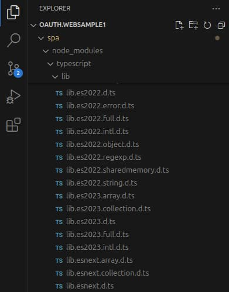

# Web Technology Setup

Previously I suggested an <a href='oauth-infrastructure-setup.mdx'>OAuth Infrastructure Setup</a>. In this post I explain how this blog uses web technology, primarily for browser based apps. I also highlight differences for Node.js code, such as APIs. The main technical goal is a business-like development setup that matches deployed systems, so that security, reliability and deployment aspects work the same locally and in production.

### Web Application Code

The main ingredient of an SPA is its view logic. Choose a language that remains close to the browser's default language, to reduce complexity. Also use clean code and a separation of concerns. I use TypeScript since I like the extensions to JavaScript in these areas:

- Expressive types including interfaces and private class members.
- Data contracts can represent API requests and responses.
- Convenient refactoring when you change types.

### Web Development Pipeline

You then need to implement a web development pipeline, where the application code is central but there are a number of related behaviors. Modern web technology changes often and can feel overwhelming at times. I therefore like to articulate my important requirements at each stage of processing.

| Stage	| Description |
| ----- | ----------- |
| Download Dependencies | Before you write any real code you typically need a way to download third party libraries as dependencies. |
| Write Code | To write non-trivial TypeScript code you need to import third party libraries and use their classes and functions. |
| Execute Tasks | You sometimes need to execute arbitrary tasks as part of development, such as code quality checks or running tests. |
| Build Code | You need to build code so that it runs in browsers, which involves compiling TypeScript. |
| Execute Code | You execute compiled code in the browser, which is different to the code you develop. |
| Decompile Code | When there is a problem, or to support debugging, you want to decompile to the original TypeScript code. |

### Downloading Dependencies: Package Manager

Node.js uses the *npm* tool to specify libraries in your application's *package.json* file. The built code uses the entries in the *dependencies* section at runtime. You typically require a number of plumbing entries in the *devDependencies* section to produce the built code.

```json
{
  "dependencies": {
    "axios": "^1.13.2",
    "mustache": "^4.2.0",
    "oidc-client-ts": "^3.4.1"
  },
  "devDependencies": {
    "@eslint/js": "^9.39.2",
    "@types/mustache": "^4.2.5",
    "@types/node": "^24.10.3",
    "eslint": "^9.39.2",
    "ts-loader": "^9.5.4",
    "tsx": "^4.21.0",
    "typescript": "^5.9.3",
    "typescript-eslint": "^8.49.0",
    "webpack": "^5.103.0",
    "webpack-cli": "^6.0.1",
    "webpack-dev-server": "^5.2.2",
    "webpack-merge": "^6.0.1"
  }
}
```

You need to think about the potential for security vulnerabilities when you include dependencies. Only use respected libraries, keep them up to date and ensure that you have a process for vulnerability scanning. Make technology choices that keep the number of dependencies to a minimum, since you are responsible for the correctness of each dependency over time.

### Downloading Dependencies:  Node Modules

When you run *npm install* your dependencies get downloaded to a *node_modules* folder from which you import classes and functions:


You consume each library as JavaScript, even if it is coded in TypeScript. Each library should include an *index.d.ts* file for TypeScript consumers, which enables type checking and intellisense for its public interface.

### Writing Code: Resolving Imports

You import libraries in source files using one of the following syntaxes. The first syntax imports a newer *ECMAScript* module, whereas you use the second syntax to import older *CommonJS* modules.

```typescript
import {UserManager, UserManagerSettings} from 'oidc-client';
import mustache from 'mustache';
```

This blog's APIs use Node.js 24 or later, with the following settings in the *tsconfig.json* file, which controls TypeScript behaviors. I typically use the latest released (non-experimental) settings. You use some settings when you import modules and other settings when you build TypeScript code to JavaScript, to enable browser execution:

```json
{
  "compilerOptions": {
    "strict": true,
    "target": "ES2024",
    "lib": ["ES2024"],
    "module":"Node18",
    "moduleResolution": "Node16",
    "allowSyntheticDefaultImports": true,
    "outDir": "dist",
    "sourceMap": true
  },
  "include": [
    "./src"
  ],
  "exclude": [
    "node_modules"
  ]
}
```

You use the following settings when you import modules:

| Setting | Desired Behaviour |
| ------- | ----------------- |
| [moduleResolution](https://www.typescriptlang.org/tsconfig#moduleResolution) | Use modern rules to resolve external modules. |
| [allowSyntheticDefaultImports](https://www.typescriptlang.org/tsconfig#allowSyntheticDefaultImports) | Enable the cleanest import syntax for older CommonJS modules. |

You also need to tell the compiler that the project's own source files use ECMAScript modules. To do so, specify *type=module* in the *package.json* file. For Node.js (non browser) code that use *type=module*, add a *.js* suffix to imports. During coding this is a TypeScript file, though it becomes JavaScript when executed:

```typescript
import {CompanyRepository} from '../repositories/companyRepository.js';
```

### Writing Code: Using Type Definition Files

To use some libraries without compilation errors, TypeScript requires type definition files from [Definitely Typed](https://github.com/DefinitelyTyped/DefinitelyTyped). These are recognised by *package.json* entries that begin with *@types*. You can find their latest versions with commands of the following form:

```bash
npm view @types/node --json | grep '"24.' | sort -rV | head -n 1
```

For libraries with no type definitions, I occasionally need to add a *typings.d.ts* file to the project and then use a *declare module* statement. This gets past compiler errors, so that my experience is no worse than developing in JavaScript, though I lose type checking or intellisense.

```typescript
declare module 'some-legacy-library';
```

### Writing Code: Using TypeScript Libraries

The *tsconfig.json* file for the SPA is a little different to that for the Node.js API. The *lib: DOM* option brings in browser type definitions and also enables the most modern coding syntax:

```json
{
  "compilerOptions": {
    "strict": true,
    "target": "ES2017",
    "lib": ["ES2024", "DOM"],
    "module":"ES2022",
    "moduleResolution": "Bundler",
    "allowSyntheticDefaultImports": true,
    "outDir": "dist",
    "sourceMap": true
  },
  "include": [
    "./src"
  ],
  "exclude": [
    "node_modules"
  ]
}
```

You can find browser types under the *node_modules/typescript/lib* folder and then use objects such as *HTMLInputElement*.

<div className='smallimage'>
    
</div>

### Writing Code: TypeScript Development

I  use a class-based development model, to encapsulate data, behaviour and dependencies together in the most standard way. Constructor injection is used for inter-class dependencies:

```typescript
export class CompaniesView {

    private readonly apiClient: ApiClient;

    public constructor(apiClient: ApiClient) {
        this.apiClient = apiClient;
    }

    public async load(): Promise {

        try {
            const data =  await this.apiClient.getCompanyList();
            this.renderData(data);
        } catch (e: any) {
            ...
        }
    }
}
```

Strong typing during coding allows the environment to make more checks and simplifies refactoring. I use ECMAScript modules so that the compiled code remains modern and closest to the original TypeScript syntax.

### Writing Code: Styling

For this blog I keep styling simple, since some web technology CSS solutions add a lot of technical overhead. I use the [Bootstrap](https://getbootstrap.com/docs/4.0/getting-started/introduction/) library's built-in styles for both presentation and a grid-based layout:

```html
<div class='row listRow'>
    <div class='col-2 my-auto text-center'>
        {{name}}
    </div>
    <div class='col-2 my-auto text-center'>
        {{region}}
    </div>
    <div class='col-2 my-auto text-center'>
        <a href='#company={{id}}'>View Transactions</a>
    </div>
    <div class='col-2 my-auto moneycolor fw-bold text-end'>
        {{formattedTargetUsd}}<br/>
    </div>
    <div class='col-2 my-auto moneycolor fw-bold text-end'>
        {{formattedInvestmentUsd}}
    </div>
    <div class='col-2 my-auto fw-bold text-end'>
        {{noInvestors}}
    </div>
</div>
```

My application CSS file is therefore a single global file, containing only padding, colours and minor adjustments to support mobile layouts:

```css
.row
{
    margin-top: 5px;
}
.listRow
{
    height: 80px;
}
.valuecolor
{
    color: blue;
}
.moneycolor
{
    color:green;
}
.largetext
{
    font-size: larger;
}
.errorcolor
{
    color:red;
}
.errorlinecolor
{
    color:darkblue;
}

@media all and (max-width: 992px)
{
    body
    {
        font-size: 0.85em;
    }
}
@media all and (max-width: 768px)
{
    body
    {
        font-size: 0.45em;
    }
}
```

### Executing Tasks

My code samples also use *npm* tasks that call bash scripts, which handle some finer details, including any environmental differences between Linux, macOS and Windows. The following example script runs build tasks and serves the SPA's built code using a static web content server:

```bash
npm install
if [ $? -ne 0 ]; then
  echo 'Problem encountered installing SPA dependencies'
  read -n 1
  exit 1
fi

npm run lint
if [ $? -ne 0 ]; then
  echo 'Problem encountered running SPA code quality checks'
  read -n 1
  exit 1
fi

npm start
if [ $? -ne 0 ]; then
  echo 'Problem encountered running the SPA'
  read -n 1
  exit 1
fi
```

### Building Code: Linting

My first build task checks code quality using the [typescript-eslint](https://github.com/typescript-eslint/typescript-eslint) library. The underlying [eslint](https://eslint.org/) library requires its own JavaScript configuration file. I import standard JavaScript and TypeScript rulesets as well as activating rules that reflect my coding preferences:

```javascript
import eslint from '@eslint/js';
import tseslint from 'typescript-eslint';

export default tseslint.config({
    files: ['**/*.ts', '**/*.mjs'],
    extends: [
        eslint.configs.strict,
        ...tseslint.configs.strict,
    ],
    rules: {
        '@typescript-eslint/explicit-module-boundary-types': ['error', {
            'allowArgumentsExplicitlyTypedAsAny': true,
        }],
        '@typescript-eslint/no-explicit-any': 'off',
        '@typescript-eslint/no-extraneous-class': 'off',
        'brace-style': ['error', '1tbs'],
        'indent': 'error',
        'max-len': ['error', { 'code': 120 }],
        'no-multiple-empty-lines': ['error', {'max': 1}],
        'no-trailing-spaces': 'error',
        'quotes': ['error', 'single'],
        'semi': 'error',
    },
});
```

This provides warnings, mostly about little things, that helps to keep code maintainable and consistent:

```markdown
/home/gary/dev/oauth.websample1/spa/src/plumbing/oauth/oauthClient.ts
   42:1  error  More than 1 blank line not allowed              no-multiple-empty-lines

/home/gary/dev/oauth.websample1/spa/src/views/titleView.ts
  20:6  error  Opening curly brace does not appear on the same line as controlling statement  brace-style
```

### Building Code: SPA Bundles

For the SPA, a build phase is essential, for the following reasons:

| Reason | Description |
| ------ | ----------- |
| Browser Support | Produce JavaScript code that browsers can execute. |
| Web Performance | Reduce code size to ensure small bundle sizes, so that the SPA performs well. |

I use the [webpack](https://webpack.js.org/) tool, but only for one main task, to produce the JavaScript bundles expressed in the final *index.html* file:

```html
<!DOCTYPE html>
<!DOCTYPE html>
<html lang='en'>
    <head>
        <meta charset='utf-8'>
        <base href='/spa/'>
        <title>OAuth Demo App</title>

        <link rel='stylesheet' href='bootstrap.min.css'>
        <link rel='stylesheet' href='app.css'>
    </head>
    <body>
        <div id='root' class='container'></div>

        <script type='module' src='vendor.bundle.js'></script>
        <script type='module' src='app.bundle.js'></script>
    </body>
</html>
```

### Building Code: Webpack Configuration

Webpack requires a configuration object that you can create in TypeScript. The options can seem a little cryptic at first. Mostly though, you just need to specify the SPA's entry point source file, then provide an output folder for compiled bundles. The following example uses an entry point of *app.ts* and writes bundles to a *dist* folder:

```typescript
const config: webpack.Configuration = {

    mode: 'development',
    context: path.resolve(dirname, './src'),
    target: ['web'],
    devtool: 'source-map',
    entry: {
        app: ['./app/app.ts']
    },
    module: {
        rules: [
            {
                test: /\.ts$/,
                use: 'ts-loader',
                exclude: /node_modules/
            }
        ]
    },
    resolve: {
        extensions: ['.ts', '.js']
    },
    output: {
        path: path.resolve(dirname, './dist'),
        filename: '[name].bundle.js',
        module: true,
    },
    experiments: {
        outputModule: true,
    },
    optimization: {
        splitChunks: {
            cacheGroups: {
                vendor: {
                    chunks: 'initial',
                    name: 'vendor',
                    test: /node_modules/,
                    enforce: true
                },
            }
        }
    }
};
```

Some newer bundlers claim to provide a simpler developer experience, but I have found that they often result in different web delivery mechanisms during development and in deployed environments. As a mature bundler, webpack enables me to use the SPA during development with the same technical steps as production users.

### Building Code: Web Compilation

Webpack has its own rules for resolving imports. You supply *extensions* to tell webpack to build both the SPA's TypeScript code and JavaScript code consumed from the *node_modules* folder. The *ts-loader* utility compiles TypeScript code into JavaScript using the settings in the *tsconfig.json* file. To compile the SPA's TypeScript code, use the <a href='https://github.com/privatenumber/tsx'>tsx loader utility</a> to run the webpack configuration file.

```bash
NODE_OPTIONS='--import tsx' webpack --config webpack.config.ts
```

The SPA's application code builds to an *app.bundle.js* file. When compiling the SPA, the [ts-loader](https://github.com/TypeStrong/ts-loader) library uses the settings from the *tsconfig.json* file. I configure webpack to build a second, larger bundle, called *vendor.bundle.js*, containing third-party code from the *node_modules* folder. The build outputs the following files to a *dist* folder. The source map files can be used to step through code in a debugger, or to diagnose exception stack traces:

```markdown
vendor.bundle.js
vendor.bundle.js.map
app.bundle.js
app.bundle.js.map
```

For SPAs, I ensure that output works in mainstream browsers for the last 5 years or so. I also produce clean production JavaScript code that maintains the expressiveness of the original TypeScript code. I therefore use the following *tsconfig.json* output settings:

| Setting | Description |
| ------- | ----------- |
| [target](https://www.typescriptlang.org/tsconfig#target) | Building to ES2017 means built code runs in all mainstream desktop and mobile browsers and *await* statements are output to the built code. |
| [module](https://www.typescriptlang.org/tsconfig#module) | ES2022 means bundled code uses the ECMAScript module format, which browsers have supported for years, and bundles may use top level await statements. |

### Building Code: ECMAScript Output

Since the SPA builds to ES2017 JavaScript, the development build results remain close to the SPA's TypeScript code, with types removed. Keeping the built code similar to the developed code makes decompilation easier later.

```typescript
class CompaniesView {
    constructor(apiClient) {
        this.apiClient = apiClient;
    }
    async load() {
        
        try {
            const data = await this.apiClient.getCompanyList();
            this.renderData(data);
        } catch (e) {
            ...
        }
    }
}
```

Support for ES2017 features were added to all main mobile and desktop browsers in around 2017. You can use online websites to check browser compatibility for any newer syntax:

- [Can I use await in browser code?](https://caniuse.com/?search=await)
- [Can I use top level await in browser code?](https://caniuse.com/?search=top-level%20await)

### Building Code: API Compilation

During development of TypeScript APIs, I avoid producing JavaScript files, since doing so adds confusion when you search the code base. Instead, Node.js can be asked to execute TypeScript files directly with the tsx tool. The Node.js runtime then uses ECMAScript modules built in-memory.

```bash
tsx watch src/host/startup/app.ts
```

Deployed builds for Node.js APIs should instead run JavaScript code, for best performance. The initial API also has an *npm run buildRelease* command to produce deployable files to its *dist* folder. The most up to date Node.js options can be used for the API build. I avoid using bundle files for API code. By keeping built code easier to read, you are better able to diagnose potential production problems, and diagnose exception stack traces.

### Executing Code: Development Web Host

After the web build, the SPA's HTML, CSS and JavaScript bundles can be served from any HTTP server. For example, Node.js Express can serve static content using the following minimal code:

```typescript
const app = express();
app.use('/spa', express.static('./dist'));
app.listen(8000, () => {
      console.log('Serving web static content ...');
  });
```

A lightweight web host is the most critical part of the web technology setup. Since the web host never comes into contact with sensitive data from APIs, you significantly simplify frontend developer setups. Web developers operate like mobile developers, and get sensitive data by calling API internet URLs. When APIs return challenge responses with HTTP status codes of 401 or 403, frontend developers can handle them with full usability control.

As is standard for SPA development, this blog uses a development static content host. I use the webpack development server, which uses Node.js Express under the hood. To serve static content locally using SSL and a custom domain name I use the following configuration. I like to write bundles to disk during development so that I can understand how my built code is returned to the browser.

```typescript
const devServer: webpackDevServer.Configuration = {

    server: {
        type: 'https',
        options: {
            pfx: fs.readFileSync('../certs/authsamples-dev.ssl.p12'),
            passphrase: 'Password1',
        },
    },
    static: {
        directory: path.join(dirname, './dist'),
        publicPath: '/spa/',
    },
    port: 443,
    open: 'https://www.authsamples-dev.com/spa',
    devMiddleware: {
        writeToDisk: true,
    },
    historyApiFallback: {
        index: '/spa/',
    },
    hot: true,
    allowedHosts: [
        'www.authsamples-dev.com',
    ],
};
```

Although I get some developer conveniences like hot reloading when I make frontend code changes, the main behavior I want from a development web static content host is to serve web assets in the same way as for production users. The development web host must be able to implement security behaviors like setting a strong content security policy. The only difference during development is that I use a non-optimized build with debugging support.

### Decompiling Code: Debugging

To step through code in GitHub repositories with multiple projects I use a [Visual Studio Code Workspace File](https://code.visualstudio.com/docs/editing/workspaces/workspaces). I then use Visual Studio Code's *Open workspace from file* option, after which I can use the *Run and Debug* tab to choose the project to debug. 

For a TypeScript API I add a */.vscode/launch.json* configuration file with settings similar to those shown below.

```json
{
    "version": "0.2.0",
    "configurations": [
        {
            "type": "node",
            "request": "launch",
            "name": "Launch API",
            "runtimeArgs": ["--import", "tsx"],
            "args": ["src/host/startup/app.ts"],
            "outputCapture": "std",
            "skipFiles": ["<node_internals>/**"]
        }
    ]
}
```

For a TypeScript SPA I add a */.vscode/launch.json* configuration file with settings similar to those shown below.

```json
{
    "version": "0.2.0",
    "configurations": [
        {
            "type": "chrome",
            "request": "launch",
            "name": "Launch SPA",
            "url": "https://www.authsamples-dev.com/spa/"
        }
    ]
}
```

From the *Debug and Run* tab I can choose *Launch API* and *Launch SPA*, then operate the SPA while setting breakpoints to inspect the state of variables:


If you inspect bundle files, their last line references a source map file that browser developer tools download when a debug session starts. Source maps enable TypeScript code debugging while the corresponding JavaScript code executes in the browser.

```text
//# sourceMappingURL=app.bundle.js.map
```

### Decompiling Code: SPA Exception Stack Traces

The webpack configuration uses separate development and production configurations. The development configuration references the development web server configuration, includes a property that enables code debugging, and also sets a property to let JavaScript know whether it should run in debug mode:

```typescript
const devConfig: webpack.Configuration = {

    mode: 'development',
    devServer,
    output: Object.assign({}, baseConfig.output, {
        devtoolModuleFilenameTemplate: 'file:///[absolute-resource-path]',
    }),
    plugins:[
        new webpack.DefinePlugin({
            IS_DEBUG: 'true',
        }),
    ],
};
```

To prevent TypeScript compilation errors, I reference the *IS_DEBUG* variable in the SPA's *typings.d.ts* file. The SPA's error handling code uses the variable to decide whether to render stack traces:

```typescript
public static getErrorStack(error: UIError): ErrorLine | null {

    if (IS_DEBUG) {
        if (error.stack) {
            return ErrorFormatter.createErrorLine('Stack', error.stack);
        }
    }

    return null;
}
```

In debug builds of this blog's frontend applications I intentionally render SPA stack trace data in a raw format. In production apps, I could use a *Send Home* feature to receive this data:


I would save a backup of source map files for each application release. When a user experiences an error you can use tools like the [Online Source Mapper](https://sourcemaps.info) to find the original source location of an error. To do so, paste stack trace data into the left hand pane and the source map data into the small edit box:


The right pane then displays an updated stack trace based on the original TypeScript lines of code. In the following example output you can see that the failure is at *line 55* of the *ApiClient.ts* source file:

```markdown
Error: simulating an exception at ApiClient.callApi (webpack:///./api/client/apiClient.ts:55:18)
at async ApiClient.getCompanyList (webpack:///./api/client/apiClient.ts:31:15)
at async CompaniesView.load (webpack:///./views/companiesView.ts:25:25)
at async Router.loadView (webpack:///./views/router.ts:43:12)
at async App.loadMainView (webpack:///./app/app.ts:118:8)
at async App.execute (webpack:///./app/app.ts:51:12)
```

Stack traces are most useful when there is a bug in the SPA's code that you cannot reproduce. If you verify that stack trace lookups work during development, you have solid options for resolving production problems later.

### Web Production Behaviors

Once you have a productive web pipeline, you are well placed to productionize and apply finishing touches to the web technology. The following blog posts explore this blog's finishing touches for web applications. None of these steps change the web technology setup:

- The <a href='spa-back-end-for-front-end.mdx'>Backend for Frontend Design</a> explains the use of secure cookies to transport access tokens.
- The <a href='final-spa-overview.mdx'>Final SPA Overview</a> explains an updates to the React framework and a strong content security policy.
- The <a href='api-journey-client-side.mdx'>API Journey Client Side</a> explains how web clients should handle API security challenges.
- The <a href='cdn-static-content-delivery.mdx'>Web Content Delivery</a> explains modern web deployments with optimal global performance.

Of course, in a real SPA you are likely to have additional requirements, like greater use of images and CSS. You may also prefer to do a little more work in the web host. You should be able to adapt this blog's web technology setup to add extra behaviors to meet your own requirements.

### Where Are We?

I summarized a thought process to ensure a modern, productive and business-like web development setup. In particular, I separate web and API concerns so that the web host does not deal with data security. Next, I explain some development setups to enable the use of HTTPS and HTTP proxies, so that you have rich options to view OAuth and API messages, when developing within a distributed architecture.

### Next

- I explain this blog's <a href='http-debugging-setup.mdx'>Development HTTP Proxy Setup</a>.
- For a list of all blog posts see the <a href='index.mdx'>Index Page</a>.
